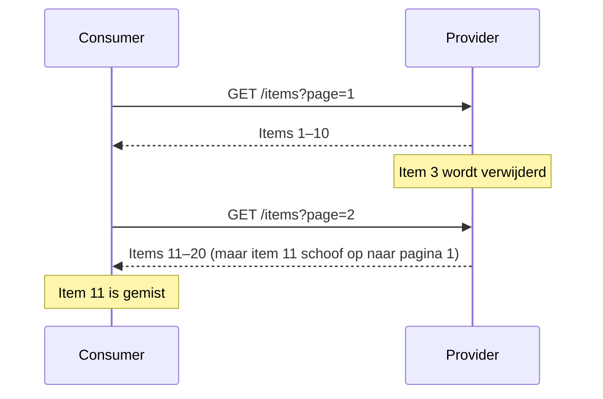

# Paginering van resourcecollecties

Vrijwel elke API die een collectie van resources aanbiedt, gebruikt paginering.
Er zijn twee veelgebruikte aanpakken: offset-paginering en keyset-paginering. Ze
lijken op elkaar, maar geven verschillende garanties — en die garanties maken
een groot verschil bij veranderende data.

Dit artikel legt beide aanpakken uit, vergelijkt hun eigenschappen en beschrijft
best practices voor het ontwerp van een paginerend API-endpoint.

## Het probleem: page skew

Bij de meest gebruikte vorm van paginering geeft een consumer een `page`- of
`offset`-parameter mee:

```http
GET /items?page=1
GET /items?page=2
```

Dit werkt prima op een statische dataset. Zodra de collectie tussen twee
aanroepen door verandert — een item wordt toegevoegd, verwijderd of gesorteerd —
klopt het beeld niet meer. Een item kan ontbreken in het resultaat, of juist
twee keer voorkomen. Dit staat bekend als _page skew_.



Page skew is geen randgeval — het treedt op bij iedere collectie die kan
veranderen terwijl een consumer die doorloopt.

## Twee aanpakken

### Offset- en paginanummering

De eenvoudigste aanpak: een consumer geeft een vast startpunt (`offset` of
`page`) in de collectie mee.

- **Voordelen**: eenvoudig te begrijpen en te implementeren; willekeurige
  toegang tot een pagina is mogelijk.
- **Nadelen**: gevoelig voor page skew bij veranderende data; inefficiënt op
  grote datasets omdat de database tot aan de offset moet lezen.

Geschikte toepassingen: statische of zelden veranderende datasets, of situaties
waarbij een incidenteel gemist item acceptabel is.

### Keyset-paginering (cursor-based)

In plaats van een positie geeft de consumer de waarde van de laatste geziene rij
mee als cursor, doorgaans de `id` of een combinatie van velden:

```http
GET /items?after=item-id-42
```

De provider haalt daarna alle items op waarvan de sleutel groter is dan de
opgegeven waarde. Zolang de sleutel stabiel en oplopend is, zijn inserts en
deletes buiten het huidige venster geen probleem.

- **Voordelen**: geen page skew door invoegingen of verwijderingen buiten het
  huidige venster; efficiënt op grote datasets.
- **Nadelen**: willekeurige toegang is niet mogelijk; bij verwijderingen of
  updates _binnen_ het huidige venster kan skew nog steeds optreden; de
  collectie moet gesorteerd zijn op een stabiele sleutel.

Geschikte toepassingen: tijdgeordende feeds, feeds die oneindig doorscrolbaar
zijn, situaties waarbij page skew aan de randen acceptabel is.

Keyset-paginering is de aanpak die partijen als Zalando, GitHub en Stripe
hanteren als standaard voor feeds. Toch biedt het geen volledige garantie: bij
een veranderende collectie kunnen items die _binnen het huidige venster_ worden
verwijderd of bijgewerkt alsnog gemist of dubbel gezien worden. Voor collecties
waar die situatie niet acceptabel is — denk aan volledige synchronisatie van een
dataset — is een ander patroon nodig. Zie
[Synchroniseren van resourcecollecties](./synchroniseren-van-resourcecollecties.md).

## Vergelijking

| Aanpak        | Page skew bij inserts/deletes | Willekeurige toegang | Geschikt voor grote datasets | Databasevereiste            |
| ------------- | ----------------------------- | -------------------- | ---------------------------- | --------------------------- |
| Offset/page   | Ja                            | Ja                   | Beperkt                      | Geen                        |
| Keyset/cursor | Deels (zie boven)             | Nee                  | Ja                           | Stabiele, oplopende sleutel |

## Best practices

### Kies de aanpak op basis van de garantie die nodig is

Paginering is geen implementatiedetail — het is een keuze over welke garanties
de API geeft. Wees daar expliciet over in de API-documentatie.

### Gebruik keyset-paginering als standaard voor feeds

Voor tijdgeordende of append-only collecties is keyset-paginering de meest
robuuste aanpak zonder extra infrastructuurvereisten. Wees daarbij wel expliciet
over de beperking: page skew aan de randen van het venster blijft mogelijk.

### Maak de cursor ondoorzichtig

Geef cursors terug als een ondoorzichtige string in plaats van een ruwe
veldwaarde. Daarmee ontkoppel je de interne sorteerstrategie van de API van het
gedrag van consumers.

```json
{
  "items": [...],
  "next": "eyJpZCI6NDJ9"
}
```

### Geef een consistente sorteervolgorde

Paginering zonder vaste sorteervolgorde geeft onvoorspelbare resultaten. Geef
altijd expliciet aan op welk veld gesorteerd wordt, en zorg dat die volgorde
stabiel is.

## Gerelateerde patronen

- Voor het ophalen én daarna actueel houden van een collectie via delta's, zie
  [Synchroniseren van resourcecollecties](./synchroniseren-van-resourcecollecties.md).
- Voor betrouwbare publicatie van wijzigingen aan de providerzijde, zie
  <!-- [Transactionele outbox](./transactionele-outbox.md). -->
