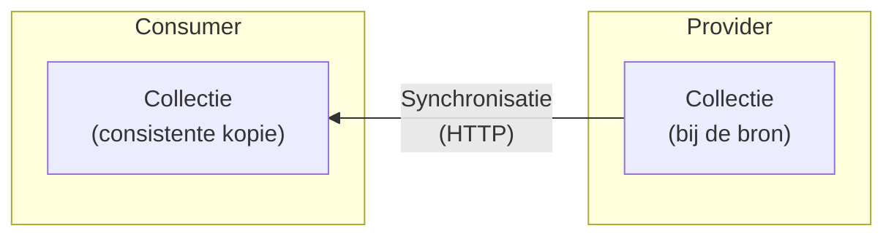

import SnapshotDeltaStreams from '@site/src/components/SnapshotDeltaStreams';

# Synchronisatie van collecties

In gedistribueerde systemen hebben consumers vaak een actuele, lokale en vooral
consistente kopie nodig van een _dynamische collectie_ binnen een REST API,
bijvoorbeeld `/publicaties`. Daarmee kunnen zij data snel bevragen, lokaal
verrijken of koppelen.



Het **snapshots-en-delta's-patroon** richt zich op _one-way state
synchronization_: het in één richting synchroniseren van de actuele toestand van
een collectie. _Snapshots_ bieden een startpunt; _delta's_ houden die toestand
daarna efficiënt bij. Het patroon is niet bedoeld voor bidirectionele
synchronisatie, conflictresolutie of volledige historische replay op basis van
events.

De garantie van het patroon is
[sequentiële consistentie](https://en.wikipedia.org/wiki/Consistency_model#Sequential_consistency):
een vorm van sterke consistentie waarbij de lokale kopie — met een
tijdsvertraging — gegarandeerd identiek is aan de collectie bij de bron.

## Het snapshots-en-delta's-patroon

Het **snapshots-en-delta's** patroon maakt synchronisatie betrouwbaar door twee
parallelle stromen te combineren: een laagfrequente stroom van snapshots en een
hoogfrequente stroom van delta's. De ene stroom biedt een veilig startpunt, de
andere stroom zorgt ervoor dat de lokale kopie actueel blijft.

Snapshots en delta's krijgen daarom een positie in dezelfde reeks. In dit
artikel noemen we die positie een **state-id**. Een snapshot bevat de toestand
tot en met zijn state-id; een delta beschrijft de stap van de vorige state-id
naar een volgende state-id.

<SnapshotDeltaStreams />

### Snapshots

Een snapshot is een volledige, consistente weergave van de collectie op één
specifiek moment. Daarmee kan een consumer starten zonder de volledige
wijzigingsgeschiedenis te kennen. Dat is nodig bij de eerste start, maar ook bij
herstel na verlies van lokale status, verlopen retentie of een breuk in de
delta-keten.

Een snapshot is pas bruikbaar als duidelijk is bij welke positie in de reeks het
hoort. Die positie vormt de verticale lijn in het patroon: alles tot en met dat
punt zit al in het snapshot, alles daarna moet via delta's worden verwerkt.

### Delta's

Delta's beschrijven de stap van een bekende toestand naar de daaropvolgende
toestand. Om de lokale kopie consistent te houden, moet de delta-keten
aaneengesloten zijn: een consumer kan zijn toestand alleen veilig doorschuiven
als een nieuwe delta exact aansluit op de positie van de laatst succesvol
verwerkte snapshot of delta. Functioneel betekent dit dat een delta ook de
voorgaande positie in de reeks meedraagt, zodat een consumer kan controleren dat
die aansluiting klopt.

Delta's vormen de reguliere route om de lokale kopie continu actueel te houden
zonder telkens de volledige dataset opnieuw op te hoeven vragen. Ze bevatten
niet alleen de notificatie dát er iets is veranderd, maar dragen ook direct de
inhoud van die wijziging met zich mee.

### State-ids

Een state-id identificeert een specifieke, stabiele toestand van de collectie:
het is de identifier van een positie in de reeks. Conceptueel lijkt dat op een
[`ETag`](https://en.wikipedia.org/wiki/HTTP_ETag), maar een state-id heeft een
sterkere semantiek: het markeert het resultaat van een atomaire overgang. Een
delta beschrijft precies de stap van één state-id naar het volgende —
daartussenin is de collectie consistent. Een `ETag` hoort bij een representatie
en biedt die atomiciteitsgarantie niet per se.

De provider kiest de concrete vorm van het state-id, bijvoorbeeld een oplopend
transactienummer, tijdstempel, UUID of hash. De enige eis is dat een state-id
uniek moet zijn binnen de collectie.

## REST API's

Hieronder werken we het snapshots-en-delta's patroon uit voor REST API's. Het
patroon zelf — snapshots, delta's, state-ids — is leidend; de URL-structuur is
hier een mogelijke opzet voor. Wie de aanbeveling volgt, maakt zijn API direct
bruikbaar voor consumers die het patroon kennen en respecteert hierin zoveel
mogelijk de standaarden.

### Resourcemodel

Het patroon voegt twee sub-resources toe aan een (eventueel bestaande)
collectie:

```text
/publicaties              → de collectie zelf (ongewijzigd)
/publicaties/snapshots    → lijst van beschikbare snapshots
/publicaties/snapshots/42 → inhoud van snapshot 42 (statische collectie)
/publicaties/deltas       → lijst of stroom van delta's (polling of SSE);
                            geen individuele endpoints per delta
```

### Snapshots ophalen

De provider publiceert een lijst van beschikbare snapshots, gesorteerd met het
meest recente snapshot eerst. De consumer kan het eerste item in die lijst als
startpunt kiezen:

```http
GET /publicaties/snapshots
→ 200 OK
  {
    "items": [
      {
        "id": 42,
        "href": "/publicaties/snapshots/42",
        "total": 850
      }
    ]
  }
```

De inhoud van een snapshot is een _statische collectie_: nadat het snapshot is
gemaakt, verandert het niet meer. Daardoor kan de provider die inhoud op
verschillende manieren aanbieden, bijvoorbeeld met paginering, vaste chunks of
bestanden. Snapshot-chunks zijn statische bestanden en kunnen potentieel groot
zijn. Ze lenen zich daardoor voor distributie via een CDN, wat een API gateway
kan ontlasten. Voor het patroon is vooral belangrijk dat alle delen samen
dezelfde snapshot-toestand representeren. De provider hoort te garanderen dat
vanaf elk aangeboden snapshot de aansluitende delta-keten beschikbaar is.
Vervolgens haalt de consumer de inhoud op via de bijbehorende link. Die link kan
relatief zijn binnen dezelfde API, maar ook absoluut.

De provider houdt snapshots lang genoeg beschikbaar om ze volledig te
downloaden; verloopt een snapshot toch tussentijds — kenbaar via `410 Gone` op
een latere chunk — dan herhaalt de consumer het proces met het meest recente
beschikbare snapshot.

### Delta's ophalen

Individuele delta's worden niet als afzonderlijke REST-resources (zoals
`GET /publicaties/deltas/57`) aangeboden. Hun waarde zit in de aaneengesloten
chronologische reeks; een losse delta bevragen dient geen synchronisatiedoel en
zou leiden tot een overload aan afzonderlijke HTTP-requests (_chatty API_).
Daarom ontsluit de provider delta's alleen als gecombineerde stroom of batch.
Hieronder werken we daarvoor polling en SSE uit.

#### Structuur van delta's

Een delta is de concrete schakel tussen de garanties hierboven en de
implementatie hieronder: de consumer kan alleen veilig doorschuiven als elke
delta expliciet aangeeft op welke vorige toestand hij aansluit.

```json
{
  "id": 57,
  "prev_id": 42,
  "operations": [
    {
      "type": "update",
      "resource_id": "item-abc",
      "resource": {
        "id": "item-abc",
        "name": "Resource ABC - Gewijzigd",
        "status": "actief"
      }
    }
  ]
}
```

Een delta bevat altijd een array van operaties (`operations`), ook als er maar
één wijziging is. Zo kan de provider meerdere samenhangende wijzigingen in één
keer laten toepassen. Elke operatie heeft minimaal een `type`, bijvoorbeeld
`create`, `update` of `delete`. Bij een `delete`-operatie ontbreekt het
`resource`-veld bewust (tombstone).

In de aanbevolen vorm bevat `resource` steeds de volledige resulterende weergave
van het record (_Event-Carried State Transfer_). Dat is de voorkeursvorm: de
consumer hoeft geen vorige toestand op te halen om de wijziging te begrijpen, en
retries blijven idempotent. Het veld `resource_id` staat ook buiten het
`resource`-object, zodat de getroffen resource ook bij een `delete`-operatie
eenduidig identificeerbaar blijft.

Alleen als resources extreem groot zijn en bandbreedte de doorslag geeft, kan de
provider in plaats van de volledige resource ook een
[JSON Merge Patch (RFC 7396)](https://datatracker.ietf.org/doc/html/rfc7396) of
[JSON Patch (RFC 6902)](https://datatracker.ietf.org/doc/html/rfc6902)
meesturen. Dat is een uitzondering op de voorkeursvorm en maakt de
consumer-logica complexer, omdat patching pad- en schema-afhankelijk is en
correct herstel na _out-of-order_ events lastiger wordt.

#### Polling

De consumer vraagt periodiek nieuwe delta's op via zijn state-id:

```http
GET /publicaties/deltas?after=42&limit=10
→ 200 OK
  {
    "items": [
      {
        "id": 57,
        "prev_id": 42,
        "operations": [
          {
            "type": "update",
            "resource_id": "item-abc",
            "resource": { "id": "item-abc", "name": "Resource ABC - Gewijzigd" }
          }
        ]
      }
    ]
  }
```

Dit gedraagt zich als cursor-based paginering, maar gebruikt expliciet
`after=<state-id>` om de volgende stap in de delta-keten op te vragen. Via
`limit` blijft de responsgrootte beheersbaar. De consumer verwerkt delta's in
volgorde, zet zijn state-id naar het `id` van de laatste verwerkte delta en
vraagt daarna de volgende pagina op met `after=<nieuw_state_id>`. Een lege
items-lijst betekent dat de consumer actueel is en na het polling-interval
opnieuw kan opvragen.

Ontvangt de consumer een delta waarvan `prev_id` niet aansluit bij de huidige
state-id, dan is er een hiaat in de keten en moet hij opnieuw beginnen vanaf
een snapshot.

Als het gevraagde state-id niet meer bekend is bij de provider, antwoordt die
met `410 Gone`:

```http
GET /publicaties/deltas?after=99
→ 410 Gone
```

Ook dan moet de consumer opnieuw beginnen vanaf een snapshot. Voor polling is
dat dus het algemene herstelpad: bij een gat in de keten of een onbekend
state-id opnieuw beginnen vanaf een snapshot.

#### Streaming (SSE)

De consumer opent een langdurige verbinding; de provider pusht delta's zodra ze
beschikbaar zijn. De consumer stuurt `Last-Event-ID` mee als state-id — zowel
bij de initiële verbinding als bij herverbinding na een onderbreking:

```http
GET /publicaties/deltas
Accept: text/event-stream
Last-Event-ID: 42

→ 200 OK (text/event-stream)

id: 57
data: {"id": 57, "prev_id": 42, "operations": [{"type": "update", "resource_id": "item-abc", ...}]}

id: 63
data: {"id": 63, "prev_id": 57, "operations": [{"type": "delete", "resource_id": "item-xyz"}]}
```

De consumer valideert bij elke ontvangen delta dat `prev_id` overeenkomt met het
huidige state-id. Een mismatch signaleert een hiaat en leidt tot hetzelfde
herstelpad als bij polling. Een open SSE-verbinding kan na opzet geen
`410 Gone` meer ontvangen; verloopt het state-id tijdens de sessie, dan sluit
de provider de verbinding. Bij herverbinding stuurt de consumer opnieuw
`Last-Event-ID`; als dat state-id inmiddels niet meer bekend is, antwoordt de
provider alsnog met `410 Gone`.

#### CloudEvents

Delta's kunnen desgewenst in een [CloudEvents](https://cloudevents.io/)-envelop
worden verpakt. Dat standaardiseert de envelop; de delta-velden in `data`
blijven ongewijzigd.

## Retentie van snapshots en delta's

Een cruciale verantwoordelijkheid van de provider is de overlap tussen
snapshot-retentie en delta-retentie. Het downloaden van een groot snapshot kost
tijd. Als een consumer pas daarna overschakelt op delta's, mogen de delta's die
in de tussentijd zijn ontstaan niet al zijn opgeruimd. De retentie van delta's
moet daarom ruimschoots langer zijn dan de langst plausibele download- en
verwerkingstijd van een snapshot. Anders gezegd: voor elk snapshot dat de
provider aanbiedt, moet de aansluitende delta-keten vanaf het state-id van dat
snapshot nog beschikbaar zijn.

De ontvangst van delta's kan vooruitlopen op het laden van een snapshot: een
consumer kan al beginnen met het ontvangen van delta's terwijl er mogelijk nog
geen snapshot is, of terwijl het snapshot nog wordt gedownload. Die delta's
worden dan tijdelijk gebufferd, maar nog niet toegepast. Zodra het snapshot is
geladen, verwijdert de consumer alles wat al in het snapshot zit en verwerkt hij
alleen de delta's die op de snapshotpositie aansluiten. Dat kan de hersteltijd
verkorten, maar is niet nodig als de provider de genoemde overlap garandeert.

De provider moet snapshots en delta's beschikbaar houden voor een
retentieperiode die groot genoeg is voor een consumer om ze te verwerken. Daarna
mag de provider ze verwijderen. Bij polling en SSE-herverbinding ontvangt de
consumer dan `410 Gone`. Daarmee weet hij dat het state-id is verlopen en dat
opnieuw een snapshot moet worden opgehaald.

## Gerelateerde patronen

- Voor het betrouwbaar genereren en publiceren van delta's kan een provider het
  [Transactionele outbox](./transactionele-outbox.md)-patroon toepassen.
- Voor navigatie door de snapshot-pagina's (en een vergelijking van
  pagineerstrategieën), zie
  [Paginering van collecties](./paginering-van-collecties.md).
- Voor een bredere introductie op event-driven communicatiepatronen, zie
  [Event Driven Architecture](./eda.md).
