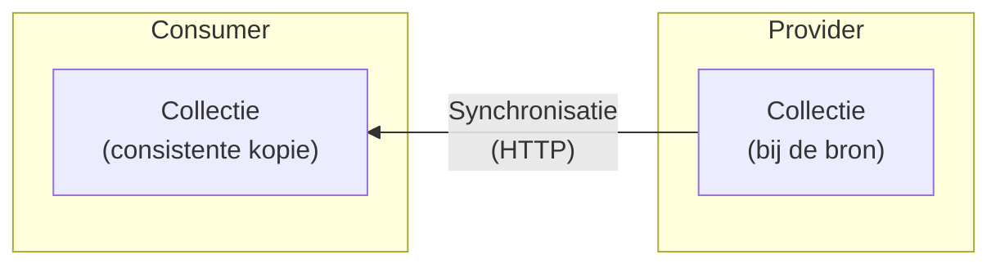

import SnapshotDeltaStreams from '@site/src/components/SnapshotDeltaStreams';

# Synchronisatie van collecties

In gedistribueerde systemen hebben consumers vaak een actuele, lokale en vooral
consistente kopie nodig van een _dynamische collectie_ binnen een REST API,
bijvoorbeeld `/publicaties`. Daarmee kunnen zij data snel bevragen, lokaal
verrijken of koppelen.



Het **snapshots-en-delta's-patroon** richt zich op _one-way state
synchronization_: het in één richting synchroniseren van de actuele toestand van
een collectie. _Snapshots_ bieden een startpunt; _delta's_ houden die toestand
daarna efficiënt bij. Het patroon is niet bedoeld voor bidirectionele
synchronisatie, conflictresolutie of volledige historische replay op basis van
events.

De garantie van het patroon is
[sequentiële consistentie](https://en.wikipedia.org/wiki/Consistency_model#Sequential_consistency):
een vorm van sterke consistentie waarbij de lokale kopie — met een
tijdsvertraging — gegarandeerd identiek is aan de collectie bij de bron.

## Het snapshots-en-delta's-patroon

Het **snapshots-en-delta's** patroon maakt synchronisatie betrouwbaar door twee
parallelle stromen te combineren: een laagfrequente stroom van snapshots en een
hoogfrequente stroom van delta's. De ene stroom biedt een veilig startpunt, de
andere stroom zorgt ervoor dat de lokale kopie actueel blijft.

Snapshots en delta's krijgen daarom een positie in dezelfde reeks. In dit
artikel noemen we die positie een **state-id**. Een snapshot bevat de toestand
tot en met zijn state-id; een delta beschrijft de stap van de vorige state-id
naar een volgende state-id.

<SnapshotDeltaStreams />

### Snapshots

Een snapshot is een volledige, consistente weergave van de collectie op één
specifiek moment. Daarmee kan een consumer starten zonder de volledige
wijzigingsgeschiedenis te kennen. Dat is nodig bij de eerste start, maar ook bij
herstel na verlies van lokale status, verlopen retentie of een breuk in de
delta-keten.

Een snapshot is pas bruikbaar als duidelijk is bij welke positie in de reeks het
hoort. Die positie vormt de verticale lijn in het patroon: alles tot en met dat
punt zit al in het snapshot, alles daarna moet via delta's worden verwerkt.

### Delta's

Delta's beschrijven de stap van een bekende toestand naar de daaropvolgende
toestand. Om de lokale kopie consistent te houden, moet de delta-keten
aaneengesloten zijn: een consumer kan zijn toestand alleen veilig doorschuiven
als een nieuwe delta exact aansluit op de positie van de laatst succesvol
verwerkte snapshot of delta.

Delta's vormen de reguliere route om de lokale kopie continu actueel te houden
zonder telkens de volledige dataset opnieuw op te hoeven vragen. Ze bevatten
niet alleen de notificatie dát er iets is veranderd, maar dragen ook direct de
inhoud van die wijziging met zich mee.

### State-ids

Een state-id identificeert een specifieke, stabiele toestand van de collectie.
Conceptueel lijkt dat op een [`ETag`](https://en.wikipedia.org/wiki/HTTP_ETag),
maar een state-id heeft een sterkere semantiek: het markeert het resultaat van
een atomaire overgang. Een delta beschrijft precies de stap van één state-id
naar het volgende — daartussenin is de collectie consistent. Een `ETag` is
gekoppeld aan een HTTP-representatie en biedt die atomiciteitsgarantie niet per
se.

De provider kiest de concrete vorm van het state-id, bijvoorbeeld een oplopend
transactienummer, tijdstempel, UUID of hash. Elk state-id moet uniek zijn binnen
de collectie.

## REST API's

Hieronder werken we het snapshots-en-delta's patroon uit voor REST API's. Het
patroon zelf — snapshot, delta, state-id — is leidend; de URL-structuur zijn
hier een mogelijke opzet voor. Wie de aanbeveling volgt, maakt zijn API direct
bruikbaar voor consumers die het patroon kennen en respecteert hierin zoveel
mogelijk de HTTP-standaarden.

Het patroon voegt twee sub-resources toe aan een (eventueel bestaande)
collectie:

```text
/publicaties             → de collectie zelf (ongewijzigd)
/publicaties/snapshots   → lijst van beschikbare snapshots
/publicaties/snapshots/42 → inhoud van snapshot 42 (statische collectie)
/publicaties/deltas       → lijst of stroom van delta's (polling of SSE);
                            geen individuele endpoints per delta
```

### Snapshot ophalen

De provider publiceert een lijst van beschikbare snapshots. De consumer kiest
daaruit een startpunt, doorgaans het meest recente:

```http
GET /publicaties/snapshots
→ 200 OK
  {
    "items": [
      {"id": 42, "created_at": "2026-05-13T10:00:00Z", "total": 850}
    ]
  }
```

Er kan tijdelijk nog geen snapshot beschikbaar zijn, bijvoorbeeld wanneer een
collectie nieuw is aangesloten of het eerste snapshot nog wordt opgebouwd. De
consumer heeft dan nog geen basistoestand en mag ontvangen delta's nog niet
toepassen. Bij transporten die een live stroom bieden, zoals SSE, webhooks of
een broker, kan de consumer die delta's alvast tijdelijk bufferen terwijl hij de
snapshot-lijst periodiek blijft opvragen. Dat bufferen is een optimalisatie,
geen vereiste voor correctheid: de provider hoort te garanderen dat vanaf elk
aangeboden snapshot de aansluitende delta-keten beschikbaar is.

De inhoud van een snapshot is statisch: nadat het snapshot is gemaakt, verandert
het niet meer. Daardoor kan de provider die inhoud op verschillende manieren
aanbieden, bijvoorbeeld met offset/limit-paginering, cursorpaginering, vaste
chunks of bestanden. Voor het patroon is vooral belangrijk dat alle delen samen
dezelfde snapshot-toestand representeren.

Vervolgens haalt de consumer de inhoud op via het id. De respons levert ook de
bijbehorende `ETag`:

```http
GET /publicaties/snapshots/42?limit=100
→ 200 OK
  ETag: "42"

  {"id": 42, "total": 850, "items": [...]}
```

```text
GET /publicaties/snapshots/42?offset=100&limit=100 → {"id": 42, "total": 850, "items": [...]}
GET /publicaties/snapshots/42?offset=200&limit=100 → {"id": 42, "total": 850, "items": [...]}
...
```

Omdat snapshots statisch zijn, treedt er geen page skew op. De consumer laadt
een snapshot bij voorkeur in een aparte staging-area en schakelt pas over naar
de nieuwe toestand — en verwijdert de vorige — als alle chunks succesvol zijn
binnengekomen. Na de laatste chunk stelt hij het state-id in op `42`. Heeft de
consumer tijdens het laden delta's gebufferd, dan verwijdert hij eerst alle
delta's met een `id` tot en met `42` en verwerkt daarna alleen de eerste
gebufferde delta waarvan `prev_id` gelijk is aan `42`, gevolgd door de
aansluitende keten. Ontbreekt die aansluiting, dan herstelt de consumer opnieuw
vanaf een beschikbaar snapshot. De provider houdt snapshots lang genoeg
beschikbaar om ze volledig te downloaden; verloopt een snapshot toch tussentijds
— kenbaar via `410 Gone` op een latere chunk — dan herhaalt de consumer het
proces met het meest recente beschikbare snapshot.

Snapshot-chunks zijn statische bestanden en kunnen potentieel groot zijn. Ze
lenen zich daardoor voor distributie via een CDN, wat een API gateway kan
ontlasten.

### Delta's ophalen

Individuele delta's worden niet als afzonderlijke REST-resources (zoals
`GET /publicaties/deltas/57`) aangeboden. Hun waarde zit in de aaneengesloten
chronologische reeks; een losse delta bevragen dient geen synchronisatiedoel en
zou leiden tot een overload aan afzonderlijke HTTP-requests (_chatty API_).
Daarom ontsluit de provider delta's alleen als gecombineerde stroom of batch:
als stroom via SSE of webhook, of als lijst via polling.

#### Formaat van delta's

Een delta is de concrete schakel tussen de garanties hierboven en de
implementatie hieronder: de consumer kan alleen veilig doorschuiven als elke
delta expliciet aangeeft op welke vorige toestand hij aansluit.

```json
{
  "id": 57,
  "prev_id": 42,
  "operations": [
    {
      "type": "update",
      "resource_id": "item-abc",
      "resource": {
        "id": "item-abc",
        "name": "Resource ABC - Gewijzigd",
        "status": "actief"
      }
    }
  ]
}
```

Een delta bevat altijd een array van operaties (`operations`), ook als er maar
één wijziging is. Zo kan de provider meerdere samenhangende wijzigingen in één
keer laten toepassen.

Elke operatie heeft minimaal een `type`:

- `create`: voeg een nieuwe resource toe.
- `update`: wijzig of vervang een bestaande resource.
- `delete`: verwijder een resource; het `resource`-veld ontbreekt dan bewust
  (tombstone).

In de aanbevolen vorm bevat `resource` steeds de volledige resulterende weergave
van het record (_Event-Carried State Transfer_). Dat is het meest robuust en
sterk aanbevolen: de consumer hoeft geen vorige toestand op te halen om de
wijziging te begrijpen, en retries blijven idempotent.

Het veld `resource_id` staat bewust ook buiten het `resource`-object. Bij een
`delete`-operatie is dat noodzakelijk, omdat er dan geen `resource` meer is.
Daarnaast kunnen consumers en tussenliggende brokers zo filteren en routeren op
ID en type zonder eerst een zwaardere payload te deserialiseren.

Alleen als resources extreem groot zijn en bandbreedte de doorslag geeft, kan de
provider in plaats van de volledige resource ook een
[JSON Merge Patch (RFC 7396)](https://datatracker.ietf.org/doc/html/rfc7396) of
[JSON Patch (RFC 6902)](https://datatracker.ietf.org/doc/html/rfc6902)
meesturen. Dat maakt de consumer-logica wel complexer, omdat patching pad- en
schema-afhankelijk is en correct herstel na _out-of-order_ events lastiger
wordt.

#### Polling

De consumer vraagt periodiek nieuwe delta's op via zijn state-id:

```http
GET /publicaties/deltas?after=42&limit=10
→ 200 OK
  {
    "items": [
      {
        "id": 57,
        "prev_id": 42,
        "operations": [
          {
            "type": "update",
            "resource_id": "item-abc",
            "resource": { "id": "item-abc", "name": "Resource ABC - Gewijzigd" }
          }
        ]
      }
    ]
  }
```

De consumer past elke delta toe en zet het state-id naar het `id` van de laatste
verwerkte delta. Ontvangt de consumer onverhoopt een delta waarvan het `id` al
gelijk is aan of ouder is dan het huidige state-id (bijvoorbeeld bij
netwerk-retries), dan negeert de consumer deze (idempotentie). Een lege
items-lijst betekent dat de consumer actueel is.

Om te voorkomen dat de respons op `GET /publicaties/deltas` een gigantisch
object wordt (bijvoorbeeld als de consumer lang offline is geweest en er
inmiddels duizenden wijzigingen zijn), past de provider twee mechanismen toe:

1. **Geforceerde paginering via `limit`:** De provider levert nooit alle
   openstaande delta's in één keer, maar dwingt een maximum af (bijvoorbeeld
   `limit=100`). De consumer verwerkt deze pagina, werkt zijn lokale status bij
   naar de `id` van de laatste verwerkte delta, en vraagt de volgende pagina op
   (`?after=<nieuwe_id>&limit=100`). Dit herhaalt zich totdat een lege lijst
   wordt teruggegeven.
2. **De `410 Gone`-vangrail:** Als de consumer zó ver achterloopt dat de delta's
   niet meer in de retentieperiode van de provider vallen (of wanneer het
   opvragen van de achterstand te zwaar is), weigert de provider de delta's te
   leveren en antwoordt met `410 Gone`. Dit dwingt de consumer om een nieuw,
   statisch en eventueel via CDN gecached snapshot te downloaden. Dat is veel
   efficiënter voor grootschalig herstel.

Als het state-id niet meer bekend is bij de provider, antwoordt de provider met
`410 Gone`:

```http
GET /publicaties/deltas?after=99
→ 410 Gone
```

De consumer weet dan dat hij opnieuw een snapshot moet ophalen.

#### Streaming (SSE)

De consumer opent een langdurige verbinding; de provider pusht delta's zodra ze
beschikbaar zijn. De consumer stuurt `Last-Event-ID` mee als state-id — zowel
bij de initiële verbinding als bij herverbinding na een onderbreking:

```http
GET /publicaties/deltas
Accept: text/event-stream
Last-Event-ID: 42

→ 200 OK (text/event-stream)

id: 57
data: {"id": 57, "prev_id": 42, "operations": [{"type": "update", "resource_id": "item-abc", ...}]}

id: 63
data: {"id": 63, "prev_id": 57, "operations": [{"type": "delete", "resource_id": "item-xyz"}]}
```

De consumer valideert bij elke ontvangen delta dat `prev_id` overeenkomt met het
huidige state-id. Een mismatch signaleert een hiaat: de consumer sluit de
verbinding en behandelt dit identiek aan een `410 Gone`.

Een open SSE-verbinding kan geen `410 Gone` ontvangen: de HTTP-statuscode ligt
vast op `200 OK` zodra de verbinding is opgezet. Raakt het state-id verlopen
terwijl de verbinding open staat, dan sluit de provider de verbinding:

```http
id: 57
data: {"id": 57, "prev_id": 42, ...}

← verbinding gesloten door provider
```

Bij herverbinding stuurt de consumer opnieuw `Last-Event-ID`; als dat state-id
inmiddels niet meer bekend is, antwoordt de provider met `410 Gone`:

```http
GET /publicaties/deltas
Accept: text/event-stream
Last-Event-ID: 99
→ 410 Gone
```

De consumer haalt dan een nieuw snapshot op en opent daarna een nieuwe
verbinding met het state-id van dat snapshot.

Een robuuste consumer behandelt beide situaties — mismatch en `410 Gone` — als
hetzelfde herstelpad: verbinding verbreken, nieuw snapshot ophalen, opnieuw
verbinden met het state-id van dat snapshot.

#### Webhooks

De provider pusht delta's naar een endpoint van de consumer zodra ze beschikbaar
zijn:

```http
POST https://consumer.example.nl/webhook/resources
Content-Type: application/json

{
  "id": 57,
  "prev_id": 42,
  "operations": [
    {
      "type": "update",
      "resource_id": "item-abc",
      "resource": {
        "id": "item-abc",
        "name": "Resource ABC - Gewijzigd"
      }
    }
  ]
}
```

De consumer valideert `prev_id` bij elk ontvangen bericht. Omdat webhooks
asynchroon zijn en berichten _out-of-order_ kunnen arriveren, signaleert een
mismatch met het state-id in eerste instantie een _gap_ in de correcte volgorde.
Een robuuste consumer buffert de onverwachte delta dan tijdelijk. Als de
ontbrekende voorgaande delta niet binnen een redelijke termijn arriveert, neemt
de consumer aan dat de delta-keten is gereset of het state-id verlopen is, en
haalt een nieuw snapshot op via de snapshot-API.

Bij polling en SSE initieert de consumer alle verbindingen, waardoor alleen
eenzijdige authenticatie nodig is. Webhooks — waarbij de provider actief naar de
consumer pusht — vereisen een publiek bereikbaar consumer-endpoint en
tweezijdige authenticatie. Bovendien moet de consumer de herkomst van elk
inkomend bericht verifiëren, bijvoorbeeld via een HMAC-handtekening over de
payload die de provider als request-header meestuurt. Zo kunnen alleen
geautoriseerde providers delta's aanleveren.

#### CloudEvents

Delta's kunnen in een [CloudEvents](https://cloudevents.io/)-envelop worden
verpakt, ongeacht het transportmechanisme (HTTP, SSE, broker):

```json
{
  "specversion": "1.0",
  "type": "nl.example.resources.update",
  "source": "/resources",
  "id": "57",
  "data": {
    "id": 57,
    "prev_id": 42,
    "operations": [
      {
        "type": "update",
        "resource_id": "item-abc",
        "resource": {...}
      }
    ]
  }
}
```

CloudEvents standaardiseert de envelop; de delta-velden in `data` blijven
ongewijzigd. Let op: het envelope-veld `id` is per CloudEvents-specificatie
altijd een string (`"57"`), terwijl het `id` in `data` de door de provider
bepaalde vorm behoudt (in de voorbeelden een getal).

## Implementatie-aandachtspunten

### Gegarandeerde atomiciteit (Transactionele Outbox)

Om operaties op de juiste manier te groeperen als provider zonder
dataconsistentie te verliezen, kan het beste het
[Transactionele outbox](https://microservices.io/patterns/data/transactional-outbox.html)-patroon
worden gebruikt. Daarbij worden de databasewijzigingen aan de resource(s) én de
logvermelding met de _operations_-array als één database-transactie opgeslagen.
Een asynchrone worker leest vervolgens de outbox-tabel uit en deelt deze als
gegarandeerd correcte berichten via polling, webhooks of de message broker.

### Geen wijzigingen verliezen tijdens snapshotten

Een cruciale verantwoordelijkheid van de provider is de overlap tussen
snapshot-retentie en delta-retentie. Het downloaden van een groot snapshot kost
tijd. Als een consumer pas daarna overschakelt op delta's, mogen de delta's die
in de tussentijd zijn ontstaan niet al zijn opgeruimd. De retentie van delta's
moet daarom ruimschoots langer zijn dan de langst plausibele download- en
verwerkingstijd van een snapshot. Anders gezegd: voor elk snapshot dat de
provider aanbiedt, moet de aansluitende delta-keten vanaf het state-id van dat
snapshot nog beschikbaar zijn.

De ontvangst van delta's kan vooruitlopen op het laden van een snapshot: een
consumer kan al beginnen met het ontvangen van delta's terwijl er mogelijk nog
geen snapshot is, of terwijl het snapshot nog wordt gedownload. Die delta's
worden dan tijdelijk gebufferd, maar nog niet toegepast. Zodra het snapshot is
geladen, verwijdert de consumer alles wat al in het snapshot zit en verwerkt hij
alleen de delta's die op de snapshotpositie aansluiten. Dat kan de hersteltijd
verkorten, maar is niet nodig als de provider de genoemde overlap garandeert.

### Retentie van snapshots en delta's

De provider moet snapshots en delta's beschikbaar houden voor een
retentieperiode die groot genoeg is voor een consumer om ze te verwerken. Daarna
mag de provider ze verwijderen. Bij polling en SSE-herverbinding ontvangt de
consumer dan `410 Gone`; bij webhooks en broker detecteert de consumer een
`prev_id`-mismatch. In beide gevallen is het state-id verlopen en moet opnieuw
een snapshot worden opgehaald.

## Gerelateerde patronen

- Voor navigatie door de snapshot-pagina's (en een vergelijking van
  pagineerstrategieën), zie
  [Paginering van collecties](./paginering-van-collecties.md).
- Voor een bredere introductie op event-driven communicatiepatronen, zie
  [Event Driven Architecture](./eda.md).
