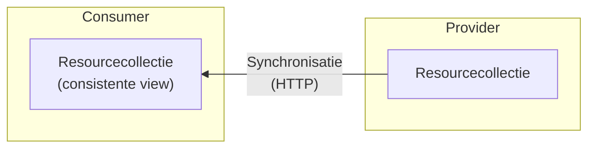
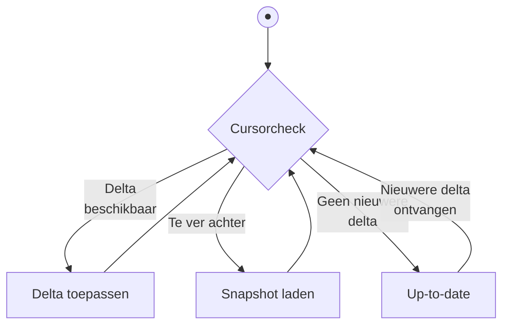
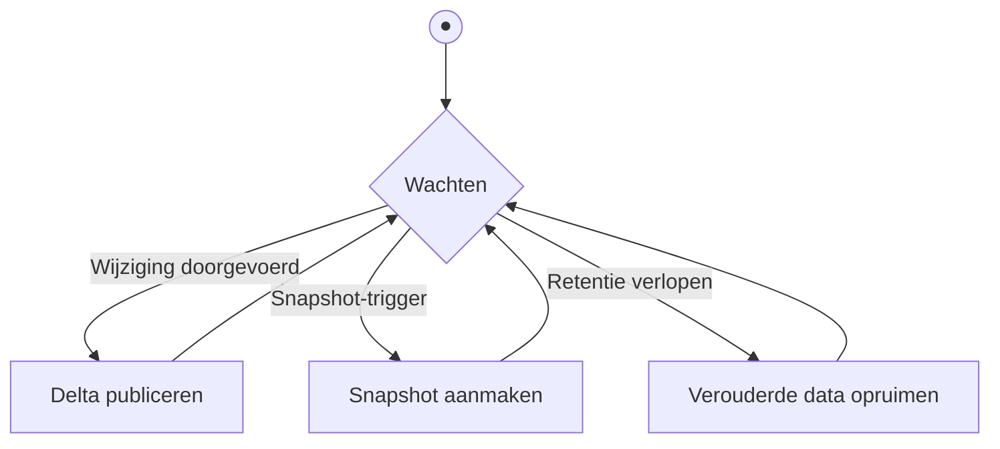

# Synchroniseren van resourcecollecties

Dit artikel beschrijft het **snapshots-en-delta's**-patroon waarmee een consumer
synchroon kan lopen met een continu veranderende resourcecollectie van
arbitraire grootte. Het patroon is transport-agnostisch: het werkt over HTTP
(polling of SSE) of via een message broker. Over HTTP kan het een extensie zijn
van een bestaande API — zonder extra modules of diensten.



Een consumer kan op een recent moment inspringen — niet per se bij het begin.
Omdat het patroon geen volledige historische replay vereist, is het ook geschikt
voor resourcecollecties die persoonsgegevens kunnen bevatten: een volledige
geschiedenis van wijzigingen is niet
[AVG-conform](https://www.autoriteitpersoonsgegevens.nl/themas/basis-avg/privacyrechten-avg/recht-op-gegevens-verwijderen).

De provider kan op elk moment een nieuwe snapshot publiceren — na een
datamigratie, schemawijziging, complete reset of nadat het recht op verwijderen
is toegepast. Consumers ontdekken dit vanzelf via het protocol en synchroniseren
opnieuw zonder dat de provider ze actief hoeft te notificeren.

## Het probleem

Bestaande aanpakken schieten tekort:

- **Gepagineerde `GET`s en polling** geven page skew: bij een veranderende
  collectie kunnen items ontbreken of dubbel voorkomen. Zie
  [Paginering van resourcecollecties](./paginering-van-resourcecollecties.md)
  voor een uitleg van dit probleem.
- Patronen zonder snapshot-mechanisme lossen het inspringprobleem niet op: een
  nieuwe consumer weet niet hoe hij de begintoestand opbouwt.

## Garanties

Dit patroon biedt de volgende garanties:

- **[Snapshot isolation](https://en.wikipedia.org/wiki/Snapshot_isolation)**:
  het snapshot beschrijft de collectie zoals die bestond op één logisch moment,
  ongeacht wijzigingen daarna.
- **Sterke consistentie**: dit patroon biedt
  [sequentiële consistentie](https://en.wikipedia.org/wiki/Consistency_model#Sequential_consistency)
  per collectie — alle consumers zien wijzigingen in dezelfde totale volgorde.
  Wie twee collecties combineert — elk met eigen id's — heeft
  [causale consistentie](https://en.wikipedia.org/wiki/Consistency_model#Causal_consistency)
  tussen de streams: de volgorde binnen elke collectie is gegarandeerd, maar er
  is geen totale volgorde over de twee streams heen.
- **Inhaalbaarheid en inspringen**: via de cursor kan een consumer op elk moment
  inspringen — zowel een nieuwe consumer die nog geen lokale toestand heeft als
  een consumer die na een onderbreking gemiste wijzigingen bijwerkt.

Deze garanties hebben een prijs: een consumer loopt altijd enigszins achter op
de werkelijkheid. Bij REST polling zit er een venster tussen het moment van een
wijziging en het moment van opvragen. Bij SSE en event-driven varianten is de
latentie kleiner, maar nooit nul. De toestand die een consumer ziet is altijd
intern consistent — ze beschrijft een werkelijke vroegere toestand van de
collectie — maar ze kan verouderd zijn.

## Het patroon

Het patroon werkt met drie begrippen:

- **Snapshot**: een consistente momentopname van de volledige resourcecollectie
  op één moment. Een snapshot heeft een uniek `id` — dit kan een getal, een
  tijdstempel of een hash zijn; de provider bepaalt de vorm. Een snapshot is het
  startpunt voor een consumer die nog geen lokale toestand heeft. De
  begintoestand van het systeem is een snapshot (eventueel leeg) met een door de
  provider toegewezen initieel `id`.
- **Delta**: een atomaire stap in de wijzigingsreeks — één of meer toevoegingen,
  aanpassingen of verwijderingen die de provider als één geheel heeft
  doorgevoerd. De consumer past een delta volledig toe of helemaal niet. Elke
  delta heeft een `id` en een `prev_id`; een delta is toepasbaar als diens
  `prev_id` overeenkomt met de cursor, waarna de cursor het `id` van de delta
  wordt.
- **Cursor**: het `id` van de laatste verwerkte snapshot of delta, lokaal
  bijgehouden door de consumer. Een consumer zonder cursor heeft nog geen
  snapshot opgehaald.

### Consumer

De consumer doorloopt continu een cursorcheck die bepaalt wat de volgende stap
is:



- **Delta toepassen**: er is een delta beschikbaar voor de cursor. De consumer
  past de delta toe en schuift de cursor op.
- **Snapshot laden**: de consumer is te ver achter; de provider heeft geen delta
  voor de huidige cursor. De consumer haalt een nieuw snapshot op om in te
  springen.
- **Up-to-date**: er zijn geen nieuwere delta's. De consumer wacht op de
  volgende delta (via SSE of polling).

### Provider

De provider kent een vergelijkbare cyclus:



- **Delta publiceren**: bij elke wijziging of groep wijzigingen legt de provider
  een delta atomair vast — met een nieuw `id` en het vorige `id` als `prev_id`.
  De delta-keten blijft zo aaneengesloten.
- **Snapshot aanmaken**: na een datamigratie, schemawijziging, toepassing van
  het recht op verwijdering of een andere complete reset maakt de provider een
  nieuw snapshot aan. Consumers ontdekken dit vanzelf: bij polling en
  SSE-herverbinding via `410 Gone`, bij webhooks en broker via een
  `prev_id`-mismatch in de volgende ontvangen delta.
- **Verouderde data opruimen**: na het verstrijken van de retentieperiode
  verwijdert de provider snapshots en delta's. Bij polling en SSE-herverbinding
  ontvangen consumers met een verlopen cursor `410 Gone`; bij webhooks en broker
  signaleert een `prev_id`-mismatch dat de cursor verlopen is.

## REST API

De onderstaande invulling is een aanbeveling. Het patroon zelf — snapshot,
delta, cursor — is leidend; de URL-structuur en veldnamen zijn niet verplicht.
Wie de aanbeveling volgt, maakt zijn API direct bruikbaar voor consumers die het
patroon kennen.

Het patroon voegt twee sub-resources toe aan een (eventueel bestaande)
collectie:

```text
GET /resources/             → de collectie zelf (ongewijzigd)
GET /resources/snapshots/   → lijst van beschikbare snapshots
GET /resources/snapshots/42 → inhoud van snapshot 42 (offset + limit)
GET /resources/deltas/      → stroom van delta's (polling of SSE);
                              geen individuele delta's
```

### Snapshot ophalen

De provider biedt een lijst van beschikbare snapshots. De consumer vraagt deze
op en kiest het meest recente:

```http
GET /resources/snapshots
→ 200 OK
  {
    "items": [
      {"id": 42, "created_at": "2026-05-13T10:00:00Z", "total": 850}
    ]
  }
```

Vervolgens haalt de consumer de inhoud op via het id. Grote snapshots worden
gepagineerd geserveerd met offset-paginering; alle chunks hebben hetzelfde `id`.
Via `total` berekent de consumer alle offsets vooraf en haalt de chunks op —
sequentieel of parallel:

```http
GET /resources/snapshots/42?limit=100             → {"id": 42, "items": [...]}
GET /resources/snapshots/42?offset=100&limit=100  → {"id": 42, "items": [...]}
GET /resources/snapshots/42?offset=200&limit=100  → {"id": 42, "items": [...]}
…
```

Omdat snapshots statisch zijn, treedt er geen page skew op. Na de laatste chunk
stelt de consumer de cursor in op `42`. De provider houdt snapshots beschikbaar
gedurende een vaste retentieperiode zodat consumers de tijd hebben om ze
volledig te downloaden.

Snapshot-chunks zijn statische bestanden en kunnen potentieel groot zijn. Ze
lenen zich daardoor voor distributie via een CDN, wat een API gateway kan
ontlasten.

### Delta's ophalen

#### Polling

De consumer vraagt periodiek nieuwe delta's op via zijn cursor:

```http
GET /resources/deltas?after=42&limit=10
→ 200 OK
  {
    "items": [
      {"id": 57, "prev_id": 42, "type": "updated", "resource_id": "item-abc", "resource": {...}},
      {"id": 63, "prev_id": 57, "type": "deleted", "resource_id": "item-xyz"}
    ]
  }
```

De consumer past elke delta toe en zet de cursor naar het `id` van de laatste
verwerkte delta. Een lege itemslijst betekent dat de consumer actueel is.

Als de cursor niet meer bekend is bij de provider, antwoordt de provider met
`410 Gone`:

```http
GET /resources/deltas?after=99
→ 410 Gone
```

De consumer weet dan dat hij opnieuw een snapshot moet ophalen.

#### Streaming (SSE)

De consumer opent een langdurige verbinding; de provider pusht delta's zodra ze
beschikbaar zijn. De consumer stuurt `Last-Event-ID` mee als cursor — zowel bij
de initiële verbinding als bij herverbinding na een onderbreking:

```http
GET /resources/deltas
Accept: text/event-stream
Last-Event-ID: 42

→ 200 OK (text/event-stream)

id: 57
data: {"id": 57, "prev_id": 42, "type": "updated", "resource_id": "item-abc", ...}

id: 63
data: {"id": 63, "prev_id": 57, "type": "deleted", "resource_id": "item-xyz"}
```

De consumer valideert bij elke ontvangen delta dat `prev_id` overeenkomt met de
huidige cursor; een mismatch signaleert een hiaat.

Een open SSE-verbinding kan geen `410 Gone` ontvangen: de HTTP-statuscode ligt
vast op `200 OK` zodra de verbinding is opgezet. Raakt de cursor verlopen
terwijl de verbinding open staat, dan sluit de provider de verbinding:

```http
GET /resources/deltas
Accept: text/event-stream
Last-Event-ID: 42

→ 200 OK (text/event-stream)

id: 57
data: {"id": 57, "prev_id": 42, ...}

← verbinding gesloten door provider
```

Bij herverbinding stuurt de consumer opnieuw `Last-Event-ID`; de provider
antwoordt dan met `410 Gone`:

```http
GET /resources/deltas
Accept: text/event-stream
Last-Event-ID: 99
→ 410 Gone
```

De consumer haalt dan een nieuw snapshot op en opent daarna een nieuwe
verbinding met de cursor van dat snapshot.

#### Webhooks

De provider pusht delta's naar een endpoint van de consumer zodra ze beschikbaar
zijn:

```http
POST https://consumer.example.nl/webhook/resources
Content-Type: application/json

{"id": 57, "prev_id": 42, "type": "updated", "resource_id": "item-abc", ...}
```

De consumer valideert `prev_id` bij elk ontvangen bericht. Een mismatch
signaleert dat de delta-keten is gereset of de cursor anderszins verlopen is; de
consumer haalt dan een nieuw snapshot op via de snapshot-API.

Bij polling en SSE initieert de consumer alle verbindingen, waardoor alleen
eenzijdige authenticatie nodig is. Webhooks — waarbij de provider actief naar de
consumer pusht — vereisen een publiek bereikbaar consumer-endpoint en
tweezijdige authenticatie.

#### CloudEvents

Delta's kunnen in een [CloudEvents](https://cloudevents.io/)-envelop worden
verpakt, ongeacht het transportmechanisme (HTTP, SSE, broker):

```json
{
  "specversion": "1.0",
  "type": "nl.example.resources.updated",
  "source": "/resources",
  "id": "57",
  "data": {"id": 57, "prev_id": 42, "type": "updated", "resource_id": "item-abc", ...}
}
```

CloudEvents standaardiseert de envelop; de delta-velden in `data` blijven
ongewijzigd.

## Event-driven (via broker)

De provider publiceert delta's op een topic; de consumer verwerkt ze op eigen
tempo:

```
topic: nl.example.resources.changes
message: {"id": 57, "prev_id": 42, "type": "updated", "resource_id": "item-abc", ...}
```

Geschikt wanneer consumer en provider ontkoppeld moeten zijn qua timing. De
consumer beheert zelf de cursor in de broker. Het snapshot wordt doorgaans nog
steeds via REST opgehaald. De consumer valideert ook hier `prev_id`; een
mismatch is het signaal om een nieuw snapshot op te halen.

## Implementatie-aandachtspunten

### Geen wijzigingen verliezen tijdens snapshotten

Een cruciale verantwoordelijkheid van de provider is dat er geen wijzigingen
verloren gaan die optreden terwijl een snapshot wordt verstuurd. Zorg dat de
bron van delta's — bijvoorbeeld een transactionele outbox — niet wordt geleegd
terwijl het snapshot nog actief is.

### Retentie van snapshots en delta's

De provider moet snapshots en delta's beschikbaar houden voor een
retentieperiode die groot genoeg is voor een consumer om ze te verwerken. Daarna
mag de provider ze verwijderen. Bij polling en SSE-herverbinding ontvangt de
consumer dan `410 Gone`; bij webhooks en broker detecteert de consumer een
`prev_id`-mismatch. In beide gevallen is de cursor verlopen en moet opnieuw een
snapshot worden opgehaald.

### Geen volledige geschiedenis

Dit patroon biedt nadrukkelijk geen complete geschiedenis van alle wijzigingen.
Systemen die een complete wijzigingshistorie nodig hebben, vereisen een ander
patroon.

## Gerelateerde patronen

- Voor navigatie door de snapshot-pagina's (en een vergelijking van
pagineerstrategieën), zie
[Paginering van resourcecollecties](./paginering-van-resourcecollecties.md).
<!-- - Voor betrouwbare publicatie van wijzigingen aan de providerzijde, zie
  [Transactionele outbox](./transactionele-outbox.md). -->
- Voor een bredere introductie op event-driven communicatiepatronen, zie
  [Event Driven Architecture](./eda.md).
