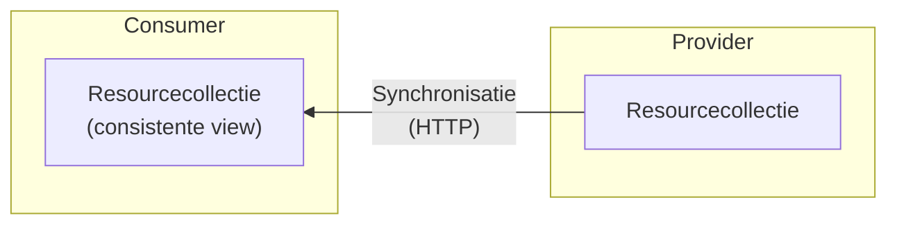
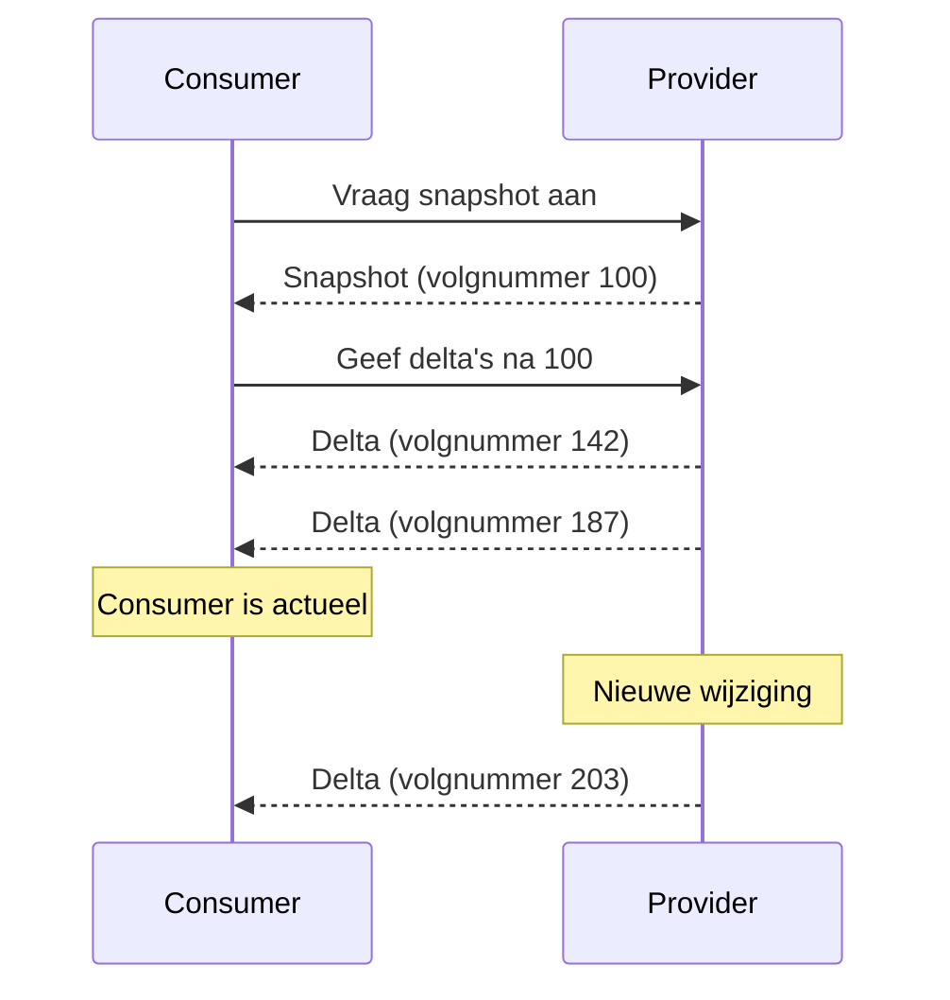

# Synchroniseren van resourcecollecties

Dit artikel beschrijft het **snapshots-en-delta's**-patroon waarmee een consumer
een continu veranderende resourcecollectie kan opvragen en bijhouden. Het
patroon is transport-onafhankelijk en werkt in REST-, SSE- en event-driven
opstellingen. Het kan daarmee volledig **in-band** (via hetzelfde API endpoint)
lopen — zonder extra infrastructuur zoals een message broker.



Een consumer kan op een recent moment inspringen — niet per se bij het begin.
Omdat het patroon geen volledige historische replay vereist, is het ook geschikt
voor resourcecollecties die persoonsgegevens kunnen bevatten: een volledige
geschiedenis van wijzigingen is niet
[AVG-conform](https://www.autoriteitpersoonsgegevens.nl/themas/basis-avg/privacyrechten-avg/recht-op-gegevens-verwijderen).

## Het probleem

Bestaande aanpakken schieten tekort:

- **Gepagineerde `GET`s en polling** geven page skew: bij een veranderende
  collectie kunnen items ontbreken of dubbel voorkomen. Zie
  [Paginering van resourcecollecties](./paginering-van-resourcecollecties.md)
  voor een uitleg van dit probleem.
- Patronen zonder snapshot-mechanisme lossen het inspringprobleem niet op: een
  nieuwe consumer weet niet hoe hij de begintoestand opbouwt.

## Garanties

Dit patroon biedt de volgende garanties:

- **[Snapshot isolation](https://en.wikipedia.org/wiki/Snapshot_isolation)**:
  het snapshot beschrijft de collectie zoals die bestond op één logisch moment,
  ongeacht wijzigingen daarna.
- **Sterke consistentie**: dit patroon biedt
  [sequentiële consistentie](https://en.wikipedia.org/wiki/Consistency_model#Sequential_consistency)
  per collectie — alle consumers zien wijzigingen in dezelfde totale volgorde.
  Wie twee collecties combineert — elk met eigen volgnummers — heeft
  [causale consistentie](https://en.wikipedia.org/wiki/Consistency_model#Causal_consistency)
  tussen de streams: de volgorde binnen elke collectie is gegarandeerd, maar er
  is geen totale volgorde over de twee streams heen.
- **Inhaalbaarheid en inspringen**: op basis van een volgnummer kan een consumer
  op elk moment inspringen — zowel een nieuwe consumer die na het snapshot
  begint als een consumer die na een onderbreking gemiste wijzigingen opnieuw
  opvraagt. Het volgnummer is de enige coördinatieprimitief die hiervoor nodig
  is.

Deze garanties hebben een prijs: een consumer loopt altijd enigszins achter op
de werkelijkheid. Bij REST polling zit er een venster tussen het moment van een
wijziging en het moment van opvragen. Bij SSE en event-driven varianten is de
latentie kleiner, maar nooit nul. De toestand die een consumer ziet is altijd
intern consistent — ze beschrijft een werkelijke vroegere toestand van de
collectie — maar ze kan verouderd zijn.

## Het patroon

Het patroon bestaat uit twee fases:

1. **Snapshot**: de consumer haalt een consistente momentopname van de volledige
   collectie op. Het snapshot eindigt met een volgnummer dat aangeeft op welk
   moment de momentopname is genomen.
2. **Delta's**: de consumer vraagt alle wijzigingen op die ná het snapshot zijn
   opgetreden, gesorteerd op oplopend volgnummer. Zodra de consumer bij de
   huidige toestand is, blijft hij luisteren of pollt hij periodiek.



## Snapshot ophalen

De provider maakt een consistente momentopname door een databasetransactie te
starten met tenminste `repeatable read`-isolatieniveau. Daarmee blijft de
gelezen toestand stabiel voor de hele duur van het snapshot, ook als de
onderliggende collectie ondertussen wijzigt.

De consumer vraagt het snapshot op en verwerkt de inhoud totdat het
eindvolgnummer bereikt is:

```http
GET /resources/snapshots/latest
→ 200 OK
  {"items": [...], "snapshot_seq": 100}
```

Het `snapshot_seq`-veld is de cursor van de consumer na het ophalen van het
snapshot: het snapshot omvat alle wijzigingen tot en met `100`. Elk delta met
een `seq` _groter dan_ `100` is nog niet in het snapshot verwerkt en moet na het
ophalen worden toegepast.

Volgnummers zijn strikt oplopend maar hoeven niet aaneengesloten te zijn. Tussen
`100` en de eerste delta kan een groot gat zitten — dat is normaal. Wat telt is
de volgorde, niet de stap.

## Delta's volgen

De consumer beheert een cursor: het volgnummer van zijn huidige lokale toestand
(na het snapshot: `snapshot_seq`). Hij vraagt alle delta's op met een `seq`
groter dan zijn cursor, en verwerkt ze in volgorde.

Een delta met `seq: 142` brengt de lokale toestand naar `142`. De delta bevat
zowel de inhoudelijke wijziging als het nieuwe volgnummer — na het toepassen
ervan zet de consumer zijn cursor naar `142`. Dat getal hoeft niet geconsecutief
te zijn met de vorige cursor: als het snapshot eindigt op `100` en de eerste
delta `seq: 142` heeft, is dat normaal. Wat telt is dat de consumer de delta's
in oplopende volgorde verwerkt en zijn cursor bijhoudt.

Elk delta-bericht bevat het volgnummer, het type wijziging en de betrokken
resource:

```json
{
  "seq": 142,
  "type": "updated",
  "id": "item-abc",
  "resource": { "...": "..." }
}
```

De keuze voor een transportvorm verandert het semantische model niet. Dezelfde
`seq`-waarden, hetzelfde event-model, dezelfde inhaalbaarheid — alleen het
mechanisme verschilt.

### REST polling

De consumer vraagt periodiek nieuwe delta's op:

```http
GET /resources/changes?after=100
→ 200 OK
  {"items": [{"seq": 142, ...}, {"seq": 187, ...}], "next_seq": 187}
```

Eenvoudig te implementeren; geen langdurige verbinding nodig. Nadeel: er zit
latentie tussen het moment van de wijziging en het moment van opvragen.

### Server-Sent Events (SSE)

De consumer opent een langdurige verbinding; de provider pusht delta's zodra ze
beschikbaar zijn:

```http
GET /resources/changes
Last-Event-ID: 100
Accept: text/event-stream

→ 200 OK  (text/event-stream)

id: 102
data: {"seq": 102, "type": "updated", "id": "item-abc", ...}

id: 103
data: {"seq": 103, "type": "deleted", "id": "item-xyz"}
```

De `Last-Event-ID`-header fungeert als catch-up-mechanisme: na een verbroken
verbinding hervat de consumer automatisch vanaf het laatste verwerkte
volgnummer. SSE ondersteunt dit van nature en is hiermee bijzonder geschikt voor
dit patroon.

### Event-driven (via broker)

De provider publiceert delta's op een topic; de consumer verwerkt ze op eigen
tempo:

```
topic: nl.example.resources.changes
message: {"seq": 102, "type": "updated", "id": "item-abc", ...}
```

Geschikt wanneer consumer en provider ontkoppeld moeten zijn qua timing. De
consumer beheert zelf de offset of cursor in de broker. Het snapshot wordt in
dit geval doorgaans nog steeds via REST opgehaald.

## Wanneer opnieuw synchroniseren

Als delta's niet langer beschikbaar zijn voor het gevraagde volgnummer — doordat
de provider delta's na een bepaalde periode verwijdert — moet de consumer
opnieuw beginnen: een nieuw snapshot ophalen en delta's verwerken vanaf het
bijbehorende volgnummer.

Gaps in de reeks zijn geen fout maar een grenssignaal: de provider geeft aan dat
hij geen volledige historie meer garandeert voor dat volgnummer.

## Implementatie-aandachtspunten

### Strikt oplopend volgnummer

Elke delta moet een uniek en oplopend volgnummer hebben. Daarmee weet een
consumer precies welke wijzigingen al verwerkt zijn en welke nog ontbreken.

### Geen wijzigingen verliezen tijdens snapshotten

Een cruciale verantwoordelijkheid van de provider is dat er geen wijzigingen
verloren gaan die optreden terwijl een snapshot wordt verstuurd. Zorg dat de
bron van delta's — bijvoorbeeld een

<!-- [transactionele outbox](./transactionele-outbox.md) — niet wordt geleegd terwijl -->

het snapshot nog actief is.

De provider kan op basis van beschikbare volgnummers bepalen of een consumer kan
volstaan met delta's, of eerst opnieuw een snapshot nodig heeft.

### Geen volledige geschiedenis

Dit patroon biedt nadrukkelijk geen complete geschiedenis van alle wijzigingen.
Als een consumer te ver achteroploopt en een delta niet meer beschikbaar is,
moet opnieuw een volledig snapshot worden opgehaald. Systemen die een complete
wijzigingshistorie nodig hebben, vereisen een ander patroon.

## Gerelateerde patronen

- Voor navigatie door de snapshot-pagina's (en een vergelijking van
pagineerstrategieën), zie
[Paginering van resourcecollecties](./paginering-van-resourcecollecties.md).
<!-- - Voor betrouwbare publicatie van wijzigingen aan de providerzijde, zie
  [Transactionele outbox](./transactionele-outbox.md). -->
- Voor een bredere introductie op event-driven communicatiepatronen, zie
  [Event Driven Architecture](./eda.md).
