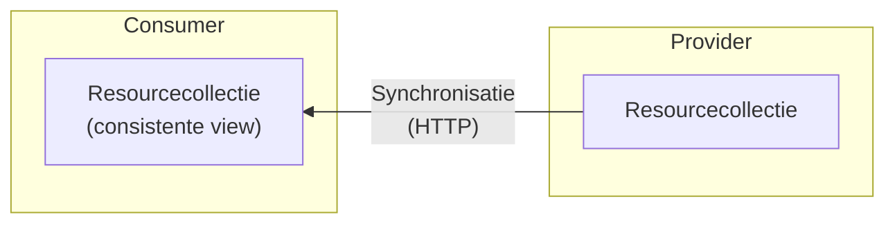
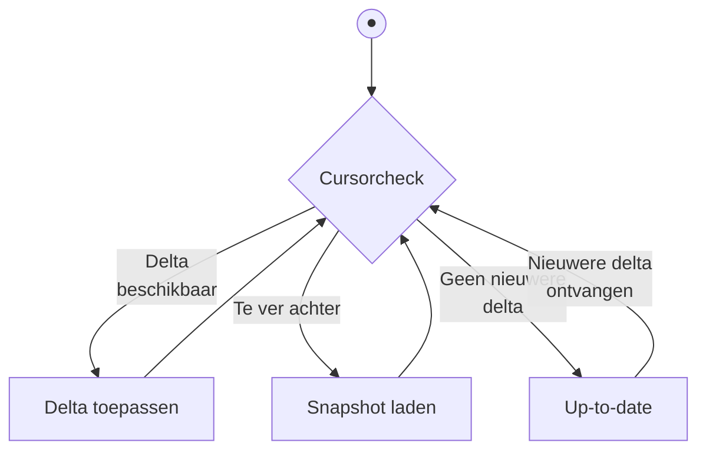
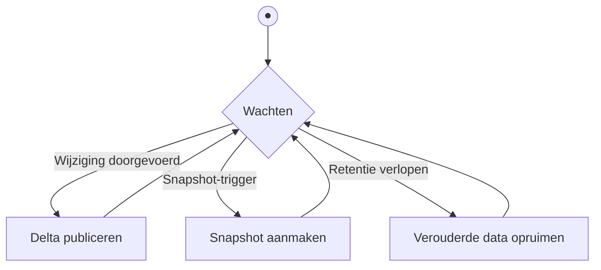

# Synchroniseren van resourcecollecties

Dit artikel beschrijft het **snapshots-en-delta's**-patroon waarmee een consumer
synchroon kan lopen met een continu veranderende resourcecollectie van
arbitraire grootte. Het patroon is transport-agnostisch: het werkt over HTTP
(polling of SSE) of via een message broker. Over HTTP kan het een extensie zijn
van een bestaande API — zonder extra modules of diensten.



Een consumer kan op een recent moment inspringen — niet per se bij het begin.
Omdat het patroon geen volledige historische replay vereist, hoeft een provider
ook geen onbeperkte wijzigingsgeschiedenis beschikbaar te houden. Dat past beter
bij resourcecollecties met persoonsgegevens, waar dataminimalisatie en
bewaartijd expliciete ontwerpkeuzes zijn.

De provider kan op elk moment een nieuwe snapshot publiceren — na een
datamigratie, schemawijziging, complete reset of nadat het recht op verwijderen
is toegepast. Consumers ontdekken dit vanzelf via het protocol en synchroniseren
opnieuw zonder dat de provider ze actief hoeft te notificeren.

## Het probleem

In gedistribueerde systemen hebben consumers vaak behoefte aan een actuele,
lokale kopie (een _mirror_ of _read model_) van een resourcecollectie. Dit stelt
hen in staat om data snel te bevragen, lokaal te verrijken of te koppelen, en
autonomer te opereren. Zodra de dataset echter groot is en de updates frequent
zijn, lopen bestaande synchronisatie-benaderingen tegen technische grenzen aan:

- **Naïef periodiek ophalen schaalt niet:** Bij grote collecties (bijvoorbeeld
  honderdduizenden records) is het periodiek inlezen van de volledige set
  onwerkbaar. Het resulteert in onnodig netwerkverkeer, langdurige
  verwerkingstijden en onnodige druk op de systemen van de provider.
- **Gepagineerde `GET`s lijden onder 'page skew':** Vraagt een consumer de data
  in stukjes op en muteert de collectie in de tussentijd, dan verschuiven de
  records over de paginagrenzen. Tijdens dit proces kunnen items ongemerkt
  worden overgeslagen of dubbel worden ingelezen. Zie
  [Paginering van resourcecollecties](./paginering-van-resourcecollecties.md)
  voor een uitleg van dit probleem.
- **Event-streams missen een 'cold start':** Via event streaming of webhooks
  ontvangen consumers real-time updates over wijzigingen. Dit model faalt echter
  bij de initiële opstart (_bootstrapping_): hoe bouwt een nieuwe consumer zijn
  begintoestand op? Zacht-ontkoppelde patronen zonder snapshot-mechanisme
  dwingen af dat alle historische events ooit afgespeeld moeten worden (event
  sourcing). Dit hindert snelle opschaling, is vaak onpraktisch groot en schuurt
  sterk met kaders inzake dataminimalisatie en de AVG.

Kortom: er mist in standaard REST of pub/sub benaderingen een gestandaardiseerde
methode die veilig grootschalige initiële opstart (_snapshots_) combineert met
betrouwbare doorlopende incrementele verwerking (_delta's_).

## Garanties

Dit patroon biedt de volgende garanties:

- **[Snapshot isolation](https://en.wikipedia.org/wiki/Snapshot_isolation)**:
  het snapshot beschrijft de collectie zoals die bestond op één logisch moment,
  ongeacht wijzigingen daarna.
- **Deterministische volgorde per collectie**: de delta-keten definieert één
  totale volgorde per collectie. Consumers die dezelfde snapshots en delta's in
  die volgorde toepassen, eindigen daarom in dezelfde toestand. Wie twee
  collecties combineert — elk met eigen id's — heeft geen totale volgorde over
  beide stromen heen.
- **Inhaalbaarheid en inspringen**: via de cursor kan een consumer op elk moment
  inspringen — zowel een nieuwe consumer die nog geen lokale toestand heeft als
  een consumer die na een onderbreking gemiste wijzigingen bijwerkt.

Deze garanties volgen direct uit de mechaniek van het patroon. Een snapshot
geeft een stabiel startpunt; daarna kan een consumer alleen verder als de
volgende delta met `prev_id` exact aansluit op de huidige cursor. Zodra die
aansluiting ontbreekt, is gecontroleerd herstel nodig: opnieuw beginnen vanaf
een nieuw snapshot.

Deze garanties hebben een prijs: een consumer loopt altijd enigszins achter op
de werkelijkheid. Bij REST polling zit er een venster tussen het moment van een
wijziging en het moment van opvragen. Bij SSE en event-driven varianten is de
latentie kleiner, maar nooit nul. De toestand die een consumer ziet is altijd
intern consistent — ze beschrijft een werkelijke vroegere toestand van de
collectie — maar ze kan verouderd zijn.

## Het patroon

Het patroon werkt met drie begrippen:

- **Snapshot**: een consistente momentopname van de volledige resourcecollectie
  op één moment. Een snapshot heeft een uniek `id` — dit kan een getal, een
  tijdstempel of een hash zijn; de provider bepaalt de vorm. Een snapshot is het
  startpunt voor een consumer die nog geen lokale toestand heeft. De
  begintoestand van het systeem is een snapshot (eventueel leeg) met een door de
  provider toegewezen initieel `id`.
- **Delta**: een atomaire stap in de wijzigingsreeks. Dit kan één enkele mutatie
  op een resource zijn, of een groepering van in één transactie samengevoegde
  mutaties. De consumer past een delta volledig toe of helemaal niet. Elke delta
  heeft een `id` en een `prev_id`; een delta is toepasbaar als diens `prev_id`
  overeenkomt met de cursor, waarna de cursor het `id` van de delta wordt. In de
  verdere eenvoudige voorbeelden hieronder staat elke delta gelijk aan één
  resourcewijziging.
- **Cursor**: het `id` van de laatste verwerkte snapshot of delta, lokaal
  bijgehouden door de consumer. Een consumer zonder cursor heeft nog geen
  snapshot opgehaald.

### Consumer

De consumer doorloopt continu een cursorcheck die bepaalt wat de volgende stap
is:



- **Delta toepassen**: er is een delta beschikbaar voor de cursor. De consumer
  past de delta toe en schuift de cursor op.
- **Snapshot laden**: de consumer is te ver achter; de provider heeft geen delta
  voor de huidige cursor. De consumer haalt een nieuw snapshot op om in te
  springen.
- **Up-to-date**: er zijn geen nieuwere delta's. De consumer wacht op de
  volgende delta (via SSE of polling).

### Provider

De provider kent een vergelijkbare cyclus:



- **Delta publiceren**: bij elke wijziging of groep wijzigingen legt de provider
  een delta atomair vast — met een nieuw `id` en het vorige `id` als `prev_id`.
  De delta-keten blijft zo aaneengesloten.
- **Snapshot aanmaken**: na een datamigratie, schemawijziging, toepassing van
  het recht op verwijdering of een andere complete reset maakt de provider een
  nieuw snapshot aan. Consumers ontdekken dit vanzelf: bij polling en
  SSE-herverbinding via `410 Gone`, bij webhooks en broker via een
  `prev_id`-mismatch in de volgende ontvangen delta.
- **Verouderde data opruimen**: na het verstrijken van de retentieperiode
  verwijdert de provider snapshots en delta's. Bij polling en SSE-herverbinding
  ontvangen consumers met een verlopen cursor `410 Gone`; bij webhooks en broker
  signaleert een `prev_id`-mismatch dat de cursor verlopen is.

## REST API

De onderstaande invulling is een aanbeveling. Het patroon zelf — snapshot,
delta, cursor — is leidend; de URL-structuur en veldnamen zijn niet verplicht.
Wie de aanbeveling volgt, maakt zijn API direct bruikbaar voor consumers die het
patroon kennen.

Het patroon voegt twee sub-resources toe aan een (eventueel bestaande)
collectie:

```text
GET /resources/             → de collectie zelf (ongewijzigd)
GET /resources/snapshots/   → lijst van beschikbare snapshots
GET /resources/snapshots/42 → inhoud van snapshot 42 (offset + limit)
GET /resources/deltas/      → stroom van delta's (polling of SSE);
                              geen individuele delta's
```

### Snapshot ophalen

De provider biedt een lijst van beschikbare snapshots. De consumer vraagt deze
op en kiest het meest recente:

```http
GET /resources/snapshots
→ 200 OK
  {
    "items": [
      {"id": 42, "created_at": "2026-05-13T10:00:00Z", "total": 850}
    ]
  }
```

Vervolgens haalt de consumer de inhoud op via het id. Grote snapshots worden
gepagineerd geserveerd met offset-paginering; alle chunks hebben hetzelfde `id`.
Via `total` berekent de consumer alle offsets vooraf en haalt de chunks op —
sequentieel of parallel:

```http
GET /resources/snapshots/42?limit=100             → {"id": 42, "items": [...]}
GET /resources/snapshots/42?offset=100&limit=100  → {"id": 42, "items": [...]}
GET /resources/snapshots/42?offset=200&limit=100  → {"id": 42, "items": [...]}
…
```

Omdat snapshots statisch zijn, treedt er geen page skew op. De consumer laadt
het nieuwe snapshot bij voorkeur in een aparte staging-area en schakelt pas over
naar de nieuwe toestand — en verwijdert de vorige — als alle chunks succesvol
zijn binnengekomen. Na de laatste chunk stelt de consumer de cursor in op `42`.
De provider houdt snapshots beschikbaar gedurende een vaste retentieperiode
zodat consumers de tijd hebben om ze volledig te downloaden.

Snapshot-chunks zijn statische bestanden en kunnen potentieel groot zijn. Ze
lenen zich daardoor voor distributie via een CDN, wat een API gateway kan
ontlasten.

### Delta's ophalen

#### Formaat van delta's

Een delta is de concrete schakel tussen de garanties hierboven en de
implementatie hieronder: de consumer kan alleen veilig doorschuiven als elke
delta expliciet aangeeft op welke vorige toestand hij aansluit.

```json
{
  "id": 57,
  "prev_id": 42,
  "operations": [
    {
      "type": "updated",
      "resource_id": "item-abc",
      "resource": {
        "id": "item-abc",
        "name": "Resource ABC - Gewijzigd",
        "status": "actief"
      }
    }
  ]
}
```

Een delta bevat altijd een array van operaties (`operations`), ook als er maar
één wijziging is. Zo kan de provider meerdere samenhangende mutaties in één keer
laten toepassen.

Elke operatie heeft minimaal een `type`:

- `created`: een nieuwe resource is toegevoegd.
- `updated`: een bestaande resource is gewijzigd of vervangen.
- `deleted`: een resource is verwijderd; het `resource`-veld ontbreekt dan
  bewust (tombstone).

In de aanbevolen vorm bevat `resource` steeds de volledige resulterende weergave
van het record (_Event-Carried State Transfer_). Dat is het meest robuust en
sterk aanbevolen: de consumer hoeft geen vorige toestand op te halen om de
wijziging te begrijpen, en retries blijven idempotent.

Het veld `resource_id` staat bewust ook buiten het `resource`-object. Bij een
`deleted`-operatie is dat noodzakelijk, omdat er dan geen `resource` meer is.
Daarnaast kunnen consumers en tussenliggende brokers zo filteren en routeren op
ID en type zonder eerst een zwaardere payload te deserialiseren.

Alleen als resources extreem groot zijn en bandbreedte de doorslag geeft, kan de
provider in plaats van de volledige resource ook een
[JSON Merge Patch (RFC 7396)](https://datatracker.ietf.org/doc/html/rfc7396) of
[JSON Patch (RFC 6902)](https://datatracker.ietf.org/doc/html/rfc6902)
meesturen. Dat maakt de consumer-logica wel complexer, omdat patching pad- en
schema-afhankelijk is en correct herstel na _out-of-order_ events lastiger
wordt.

#### Polling

De consumer vraagt periodiek nieuwe delta's op via zijn cursor:

```http
GET /resources/deltas?after=42&limit=10
→ 200 OK
  {
    "items": [
      {
        "id": 57,
        "prev_id": 42,
        "operations": [
          {
            "type": "updated",
            "resource_id": "item-abc",
            "resource": { "id": "item-abc", "name": "Resource ABC - Gewijzigd", "status": "actief" }
          }
        ]
      },
      {
        "id": 63,
        "prev_id": 57,
        "operations": [
          {
            "type": "deleted",
            "resource_id": "item-xyz"
          }
        ]
      }
    ]
  }
```

De consumer past elke delta toe en zet de cursor naar het `id` van de laatste
verwerkte delta. Ontvangt de consumer onverhoopt een delta waarvan het `id` al
gelijk is aan of ouder is dan de huidige cursor (bijvoorbeeld bij
netwerk-retries), dan negeert de consumer deze (idempotentie). Een lege
items-lijst betekent dat de consumer actueel is.

Als de cursor niet meer bekend is bij de provider, antwoordt de provider met
`410 Gone`:

```http
GET /resources/deltas?after=99
→ 410 Gone
```

De consumer weet dan dat hij opnieuw een snapshot moet ophalen.

#### Streaming (SSE)

De consumer opent een langdurige verbinding; de provider pusht delta's zodra ze
beschikbaar zijn. De consumer stuurt `Last-Event-ID` mee als cursor — zowel bij
de initiële verbinding als bij herverbinding na een onderbreking:

```http
GET /resources/deltas
Accept: text/event-stream
Last-Event-ID: 42

→ 200 OK (text/event-stream)

id: 57
data: {"id": 57, "prev_id": 42, "operations": [{"type": "updated", "resource_id": "item-abc", ...}]}

id: 63
data: {"id": 63, "prev_id": 57, "operations": [{"type": "deleted", "resource_id": "item-xyz"}]}
```

De consumer valideert bij elke ontvangen delta dat `prev_id` overeenkomt met de
huidige cursor. Een mismatch signaleert een hiaat: de consumer sluit de
verbinding en behandelt dit identiek aan een `410 Gone`.

Een open SSE-verbinding kan geen `410 Gone` ontvangen: de HTTP-statuscode ligt
vast op `200 OK` zodra de verbinding is opgezet. Raakt de cursor verlopen
terwijl de verbinding open staat, dan sluit de provider de verbinding:

```http
GET /resources/deltas
Accept: text/event-stream
Last-Event-ID: 42

→ 200 OK (text/event-stream)

id: 57
data: {"id": 57, "prev_id": 42, ...}

← verbinding gesloten door provider
```

Bij herverbinding stuurt de consumer opnieuw `Last-Event-ID`; de provider
antwoordt dan met `410 Gone`:

```http
GET /resources/deltas
Accept: text/event-stream
Last-Event-ID: 99
→ 410 Gone
```

De consumer haalt dan een nieuw snapshot op en opent daarna een nieuwe
verbinding met de cursor van dat snapshot.

Een robuuste consumer behandelt beide situaties — mismatch en `410 Gone` — als
hetzelfde herstelpad: verbinding verbreken, nieuw snapshot ophalen, opnieuw
verbinden met de cursor van dat snapshot.

#### Webhooks

De provider pusht delta's naar een endpoint van de consumer zodra ze beschikbaar
zijn:

```http
POST https://consumer.example.nl/webhook/resources
Content-Type: application/json

{
  "id": 57,
  "prev_id": 42,
  "operations": [
    {
      "type": "updated",
      "resource_id": "item-abc",
      "resource": {
        "id": "item-abc",
        "name": "Resource ABC - Gewijzigd"
      }
    }
  ]
}
```

De consumer valideert `prev_id` bij elk ontvangen bericht. Omdat webhooks
asynchroon zijn en berichten _out-of-order_ kunnen arriveren, signaleert een
mismatch met de cursor in eerste instantie een _gap_ in de correcte volgorde.
Een robuuste consumer buffert de onverwachte delta dan tijdelijk. Als de
ontbrekende voorgaande delta niet binnen een redelijke termijn arriveert, neemt
de consumer aan dat de delta-keten is gereset of de cursor verlopen is, en haalt
een nieuw snapshot op via de snapshot-API.

Bij polling en SSE initieert de consumer alle verbindingen, waardoor alleen
eenzijdige authenticatie nodig is. Webhooks — waarbij de provider actief naar de
consumer pusht — vereisen een publiek bereikbaar consumer-endpoint en
tweezijdige authenticatie.

#### CloudEvents

Delta's kunnen in een [CloudEvents](https://cloudevents.io/)-envelop worden
verpakt, ongeacht het transportmechanisme (HTTP, SSE, broker):

```json
{
  "specversion": "1.0",
  "type": "nl.example.resources.updated",
  "source": "/resources",
  "id": "57",
  "data": {
    "id": 57,
    "prev_id": 42,
    "operations": [
      {
        "type": "updated",
        "resource_id": "item-abc",
        "resource": {...}
      }
    ]
  }
}
```

CloudEvents standaardiseert de envelop; de delta-velden in `data` blijven
ongewijzigd.

## Event-driven (via broker)

De provider publiceert delta's op een topic; de consumer verwerkt ze op eigen
tempo:

```text
topic: nl.example.resources.changes
message: {"id": 57, "prev_id": 42, "operations": [{"type": "updated", "resource_id": "item-abc", ...}]}
```

Geschikt wanneer consumer en provider ontkoppeld moeten zijn qua timing. De
consumer beheert zelf de cursor in de broker. Het snapshot wordt doorgaans nog
steeds via REST opgehaald. De consumer valideert ook hier `prev_id`; net als bij
webhooks kan een mismatch duiden op _out-of-order_ aflevering of een
daadwerkelijke breuk in de keten. In dat laatste geval is het signaal om een
nieuw snapshot op te halen.

## Implementatie-aandachtspunten

### Gegarandeerde atomiciteit (Transactionele Outbox)

Om operaties op de juiste manier te groeperen als provider zonder
dataconsistentie te verliezen, kan het beste het
[Transactionele outbox](https://microservices.io/patterns/data/transactional-outbox.html)-patroon
worden gebruikt. Daarbij worden de databasewijzigingen aan de resource(s) én de
logvermelding met de _operations_-array als één database-transactie opgeslagen.
Een asynchrone worker leest vervolgens de outbox-tabel uit en deelt deze als
gegarandeerd correcte berichten via polling, webhooks of de message broker.

### Geen wijzigingen verliezen tijdens snapshotten

Een cruciale verantwoordelijkheid van de provider is de overlap tussen
snapshot-retentie en delta-retentie. Het downloaden van een groot snapshot kost
tijd. Als een consumer pas daarna overschakelt op delta's, mogen de delta's die
in de tussentijd zijn ontstaan niet al zijn opgeruimd. De retentie van delta's
moet daarom ruimschoots langer zijn dan de langst plausibele download- en
verwerkingstijd van een snapshot.

### Retentie van snapshots en delta's

De provider moet snapshots en delta's beschikbaar houden voor een
retentieperiode die groot genoeg is voor een consumer om ze te verwerken. Daarna
mag de provider ze verwijderen. Bij polling en SSE-herverbinding ontvangt de
consumer dan `410 Gone`; bij webhooks en broker detecteert de consumer een
`prev_id`-mismatch. In beide gevallen is de cursor verlopen en moet opnieuw een
snapshot worden opgehaald.

### Geen volledige geschiedenis

Dit patroon biedt nadrukkelijk geen complete geschiedenis van alle wijzigingen.
Systemen die een complete wijzigingshistorie nodig hebben, vereisen een ander
patroon.

## Gerelateerde patronen

- Voor navigatie door de snapshot-pagina's (en een vergelijking van
pagineerstrategieën), zie
[Paginering van resourcecollecties](./paginering-van-resourcecollecties.md).
<!-- - Voor betrouwbare publicatie van wijzigingen aan de providerzijde, zie
  [Transactionele outbox](./transactionele-outbox.md). -->
- Voor een bredere introductie op event-driven communicatiepatronen, zie
  [Event Driven Architecture](./eda.md).
