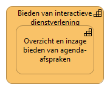
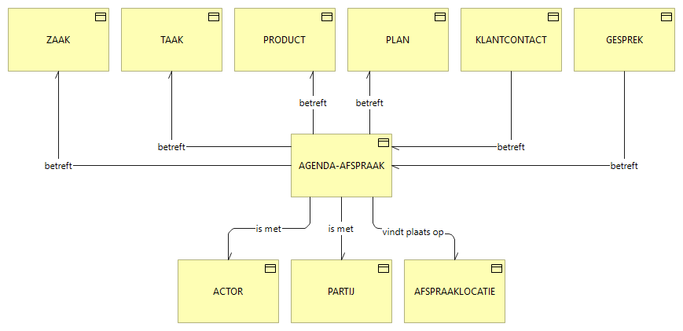
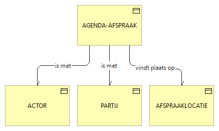
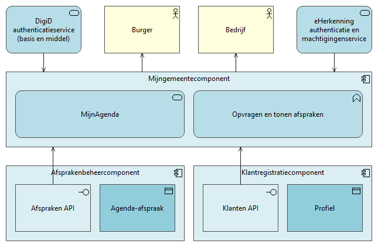
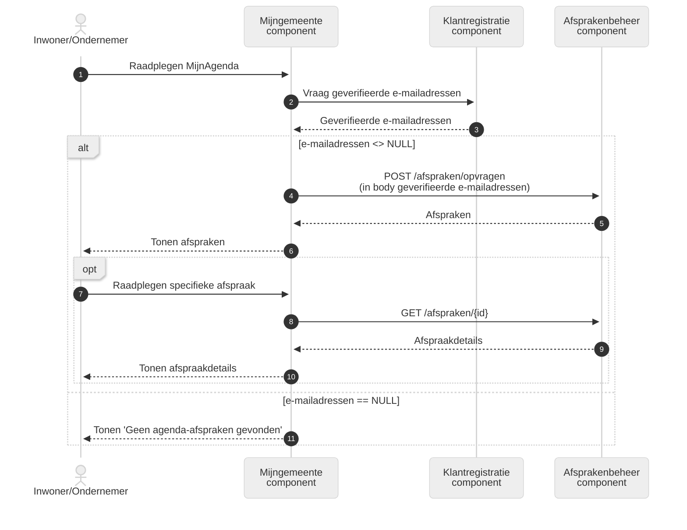
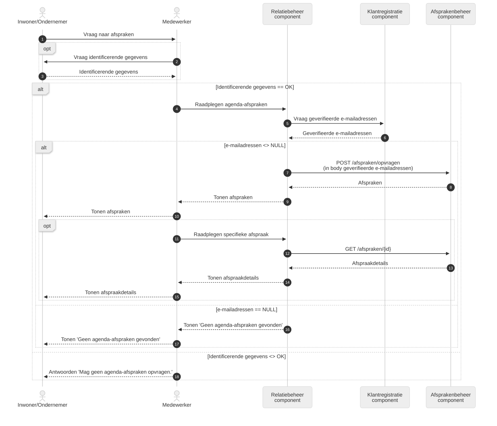
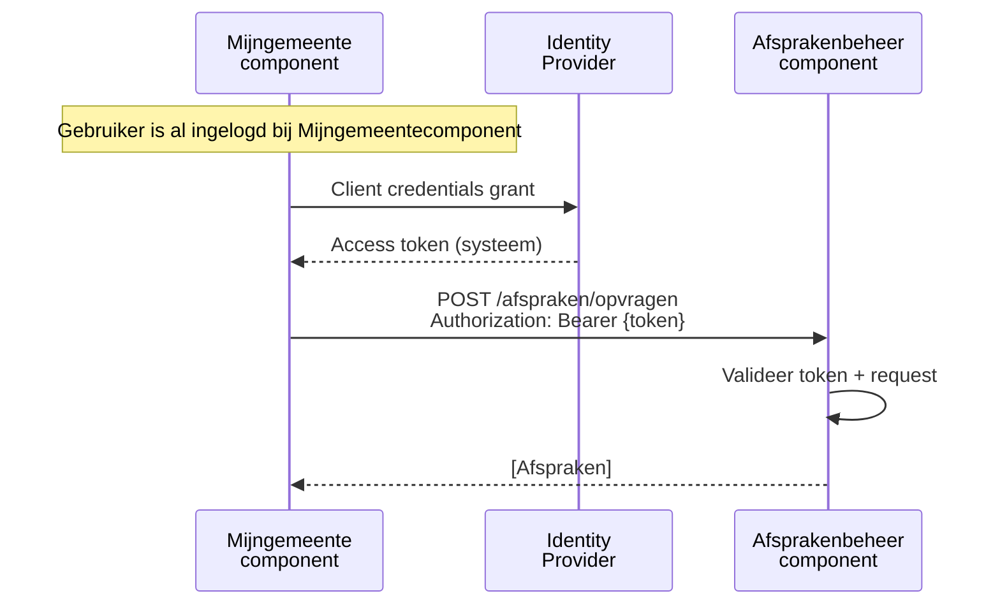

# MijnAgenda

Voor sommige producten of diensten van een gemeente is een afspraak met een
overheidsorganisatie nodig. Overheidsorganisaties bieden een webomgeving (via
een afsprakensysteem) aan waarmee inwoners of ondernemers een afspraak kunnen
inplannen. Als bij het maken van de afspraak ook een e-mailadres is ingevuld,
wordt een e-mail als bevestiging van de afspraak verstuurd. Naderhand is via de
link in de verstuurde e-mail de afspraak via hetzelfde afsprakensysteem in te
zien en aan te passen.

Om de gemaakte afspraken ook in een MijnOmgeving te kunnen tonen, is samen met
verschillende leveranciers van afsprakensystemen de MijnAgenda service
ontwikkeld. Inwoners of ondernemers die via een digitaal authenticatiemiddel
(zoals DigiD en eHerkenning) in een MijnOmgeving zijn ingelogd, kunnen dan hun
gemaakte afspraken ook hierin terugzien.

De MijnAgenda service biedt voorlopig alleen de functie voor het tonen van de
afspraken. Het kunnen maken, aanpassen of annuleren van afspraken wordt mogelijk
op een later moment toegevoegd.

## Uitgangspunten

- De interacties met MijnAgenda gaan ervan uit dat van een inwoner het
  identificerend gegeven BSN bekend is. Dit wordt normaliter verkregen via
  inlogmiddelen zoals DigiD, eIDAS 1.0 of EUDI Wallet.
- Bij interacties met een ondernemer is het uitgangspunt dat het KvK-nummer van
  de ondernemer bekend moet zijn. Dit wordt normaliter verkregen via het
  inlogmiddel eHerkenning.
- Bij de opzet van MijnAfspraken wordt het Common Ground principe van "eenmalig
  vastleggen en meervoudig gebruik" gehanteerd. Als bron voor de afspraken wordt
  het afsprakensysteem gebruikt. Er is dus geen sprake van een afzonderlijk
  afsprakenregister.
- De bronorganisatie (de overheidsorganisatie) kent slechts 1 afsprakensysteem.
  Mochten meerdere afsprakensystemen in gebruik zijn bij een
  overheidsorganisatie dan zal een "converter laag" nodig zijn. Dit is een laag
  die in staat is om de interacties met het afsprakensysteem om te zetten naar
  interacties met meerdere afspraaksystemen. Dit is echter een
  implementatievraagstuk en is daarom buiten scope van deze standaard geplaatst.
- Voor het maken van een afspraak in het afsprakensysteem logt de inwoner of
  ondernemer niet in via een digitaal authenticatiemiddel zoals DigiD of
  eHerkenning. Het afsprakensysteem kan geen BSN herleiden.
- Er wordt in het afsprakensysteem geen BSN opgeslagen.
- Voor het specificeren van de API's wordt de landelijk standaard gevolgd:
  [https://docs.geostandaarden.nl/api/API-Strategie/](https://docs.geostandaarden.nl/api/API-Strategie/).
- Er wordt gebruik gemaakt van OAuth 2.0 voor autorisatie in de API’s.
- Het afspraaksysteem levert alleen agenda-afspraken die niet geannuleerd zijn.
- Statusinformatie van de agenda-afspraak wordt door het afspraaksysteem niet
  geleverd.

## Uitgangspunten voor de pilot

Het ontwerp van de MijnAgenda Service heeft de scope zoals verwoord in de
uitgangspunten hierboven. Daarnaast wordt een eerste pilot opgestart waarvoor
een kleinere scope wordt gekozen:

- Aanmaken, wijzigen of annuleren van een afspraak gebeurt in het
  afsprakensysteem.
- Alleen afspraken die betrekking hebben op een inwoner worden getoond in de
  MijnOmgeving. Afspraken m.b.t. ondernemers zijn uit scope van de pilot.
- Het tonen van de afspraken in een KCC-applicatie is uit scope.
- Het opgegeven e-mailadres wordt gebruikt om afspraken aan een inwoner te
  koppelen nadat de inwoner via DigiD bij de MijnOmgeving is ingelogd.
- Het e-mailadres uit de afspraak wordt gecontroleerd tegen het geverifieerde
  e-mailadres uit het Profiel (MijnProfiel). Als dat gelijk is, wordt de
  afspraak in een MijnOmgeving getoond. (voorbeeld hiervan
  [https://redocly.github.io/redoc/?url=https://raw.githubusercontent.com/maykinmedia/open-klant/master/src/openklant/components/klantinteracties/openapi.yaml](https://redocly.github.io/redoc/?url=https://raw.githubusercontent.com/maykinmedia/open-klant/master/src/openklant/components/klantinteracties/openapi.yaml)).

## NL Design System

- Door het NL Design System te benoemen
- Documentatie is te vinden op onder andere
  [https://github.com/orgs/nl-design-system/discussions/categories/mijn-omgevingen](https://github.com/orgs/nl-design-system/discussions/categories/mijn-omgevingen)

## Use cases

## Inwoner

| Als         | inwoner                                                                                                                                                                                                                                                                    |
| ----------- | -------------------------------------------------------------------------------------------------------------------------------------------------------------------------------------------------------------------------------------------------------------------------- |
| wil ik      | mijn agenda-afspraken in een MijnOmgeving van een overheidsorganisatie zien                                                                                                                                                                                                |
| zodat       | ik kan zien wanneer ik een afspraak bij de overheidsorganisatie heb.                                                                                                                                                                                                       |
| Toelichting | De inwoner is ingelogd in de MijnOmgeving van de overheidsorganisatie via een sterk identificatiemiddel zoals DigiD. Er wordt een overzicht getoond van toekomstige agenda-afspraken en van agenda-afspraken die in het verleden hebben plaatsgevonden. **IN SCOPE PILOT** |

| Als         | inwoner                                                                                                                                                                                                                                                                                                                                                             |
| ----------- | ------------------------------------------------------------------------------------------------------------------------------------------------------------------------------------------------------------------------------------------------------------------------------------------------------------------------------------------------------------------- |
| wil ik      | detailgegevens van een mijn agenda-afspraken in een MijnOmgeving van een overheidsorganisatie zien                                                                                                                                                                                                                                                                  |
| zodat       | ik weet waarover de agenda-afspraak gaat en hoe laat ik waar moet zijn.                                                                                                                                                                                                                                                                                             |
| Toelichting | In de detailgegevens van de agenda-afspraak is meer informatie te vinden over de agenda-afspraak. Minimaal is te zien op welke datum en tijdstip de agenda-afspraak is/was. Ook is te zien op welke locatie de agenda-afspraak plaatsvindt/plaatsvond. Daarnaast kan ook aangeven worden waarover de afspraak gaat, zoals een aanvraag paspoort. **IN SCOPE PILOT** |

| Als         | inwoner                                                                          |
| ----------- | -------------------------------------------------------------------------------- |
| wil ik      | vanuit een MijnOmgeving een geplande agenda-afspraak kunnen annuleren            |
| zodat       | de overheidsorganisatie weet dat de agenda-afspraak niet door gaat.              |
| Toelichting | Een agenda-afspraak kan door een inwoner worden geannuleerd. **UIT SCOPE PILOT** |

| Als         | inwoner                                                                                                                                                                                                                                                                                                                                                                                                     |
| ----------- | ----------------------------------------------------------------------------------------------------------------------------------------------------------------------------------------------------------------------------------------------------------------------------------------------------------------------------------------------------------------------------------------------------------- |
| wil ik      | vanuit een MijnOmgeving een geplande agenda-afspraak van datum en tijd kunnen wijzigen                                                                                                                                                                                                                                                                                                                      |
| zodat       | de agenda-afspraak beter aansluit bij mijn beschikbaarheid.                                                                                                                                                                                                                                                                                                                                                 |
| Toelichting | Als de agenda-afspraak niet past bij de beschikbaarheid van de inwoner, moet de inwoner de agenda-afspraak vanuit een MijnOmgeving kunnen aanpassen. Het gaat hier om het aanpassen naar een andere datum en tijdstip of naar een ander tijdstip op dezelfde dag. De nieuwe datum en/of tijdstip moet gekozen kunnen worden uit beschikbare data en tijden van de overheidsorganisatie. **UIT SCOPE PILOT** |

| Als         | inwoner                                                                                                              |
| ----------- | -------------------------------------------------------------------------------------------------------------------- |
| wil ik      | een e-mailbevestiging ontvangen als ik aan agenda-afspraak heb gewijzigd of heb geannuleerd                          |
| zodat       | ik weet dat de agenda-afspraak is aangepast.                                                                         |
| Toelichting | De e-mailbevestiging wordt gestuurd naar het e-mailadres dat is opgegeven in de agenda-afspraak. **UIT SCOPE PILOT** |

## Ondernemer

| Als         | ondernemer                                                                                                                                                                                                                                                                           |
| ----------- | ------------------------------------------------------------------------------------------------------------------------------------------------------------------------------------------------------------------------------------------------------------------------------------ |
| wil ik      | mijn agenda-afspraken in een MijnOmgeving van een overheidsorganisatie zien                                                                                                                                                                                                          |
| zodat       | ik kan zien wanneer ik een afspraak bij de overheidsorganisatie heb                                                                                                                                                                                                                  |
| Toelichting | De ondernemer is ingelogd in de MijnOmgeving van de overheidsorganisatie via een sterk identificatiemiddel zoals eHerkenning. Er wordt een overzicht getoond van toekomstige agenda-afspraken en van agenda-afspraken die in het verleden hebben plaatsgevonden. **UIT SCOPE PILOT** |

| Als         | ondernemer                                                                                                                                                                                                                                                                                                                                                             |
| ----------- | ---------------------------------------------------------------------------------------------------------------------------------------------------------------------------------------------------------------------------------------------------------------------------------------------------------------------------------------------------------------------- |
| wil ik      | detailgegevens van een mijn agenda-afspraken in een MijnOmgeving van een overheidsorganisatie zien                                                                                                                                                                                                                                                                     |
| zodat       | ik weet waarover de agenda-afspraak gaat en hoe laat ik waar moet zijn                                                                                                                                                                                                                                                                                                 |
| Toelichting | In de detailgegevens van de agenda-afspraak is meer informatie te vinden over de agenda-afspraak. Minimaal is te zien op welke datum en tijdstip de agenda-afspraak is/was. Ook is te zien op welke locatie de agenda-afspraak plaatsvindt/plaatsvond. Daarnaast kan ook aangeven worden waarover de afspraak gaat, zoals een aanvraag vergunning. **UIT SCOPE PILOT** |

| Als         | ondernemer                                                                          |
| ----------- | ----------------------------------------------------------------------------------- |
| wil ik      | vanuit een MijnOmgeving een geplande agenda-afspraak kunnen annuleren               |
| zodat       | de overheidsorganisatie weet dat de agenda-afspraak niet door gaat.                 |
| Toelichting | Een agenda-afspraak kan door een ondernemer worden geannuleerd. **UIT SCOPE PILOT** |

| Als         | ondernemer                                                                                                                                                                                                                                                                                                                                                                                                        |
| ----------- | ----------------------------------------------------------------------------------------------------------------------------------------------------------------------------------------------------------------------------------------------------------------------------------------------------------------------------------------------------------------------------------------------------------------- |
| wil ik      | vanuit een MijnOmgeving een geplande agenda-afspraak van datum en tijd kunnen wijzigen                                                                                                                                                                                                                                                                                                                            |
| zodat       | de agenda-afspraak beter aansluit bij mijn beschikbaarheid.                                                                                                                                                                                                                                                                                                                                                       |
| Toelichting | Als de agenda-afspraak niet past bij de beschikbaarheid van de ondernemer, moet de ondernemer de agenda-afspraak vanuit een MijnOmgeving kunnen aanpassen. Het gaat hier om het aanpassen naar een andere datum en tijdstip of naar een ander tijdstip op dezelfde dag. De nieuwe datum en/of tijdstip moet gekozen kunnen worden uit beschikbare data en tijden van de overheidsorganisatie. **UIT SCOPE PILOT** |

| Als         | ondernemer                                                                                                           |
| ----------- | -------------------------------------------------------------------------------------------------------------------- |
| wil ik      | een e-mailbevestiging ontvangen als ik aan agenda-afspraak heb gewijzigd of heb geannuleerd                          |
| zodat       | ik weet dat de agenda-afspraak is aangepast.                                                                         |
| Toelichting | De e-mailbevestiging wordt gestuurd naar het e-mailadres dat is opgegeven in de agenda-afspraak. **UIT SCOPE PILOT** |

## KCC-medewerker

| Als         | KCC-medewerker                                                                                                                                                                                                                                             |
| ----------- | ---------------------------------------------------------------------------------------------------------------------------------------------------------------------------------------------------------------------------------------------------------- |
| wil ik      | agenda-afspraken van een inwoner of ondernemer in een KCC-applicatie zien                                                                                                                                                                                  |
| zodat       | ik kan zien wanneer inwoner of ondernemer een afspraak bij de overheidsorganisatie heeft.                                                                                                                                                                  |
| Toelichting | Agenda-afspraken mogen alleen opgevraagd worden als met zekerheid is vastgesteld dat de inwoner of ondernemer is, die hij/zij zegt dat hij/zij is. Een opgegeven/opgevraagd BSN wordt gebruikt om de agenda-afspraken te kunnen tonen. **UIT SCOPE PILOT** |

| Als         | KCC-medewerker                                                                                                                                                                                                                            |
| ----------- | ----------------------------------------------------------------------------------------------------------------------------------------------------------------------------------------------------------------------------------------- |
| wil ik      | een attendering ontvangen als een inwoner of ondernemer een agenda-afspraak heeft gewijzigd of heeft geannuleerd                                                                                                                          |
| zodat       | ik weet dat de agenda-afspraak is aangepast.                                                                                                                                                                                              |
| Toelichting | De attendering kan op verschillende manieren plaatsvinden: via een e-mail naar de medewerker die betrokken is bij de agenda-afspraak, of via een attendering in een applicatie dat door de medewerker wordt gebruikt. **UIT SCOPE PILOT** |

## Architectuur

In dit hoofdstuk wordt de architectuur beschreven van de MijnAgenda service. De
capabilities (wat moet een organisatie kunnen) zijn verwoord, het
bedrijfsobjectenmodel wordt beschreven, de informatiearchitectuur is
gemodelleerd en de sequentie diagrammen zijn getekend.

## Capabilities

Capabilities geven aan wat een organisatie doet in het kader van de MijnAgenda.
Het geeft aan welke vaardigheden een organisatie moet bezitten. Hoe een
organisatie dat doet en hoe een organisatie de vaardigheden inzet, wordt
gemodelleerd door diensten en processen.

Onderstaande capability is onderdeel van een andere, algemenere capability:
‘Bieden van interactieve dienstverlening’. Deze capability is van toepassing op
Omnichannel en daarmee ook op de afzonderlijke MijnServices, zoals MijnAgenda.
Naast de capability ten behoeve van MijnAgenda, zijn er in de algemene
capability ook capabilities opgenomen voor MijnZaken, Mijntaken,
MijnContactmomenten, MijnBerichten en Notificieren.



| **Capability**                                  | **Toelichting**                                                                                                                                                                                                                                                                                                                                                 |
| ----------------------------------------------- | --------------------------------------------------------------------------------------------------------------------------------------------------------------------------------------------------------------------------------------------------------------------------------------------------------------------------------------------------------------- |
| Bieden van interactieve dienstverlening         | Tijdens de dienstverlening heeft een organisatie veelvuldig contact met burgers en bedrijven in allerlei vormen. Overheidsorganisaties kunnen hierbij interactieve dienstverlening bieden, waarbij de overheidsorganisatie zelf de dienstverlening initieert of dat de dienstverlening wordt geboden naar aanleiding van een verzoek van een burger of bedrijf. |
| Overzicht en inzage bieden van agenda-afspraken | De overheidsorganisatie kan een overzicht en inzage bieden in de agenda-afspraken die een burger of bedrijf heeft of heeft gehad bij de overheidsorganisatie.                                                                                                                                                                                                   |

## Bedrijfsobjectenmodel

In het bedrijfsobjectenmodel worden de bedrijfsobjecten in relatie met elkaar
gemodelleerd. De bedrijfsobjecten hebben namen gekregen die aansluiten bij de
taal van de ‘business’. Het biedt daardoor een model dat goed te bespreken is
met de organisatie, zonder termen of begrippen uit de techniek te gebruiken. Het
bedrijfsobjectenmodel is daarna te vertalen naar informatiemodellen, dat
mogelijk andere benamingen gebruikt.

In onderstaand bedrijfsobjectenmodel staat de kern ‘AGENDA-AFSPRAAK’ centraal.
Aan de bovenkant daarvan zijn bedrijfsobjecten die het onderwerp van de
agenda-afspraak kunnen zijn of waarvan de agenda-afspraak het onderwerp is. Aan
de onderkant zijn de personen opgenomen die betrokken kunnen zijn bij een
agenda-afspraak.



| **Bedrijfsobject** | **Definitie**                                                                                                                                                                                  |
| ------------------ | ---------------------------------------------------------------------------------------------------------------------------------------------------------------------------------------------- |
| ACTOR              | Iets dat of iemand die voor de overheidsorganisatie werkzaamheden uitvoert.                                                                                                                    |
| AFSPRAAKLOCATIE    | De specifieke plaats waar een afspraak plaatsvindt, zoals een fysiek bezoekadres, een online afspraak met een URL of een telefonische afspraak.                                                |
| AGENDA-AFSPRAAK    | Een gepland contactmoment waarop er een gesproken interactie plaatsvindt tussen een burger, bedrijf of instelling en een overheidsorganisatie.                                                 |
| GESPREK            | Een digitale dialoog tussen een burger, bedrijf of instelling en (een) overheidsorganisatie(s).                                                                                                |
| KLANTCONTACT       | Contactmoment tussen een burger, bedrijf of instelling en een overheidsorganisatie dat werkelijk heeft plaatsgevonden.                                                                         |
| PARTIJ             | Persoon of organisatie waarmee de overheidsorganisatie een relatie heeft.                                                                                                                      |
| PLAN               | Een gestructureerde en vastgelegde beschrijving van doelen, keuzes, activiteiten en middelen, waarin wordt uitgewerkt wat de burger wil bereiken, hoe dat gebeurt, wanneer en met welke inzet. |
| PRODUCT            | Iets wat wordt voortgebracht en een concrete of herkenbare waarde heeft voor een burger, bedrijf, instelling of andere overheidsorganisatie.                                                   |
| TAAK               | Een welomschreven en afgebakende hoeveelheid werk dat iemand doet of moet doen, horende bij een ZAAK of betrekking hebbende op een PRODUCT.                                                    |
| ZAAK               | Een samenhangende hoeveelheid werk met een welgedefinieerde aanleiding en een welgedefinieerd eindresultaat, waarvan kwaliteit en doorlooptijd bewaakt moeten worden.                          |

## Bedrijfsobjectenmodel t.b.v. de pilot

In onderstaand model zijn alleen de bedrijfsobjecten opgenomen die worden
meegenomen in de pilot. De onderwerpen waarover de agenda-afspraak gaat of
waarvoor de agenda-afspraak zelf een onderwerp is (zoals het naderhand
vastleggen van de agenda-afspraak als een klantcontact wanneer de
agenda-afspraak daadwerkelijk heeft plaatsgevonden) zijn uit scope geplaatst.



| **Bedrijfsobject** | **Definitie**                                                                                                                                   |
| ------------------ | ----------------------------------------------------------------------------------------------------------------------------------------------- |
| ACTOR              | Iets dat of iemand die voor de overheidsorganisatie werkzaamheden uitvoert.                                                                     |
| AFSPRAAKLOCATIE    | De specifieke plaats waar een afspraak plaatsvindt, zoals een fysiek bezoekadres, een online afspraak met een URL of een telefonische afspraak. |
| AGENDA-AFSPRAAK    | Een gepland contactmoment waarop er een gesproken interactie plaatsvindt tussen een burger, bedrijf of instelling en een overheidsorganisatie.  |
| PARTIJ             | Persoon of organisatie waarmee de overheidsorganisatie een relatie heeft.                                                                       |

## Informatiearchitectuur

Om de MijnAgenda service goed te laten werken, zijn verschillende componenten
nodig. In de GEMMA zijn deze componenten opgenomen als referentiecomponenten. In
onderstaand model zijn deze referentiecomponenten in relatie tot elkaar
opgenomen. Verder zijn de applicatieservices, applicatieinterfaces,
applicatiefuncties en dataobjecten opgenomen in het model.

Leveranciers bieden specifieke software die invulling geven aan een dergelijke
referentiecomponenten. Er kunnen meerdere ‘instanties’ van een
referentiecomponent voorkomen. Voor de eenvoud van het model, wordt er vanuit
gegaan dat er één ‘instantie’ per referentiecomponent wordt gebruikt. Bij
meerdere ‘instanties’ zou ook een integratiecomponent in het model opgenomen
kunnen worden. Dit is zeker het geval als componenten bij verschillende
organisaties worden gehost. Vanwege de eenvoud is dat in onderstaand model
weggelaten.



In het model is ook de Klantregistratiecomponent opgenomen. Dit component is
nodig om de geverifieerde e-mailgegevens uit het profiel van een inwoner te
halen. De component en bijhorende API zijn geen onderdeel van de API die nodig
is om de agenda-afspraken op te halen uit de afsprakenbeheercomponent, maar zijn
wel nodig in het patroon. Om die reden is de Klantenregistratiecomponent als
context meegenomen in het model.

| **Element**                                      | **Archimate type**  | **Definitie**                                                                                                                                                                                                                                                                                                                              |
| ------------------------------------------------ | ------------------- | ------------------------------------------------------------------------------------------------------------------------------------------------------------------------------------------------------------------------------------------------------------------------------------------------------------------------------------------ |
| Afsprakenbeheercomponent                         | Applicatiecomponent | Component voor het maken van afspraken tussen burgers, bedrijven en ambtenaren.                                                                                                                                                                                                                                                            |
| Agenda-afspraak                                  | Dataobject          | Een gepland contactmoment waarop er een gesproken interactie plaatsvindt tussen een burger, bedrijf of instelling en een overheidsorganisatie.                                                                                                                                                                                             |
| Afspraken API                                    | Applicatieinterface | De Afspraken API standaardiseert het opvragen van gegevens van agenda-afspraken.                                                                                                                                                                                                                                                           |
| Bedrijf                                          | Actor               | Een organisatie van mensen en middelen met als doel het leveren van producten of het verlenen van diensten aan andere organisaties of particulieren.                                                                                                                                                                                       |
| Burger                                           | Actor               | Iedere inwoner van een land.                                                                                                                                                                                                                                                                                                               |
| DigiD authenticatieservice (basis en middel)     | Applicatieservice   | Applicatieservice voor het authenticeren van burgers                                                                                                                                                                                                                                                                                       |
| eHerkenning authenticatie en machtigingenservice | Applicatieservice   | Landelijk systeem voor authenticatie van bedrijven inclusief bijbehorend machtigingen register.                                                                                                                                                                                                                                            |
| Klanten API                                      | Applicatieinterface | De Klanten API standaardiseert het creëren, bijwerken, lezen en verwijderen van klantgegevens.                                                                                                                                                                                                                                             |
| Klantregistratiecomponent                        | Applicatiecomponent | Component voor opslag en ontsluiting van klantgegevens.                                                                                                                                                                                                                                                                                    |
| MijnAgenda                                       | Applicatieservice   | Deze service is een verzameling van services die gebruikt worden in portalen of andere soorten interactiecomponenten. De MijnAgenda service geeft een overzicht van komende en plaatsgevonden agenda-afspraken zaken en geeft details van de agenda-afspraak.                                                                              |
| Mijngemeentecomponent                            | Applicatiecomponent | Component die via webtechnologie veilig toegang biedt tot persoonlijke informatie en gepersonaliseerde digitale dienstverlening.                                                                                                                                                                                                           |
| Opvragen en tonen afspraken                      | Applicatiefunctie   | Functie voor het opvragen en tonen van agenda-afspraken.                                                                                                                                                                                                                                                                                   |
| Profiel                                          | Dataobject          | Bevat persoonsgegevens van een klant die nodig zijn voor de communicatie tussen de klant en de overheidsorganisatie. Dit zijn zowel de contactgegevens (zoals e-mailadres of mobiele telefoonnummer) als de kanaalvoorkeuren (zoals e-mail, SMS of post) waarover de communicatie tussen de klant en de overheidsorganisaties plaatsvindt. |

## Standaarden

MijnAgenda hanteert de volgende standaarden:

- Nederlandse API strategie
  ([https://docs.geostandaarden.nl/api/API-Strategie/](https://docs.geostandaarden.nl/api/API-Strategie/))
- NLGov REST API Design Rules 2.1.0
  ([https://gitdocumentatie.logius.nl/publicatie/api/adr/2.1.0/](https://gitdocumentatie.logius.nl/publicatie/api/adr/2.1.0/))
- NL GOV Assurance profile for OAuth 2.0 v1.1.0
  ([https://gitdocumentatie.logius.nl/publicatie/api/oauth/](https://gitdocumentatie.logius.nl/publicatie/api/oauth/))
- OpenAPI Specifications 3.0
  ([https://www.forumstandaardisatie.nl/open-standaarden/openapi-specification](https://www.forumstandaardisatie.nl/open-standaarden/openapi-specification))
- Digikoppeling Koppelvlakstandaard REST-API 3.0.1 (indien van toepassing)
  ([https://gitdocumentatie.logius.nl/publicatie/dk/restapi/3.0.1/](https://gitdocumentatie.logius.nl/publicatie/dk/restapi/3.0.1/))
- Metamodel Informatiemodellering
  [https://www.geonovum.nl/geo-standaarden/metamodel-informatiemodellering-mim](https://www.geonovum.nl/geo-standaarden/metamodel-informatiemodellering-mim)
- Federatieve Service Connectiviteit
  ([https://fsc-standaard.nl/standaard](https://fsc-standaard.nl/standaard))

## Sequentiediagrammen

De werking van de MijnAgenda service is in een aantal sequentiediagrammen
uitgewerkt.

### Raadplegen agenda-afspraken via Mijngemeentecomponent (IN SCOPE PILOT)

Dit patroon beschrijft het raadplegen van de afspraken van een
inwoner/ondernemer via de MijnAgenda service via een Mijngemeentecomponent. De
inwoner/ondernemer is via een sterk identificatiemiddel (zoals DigiD of
eHerkenning) geauthenticeerd in de Mijngemeentecomponent. Op basis hiervan is
het BSN / KvK-nummer bekend in de Mijngemeentecomponent.



| **#** | **Omschrijving**                                                | **Toelichting**                                                                                                                                                                                                                                                                                                                                                                                                                 |
| ----- | --------------------------------------------------------------- | ------------------------------------------------------------------------------------------------------------------------------------------------------------------------------------------------------------------------------------------------------------------------------------------------------------------------------------------------------------------------------------------------------------------------------- |
| 1     | Raadplegen MijnAgenda                                           | De inwoner/ondernemer selecteert de service MijnAgenda in de Mijngemeentecomponent.                                                                                                                                                                                                                                                                                                                                             |
| 2     | Vraag geverifieerde e-mailadressen                              | Opvragen van geverifieerde e-mailadressen van de ingelogde inwoner/ondernemer. Hierbij wordt het BSN of het KvK-nummer als zoekargument gebruikt.                                                                                                                                                                                                                                                                               |
| 3     | Geverifieerde e-mailadressen                                    | Set van geverifieerde e-mailadressen die geregistreerd staan in het profiel van de inwoner/ondernemer worden als resultaat teruggegeven. Als er geen geverifieerde e-mailadressen in het profiel van de inwoner/ondernemer zijn geregistreerd, is het resultaat leeg.                                                                                                                                                           |
| 4     | POST /afspraken/opvragen (in body geverifieerde e-mailadressen) | Opvragen van alle afspraken waarbij het e-mailadres van de afspraak overeenkomt met de opgegeven geverifieerde e-mailadressen in het zoekargument. Er wordt een POST operatie gebruikt zodat identificerende gegevens (zoals BSN of KvK-nummer) niet in de URL verschijnen en niet in verschillende loggings terecht kunnen komen. Deze actie wordt alleen uitgevoerd als de set van geverifieerde e-mailadressen niet leeg is. |
| 5     | Afspraken                                                       | Alle afspraken waarvan het e-mailadres van de afspraak overeenkomt met de opgegeven geverifieerde e-mailadressen in het zoekargument.                                                                                                                                                                                                                                                                                           |
| 6     | Tonen afspraken                                                 | Tonen van alle gevonden afspraken.                                                                                                                                                                                                                                                                                                                                                                                              |
| 7     | Raadplegen specifieke afspraak                                  | Opvragen van een specifieke afspraak waarvan de details getoond moeten worden. Deze actie wordt optioneel door de inwoner/ondernemer uitgevoerd.                                                                                                                                                                                                                                                                                |
| 8     | `GET /afspraken/{id}`                                           | Via een GET opdracht worden de details van een specifieke afspraak opgevraagd. Als identificatie wordt hierbij de ID van de afspraak in het afsprakensysteem gebruikt.                                                                                                                                                                                                                                                          |
| 9     | Afspraakdetails                                                 | Detailgegevens van de specifieke afspraak.                                                                                                                                                                                                                                                                                                                                                                                      |
| 10    | Tonen afspraakdetails                                           | Tonen detailgegevens van de specifieke afspraak.                                                                                                                                                                                                                                                                                                                                                                                |
| 11    | Tonen ‘Geen agenda-afspraken gevonden’                          | Als er geen agenda-afspraken zijn gevonden, wordt dit aangegeven.                                                                                                                                                                                                                                                                                                                                                               |

### Raadplegen agenda-afspraken via Relatiebeheercomponent (UIT SCOPE PILOT)

Dit patroon beschrijft het raadplegen van de afspraken van een
inwoner/ondernemer via een medewerker van een KCC. Via de Relatiebeheercomponent
(KCC-applicatie) worden agenda-afspraken opgehaald en getoond aan de
inwoner/ondernemer. De KCC-medewerker moet wel eerst de identiteit van de
inwoner/ondernemer kunnen vaststellen voordat agenda-afspraken opgehaald kunnen
worden. Als dat positief is, kan het BSN of KvK-nummer gebruikt worden om
agenda-afspraken op te halen.



| **#** | **Omschrijving**                                                | **Toelichting**                                                                                                                                                                                                                                                                                                                                                                                                                 |
| ----- | --------------------------------------------------------------- | ------------------------------------------------------------------------------------------------------------------------------------------------------------------------------------------------------------------------------------------------------------------------------------------------------------------------------------------------------------------------------------------------------------------------------- |
| 1     | Vraag naar afspraken                                            | De inwoner/ondernemer vraagt aan de KCC-medewerker naar agenda-afspraken die voor de inwoner/ondernemer gemaakt zijn.                                                                                                                                                                                                                                                                                                           |
| 2     | Vraag identificerende gegevens                                  | De KCC-medewerker vraagt naar identificerende gegevens om vast stellen of de persoon wel is wie hij/zij zegt die hij/zij is.                                                                                                                                                                                                                                                                                                    |
| 3     | Identificerende gegevens                                        | De inwoner/ondernemer verstrekt de identificerende gegevens zodat de KCC-medewerker dit kan controleren.                                                                                                                                                                                                                                                                                                                        |
| 4     | Raadplegen agenda-afspraken                                     | Als de identiteit door de KCC-medewerker is vastgesteld, vraagt de KCC-medewerker de agenda-afspraken op via de Relatiebeheercomponent (KCC-applicatie).                                                                                                                                                                                                                                                                        |
| 5     | Vraag geverifieerde e-mailadressen                              | Opvragen van geverifieerde e-mailadressen van de inwoner/ondernemer. Hierbij wordt het BSN of het KvK-nummer als zoekargument gebruikt.                                                                                                                                                                                                                                                                                         |
| 6     | Geverifieerde e-mailadressen                                    | Set van geverifieerde e-mailadressen die geregistreerd staan in het profiel van de inwoner/ondernemer worden als resultaat teruggegeven. Als er geen geverifieerde e-mailadressen in het profiel van de inwoner/ondernemer zijn geregistreerd, is het resultaat leeg.                                                                                                                                                           |
| 7     | POST /afspraken/opvragen (in body geverifieerde e-mailadressen) | Opvragen van alle afspraken waarbij het e-mailadres van de afspraak overeenkomt met de opgegeven geverifieerde e-mailadressen in het zoekargument. Er wordt een POST operatie gebruikt zodat identificerende gegevens (zoals BSN of KvK-nummer) niet in de URL verschijnen en niet in verschillende loggings terecht kunnen komen. Deze actie wordt alleen uitgevoerd als de set van geverifieerde e-mailadressen niet leeg is. |
| 8     | Afspraken                                                       | Alle afspraken waarvan het e-mailadres van de afspraak overeenkomt met de opgegeven geverifieerde e-mailadressen in het zoekargument.                                                                                                                                                                                                                                                                                           |
| 9     | Tonen afspraken                                                 | Tonen van alle gevonden afspraken.                                                                                                                                                                                                                                                                                                                                                                                              |
| 10    | Tonen afspraken                                                 | De KCC-medewerker toont de agenda-afspraken aan de inwoner/ondernemer.                                                                                                                                                                                                                                                                                                                                                          |
| 11    | Raadplegen specifieke afspraak                                  | Opvragen van een specifieke afspraak waarvan de details getoond moeten worden. Deze actie wordt optioneel door de inwoner/ondernemer uitgevoerd.                                                                                                                                                                                                                                                                                |
| 12    | `GET /afspraken/{id}`                                           | Via een GET opdracht worden de details van een specifieke afspraak opgevraagd. Als identificatie wordt hierbij de ID van de afspraak in het afsprakensysteem gebruikt.                                                                                                                                                                                                                                                          |
| 13    | Afspraakdetails                                                 | Detailgegevens van de specifieke afspraak.                                                                                                                                                                                                                                                                                                                                                                                      |
| 14    | Tonen afspraakdetails                                           | Tonen detailgegevens van de specifieke afspraak.                                                                                                                                                                                                                                                                                                                                                                                |
| 15    | Tonen afspraakdetails                                           | De KCC-medewerker toont de detailgegevens van de agenda-afspraak aan de inwoner/ondernemer.                                                                                                                                                                                                                                                                                                                                     |
| 16    | Tonen ‘Geen agenda-afspraken gevonden’                          | Als er geen agenda-afspraken zijn gevonden, wordt dit aangegeven.                                                                                                                                                                                                                                                                                                                                                               |
| 17    | Tonen ‘Geen agenda-afspraken gevonden’                          | De KCC-medewerker geeft aan dat er geen agenda-afspraken gevonden zijn.                                                                                                                                                                                                                                                                                                                                                         |
| 18    | Antwoorden ‘Mag geen agenda-afspraken opvragen.’                | De KCC-medewerker geeft aan dat er geen agenda-afspraken opgevraagd mogen worden omdat de identiteit van de inwoner/ondernemer niet vastgesteld is.                                                                                                                                                                                                                                                                             |

## CloudEvents

Voor dit patroon worden geen CloudEvents verstuurd.

## Informatiemodel

Het informatiemodel is uitgewerkt in Enterprise Architect en is als ReSpec
gedocumenteerd en gepubliceerd via onderstaande link.

- De MijnAgenda-respec repository:
  [https://github.com/VNG-Realisatie/MijnAgenda-Respec](https://github.com/VNG-Realisatie/MijnAgenda-Respec)
  - Daarin staat een link naar het lees- en klikbare informatiemodel:
    [https://vng-realisatie.github.io/MijnAgenda-Respec/](https://vng-realisatie.github.io/MijnAgenda-Respec/)
  - Feedback is te geven d.m.v. issues via
    [https://github.com/VNG-Realisatie/MijnAgenda-Respec/issues](https://github.com/VNG-Realisatie/MijnAgenda-Respec/issues)
- Het informatiemodel maakt gebruik van het zgn. informatiemodel
  klantinteracties
  ([https://vng-realisatie.github.io/klantinteracties/](https://vng-realisatie.github.io/klantinteracties/)),
  een halfproduct.

## API’s

De gegevens van de agenda-afspraken worden direct bij de bron
(afsprakenbeheercomponent) via een gestandaardiseerde API opgevraagd. De
specificatie van de ‘Afspraken API’ zijn opgenomen op de
[Github-omgeving](https://github.com/VNG-Realisatie/Interactie-APIs) van de VNG.

## OAuth 2.0 Client Credentials (System-to-System)

De Afspraken API die gebruikt wordt door de MijnAgenda service gebruikt OAuth
2.0.

Dit betreft:

- Authenticatie van het vragende systeem (Mijngemeentecomponent,
  Relatiebeheercomponent, etc.)
- Autorisatie: is dit systeem geautoriseerd om de API te gebruiken?

De Afspraken API wordt aangeroepen door **meerdere
systemen** (system-to-system), niet direct door eindgebruikers.
Mijngemeentecomponent en Relatiebeheercomponent zijn voorbeelden van
consumerende systemen. De authenticatie van de eindgebruiker vindt plaats in het
vragende systeem zelf, niet bij het Afsprakenbeheercomponent.

> De [NL API Strategie](https://docs.geostandaarden.nl/api/API-Strategie-mod-access-control/) biedt
> richtlijnen voor access control in overheids-API's.



### Voordelen

- ✅ **Eenvoudiger**: Geen gebruiker-specifieke tokens
- ✅ **Performance**: Token kan gecached worden door Mijngemeentecomponent
- ✅ **Minder round-trips**: Geen per-gebruiker token exchange

### Nadelen

- ❌ **Geen gebruiker-context in token**: Afsprakenbeheercomponent moet
  Mijngemeentecomponent vertrouwen
- ❌ **Hoger risico**: Gestolen systeem-token geeft toegang tot alle data
- ❌ **Audit trail**: Lastiger te loggen wie wat opvroeg

### Technische overwegingen

- Vereist: Strikte validatie van request inhoud
- Vereist: Vertrouwensrelatie tussen Mijngemeentecomponent en
  Afsprakenbeheercomponent
- Aanbevolen: mTLS voor extra systeem-authenticatie

## Identificatie

### Aanpak

Gebruikers worden geïdentificeerd aan de hand van **geverifieerde
contactgegevens** (bijvoorbeeld uit een dienst zoals MijnProfiel):

- **Email adressen** (één of meerdere)
- Toekomstig uitbreidbaar met andere identificatietypes

Het afspraaksysteem retourneert alle afspraken die matchen met **minimaal
één** van de meegegeven identificaties.

### Waarom geen querystring?

Identificatiegegevens zoals email adressen worden **niet** via de querystring
verstuurd, maar via een POST request body:

| Risico querystring              | Oplossing POST body             |
| ------------------------------- | ------------------------------- |
| Zichtbaar in server access logs | Request body wordt niet gelogd  |
| Opgeslagen in browser history   | Geen URL history                |
| Zichtbaar in referer headers    | Geen lekkage naar externe sites |

### Request formaat

```http
POST /afspraken/opvragen
Content-Type:application/json

{
  "identificaties": [
    { "type": "email", "waarde": "gebruiker@example.nl" },
    { "type": "email", "waarde": "werk@bedrijf.nl" }
  ],
  "van": "2026-01-01T00:00:00+01:00",
  "tot": "2026-12-31T23:59:59+01:00"
}
```

| **Parameter**    | **Verplicht** | **Beschrijving**                         |
| ---------------- | ------------- | ---------------------------------------- |
| `identificaties` | Ja            | Array van identificaties om op te zoeken |
| `van`            | Nee           | Starttijdstip filter (inclusief)         |
| `tot`            | Nee           | Eindtijdstip filter (inclusief)          |

### Datum/tijd formaat

Alle datum/tijd waarden gebruiken **ISO 8601** formaat met timezone offset:

```text
YYYY-MM-DDTHH:mm:ss±HH:mm
```

Voorbeelden:

- `2026-03-15T09:00:00+01:00` - 15 maart 2026, 09:00 CET
- `2026-07-15T14:30:00+02:00` - 15 juli 2026, 14:30 CEST
- `2026-01-01T00:00:00Z` - 1 januari 2026, middernacht UTC

De timezone offset is verplicht om onduidelijkheid te voorkomen, met name rond
zomer/wintertijd wisselingen.

### Uitbreidbaarheid

Het identificatiesysteem is ontworpen voor uitbreiding. Nieuwe
identificatietypes kunnen in de toekomst worden toegevoegd zonder breaking
changes.

**Huidige ondersteunde types:**

| **Type** | **Voorbeeld**                                       |
| -------- | --------------------------------------------------- |
| `email`  | [gebruiker@example.nl](mailto:gebruiker@example.nl) |

## Afspraaksysteem API

Elk afspraaksysteem implementeert dezelfde gestandaardiseerde API, conform
de [NL API Strategie Naming Conventions](https://docs.geostandaarden.nl/api/API-Strategie-mod-naming-conventions/):

```text
POST /afspraken/opvragen              # Zoek afspraken op basis van identificaties
GET  /afspraken/{afspraakreferentie}  # Haal details van een specifieke afspraak op
```

> **Opmerking**: Er wordt POST gebruikt in plaats van GET omdat de
> identificatiegegevens niet via de URL mogen worden verstuurd (privacy). De NL
> API Strategie staat dit toe voor complexe zoekopdrachten.

### Twee-staps flow

De API werkt met een twee-staps flow:

1. **Zoeken**: `POST /afspraken/opvragen` retourneert een lijst van afspraken
   met basisgegevens, inclusief een `afspraakreferentie` per afspraak
2. **Details ophalen**: `GET /afspraken/{afspraakreferentie}` haalt de volledige
   details van één afspraak op

De `afspraakreferentie` is een unieke identifier die door het afspraaksysteem
wordt toegekend. Dit kan een UUID, een interne ID, of een ander uniek kenmerk
zijn.

## Datamodel

> **Let op**: Het datamodel voor afspraken is nog in ontwikkeling. De exacte
> velden worden in een latere fase gedefinieerd.

Vastgestelde elementen:

| **Veld**             | **Beschrijving**                                                              |
| -------------------- | ----------------------------------------------------------------------------- |
| `afspraakreferentie` | Unieke identifier voor de afspraak, te gebruiken voor het ophalen van details |

Verwachte elementen (nog niet definitief):

- Titel van de afspraak
- Datum en tijd van de afspraak (begin en eind)
- Locatie of kanaal (fysiek, telefonisch, video)
- Onderwerp of type dienstverlening
- Status (gepland, bevestigd, geannuleerd)
- Mee te nemen op agenda-afspraak

## Informatiebeveiliging en Privacy

Binnen MijnAgenda worden afspraken van inwoners en ondernemers uitsluitend
getoond nadat de gebruiker zich heeft geauthenticeerd via een sterk
identificatiemiddel (zoals DigiD). Daarmee is de identiteit van de gebruiker
ondubbelzinnig vastgesteld en is het BSN beschikbaar binnen de keten,
uitsluitend voor het doel waarvoor dit wettelijk is toegestaan. Het BSN wordt in
deze context niet gebruikt om afspraken op te vragen bij afspraaksystemen, maar
uitsluitend om binnen de Profielservice van MijnProfiel de bij die identiteit
behorende, vooraf geverifieerde digitale contactgegevens te selecteren. De
Profielservice fungeert hierbij als bron voor gevalideerde contactinformatie.
Alleen e-mailadressen die aantoonbaar zijn gekoppeld aan de ingelogde persoon
worden teruggegeven aan de MijnOmgeving. De MijnOmgeving gebruikt deze
e-mailadressen vervolgens als zoekparameter richting afspraaksystemen, met als
doel afspraken te tonen die bereikbaar zijn via deze contactgegevens. Afspraken
die zijn vastgelegd op basis van e-mailadressen die niet als geverifieerd zijn
geregistreerd in MijnProfiel, worden expliciet niet getoond in de MijnOmgeving.

Vanuit AVG-perspectief is hierbij van belang dat e-mailadressen niet worden
ingezet als primaire identificator van de persoon, maar als afgeleid attribuut
binnen een reeds vastgestelde identiteitscontext. De verwerking van
persoonsgegevens vindt plaats op basis van het beginsel van dataminimalisatie
(artikel 5, eerste lid, onder c AVG): er worden geen extra persoonsgegevens
opgevraagd of gecombineerd die niet reeds noodzakelijk zijn voor het tonen van
de afspraken. De MijnOmgeving ontvangt uitsluitend de afspraken die voldoen aan
de vooraf bepaalde filtercriteria en toont niet meer informatie dan reeds
beschikbaar is voor de betrokkene via het afspraaksysteem zelf.

Het beginsel van doelbinding (artikel 5, eerste lid, onder b AVG) wordt geborgd
doordat de e-mailadressen uitsluitend worden gebruikt voor het doel waarvoor zij
binnen MijnProfiel (door de betrokkene?) zijn vastgelegd, namelijk het
ondersteunen van digitale dienstverlening richting de betrokkene. Er vindt geen
hergebruik plaats voor nieuwe of onverenigbare doeleinden. De MijnOmgeving
creëert geen nieuw zelfstandig register van afspraken, maar fungeert als
weergavelaag. Het maken, wijzigen en annuleren van afspraken blijft volledig
belegd bij de afspraaksystemen zelf.

Ook vanuit het beginsel van privacy by design en by default (artikel 25 AVG) is
deze oplossing verdedigbaar. Afspraken worden niet automatisch aan een persoon
gekoppeld op basis van aannames of impliciete correlatie. Alleen afspraken die
corresponderen met vooraf geverifieerde contactgegevens worden zichtbaar. Dit
leidt er in de praktijk toe dat de MijnOmgeving juist minder afspraken toont dan
theoretisch mogelijk zou zijn, en daarmee het risico op onterechte inzage
verkleint in plaats van vergroot.

Een relevant aandachtspunt is dat afspraken die met een onjuist e-mailadres zijn
gemaakt, in de huidige situatie al toegankelijk zijn voor de ontvanger van dat
e-mailbericht via directe links vanuit het afspraaksysteem. De MijnOmgeving
introduceert in dat scenario geen additioneel privacy-risico of nieuw datalek.
Integendeel: doordat alleen afspraken met geverifieerde e-mailadressen worden
getoond, wordt voorkomen dat dergelijke afspraken in de MijnOmgeving zichtbaar
worden.

Wel is onderkend dat een afspraak die wordt gevonden op basis van een
geverifieerd e-mailadres, niet per definitie expliciet aan de persoon is
gekoppeld vanuit het bronsysteem. Dit wordt beschouwd als een aanvaardbaar
restrisico, mits duidelijk wordt gedocumenteerd dat MijnAgenda afspraken toont
die bereikbaar zijn via geverifieerde contactgegevens van de ingelogde
gebruiker, en niet automatisch alle afspraken die juridisch of administratief
aan die persoon toebehoren. Door deze betekenis expliciet vast te leggen, wordt
voldaan aan het transparantiebeginsel (artikel 5, eerste lid, onder a AVG).

Indien in een later stadium aanvullende zekerheid gewenst is, kan binnen de
MijnOmgeving een expliciete bevestigingsstap worden toegevoegd waarmee de
gebruiker een afspraak actief bevestigt als “van mij”. Daarmee wordt de
semantische relatie tussen persoon en afspraak verder versterkt, zonder dat
daarvoor extra persoonsgegevens hoeven te worden verwerkt of opgeslagen in de
afspraaksystemen.

Samenvattend is deze oplossing AVG-conform doordat zij uitgaat van sterke
authenticatie, minimale en doelgebonden gegevensverwerking, expliciete
bronverantwoordelijkheid en het voorkomen van impliciete correlatie. De
MijnOmgeving vergroot geen bestaande risico’s, maar structureert de
zichtbaarheid van afspraken op een wijze die proportioneel, uitlegbaar en
controleerbaar is binnen het kader van persoonsgerichte digitale
dienstverlening.

## Beheer

Lifecycle van het object, eigenaarschap en security en privacy
