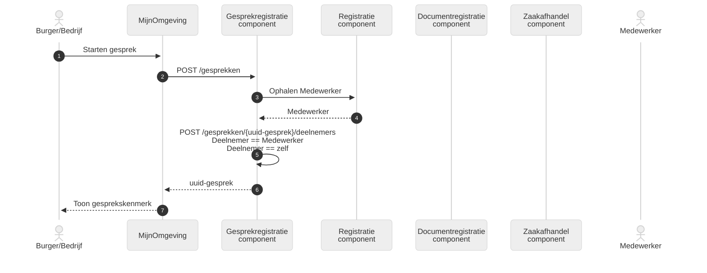
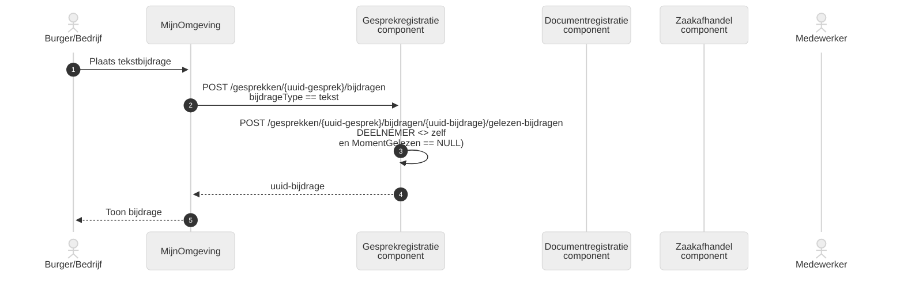
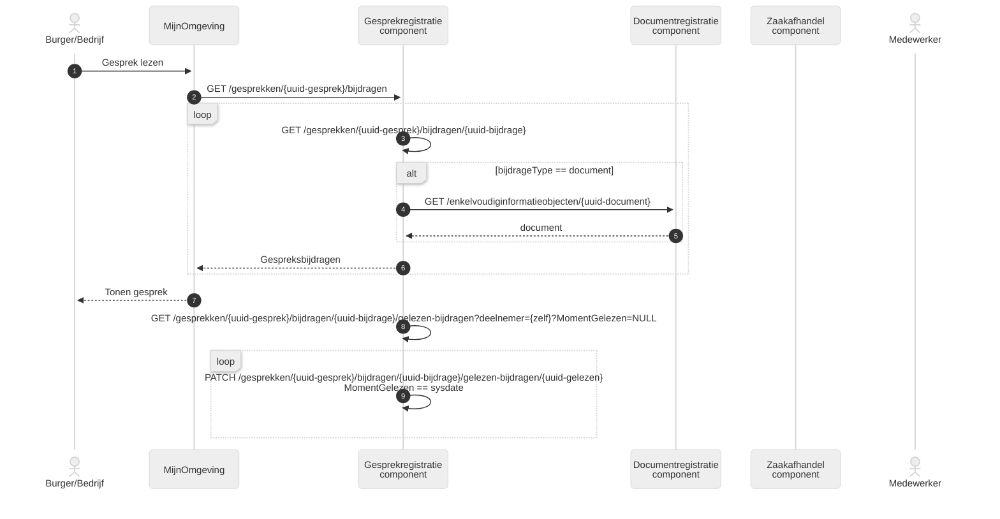
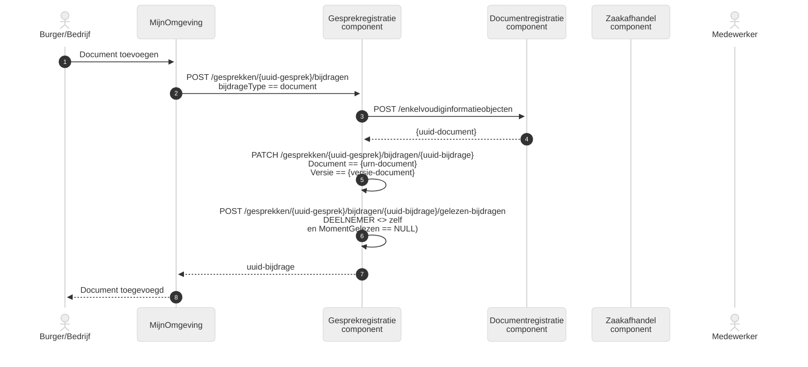
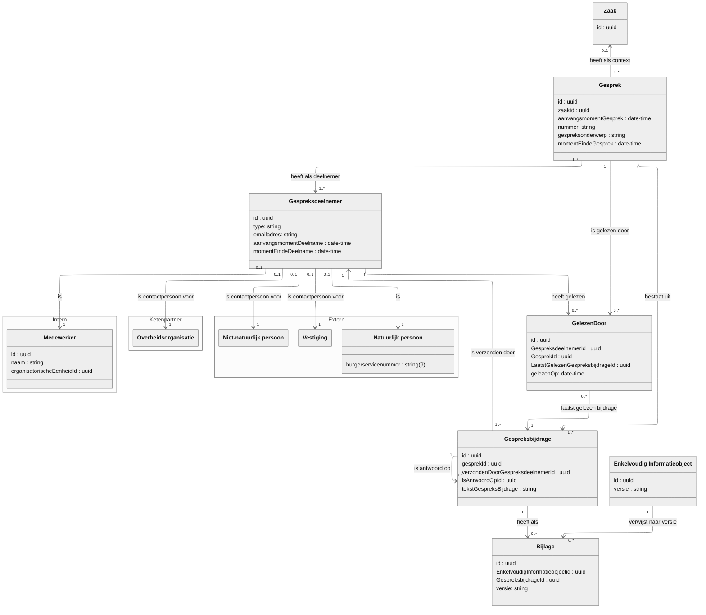
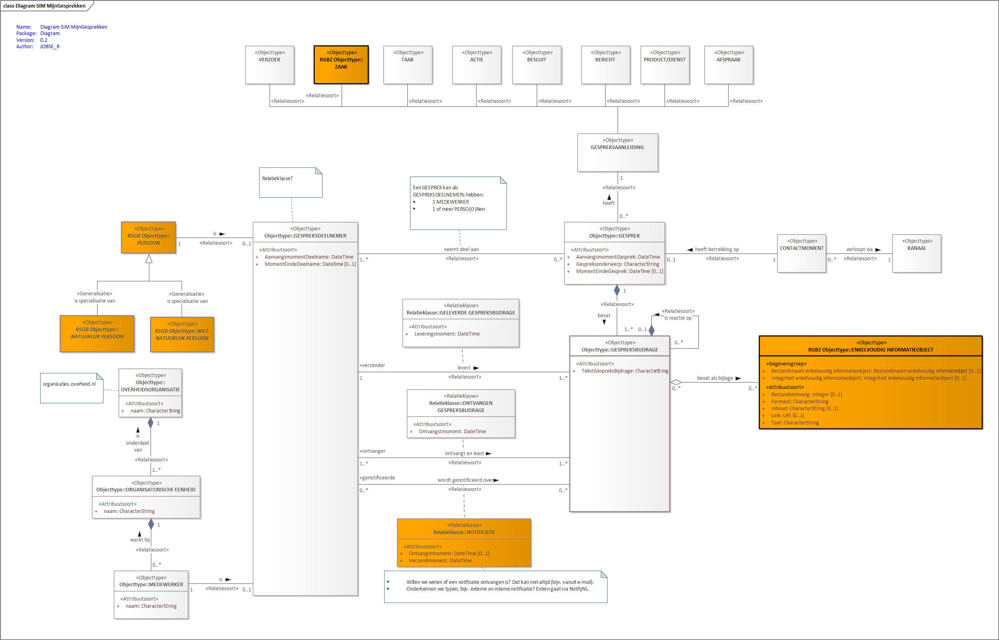

# MijnGesprekken

:::info[MijnGesprekken is in ontwikkeling]

Deze pagina beschrijft een standaard die nog in ontwikkeling is. De inhoud kan
veranderen.

:::

## Inleiding

Het concept **“gesprekken”** betreft een gestandaardiseerde manier om
interactieve communicatie tussen geauthenticeerde inwoners/ondernemers en
gemeente te faciliteren binnen de persoonlijke MijnOmgeving of andere
ondersteunende componenten.

Steeds meer burgers verwachten een moderne digitale dienstverlening, waaronder
de mogelijkheid om op een laagdrempelige manier vragen te stellen of informatie
uit te wisselen met de gemeente – vergelijkbaar met chat of berichten in andere
platforms.

Tot op heden ontbreekt een eenduidig patroon hiervoor; gemeenten en leveranciers
lossen dit vaak ad-hoc op via e-mail, losse webformulieren of propriëtaire
chatfuncties. Dit leidt tot versnippering van gegevens, inefficiënte afhandeling
en een gebrek aan centrale regie.

## Uitgangspunten

Bij het ontwerpen van het gesprekken-patroon hanteren we een aantal
uitgangspunten en ontwerpprincipes:

- We sluiten aan bij de begripswereld van eindgebruikers. Voor de inwoner voelt
  een _gesprek_ als een natuurlijke interactie (vergelijkbaar met een chat of
  berichtenreeks), niet als het indienen van een formeel verzoek. De term
  _gesprek_ dekt deze lading beter dan technische begrippen als _contactmoment_
  of _bericht_. Dit draagt bij aan gebruiksgemak en adoptie.
- Er is een duidelijk onderscheid tussen _gesprekken_ en formele _verzoeken_.
  Een gesprek kan allerlei onderwerpen betreffen – van een vraag om informatie
  tot het melden van een situatie – zonder dat daarmee meteen een formele
  procedure gestart wordt. Pas wanneer nodig wordt een gesprek omgezet in een
  formeel traject (bijvoorbeeld het indienen van een officiële aanvraag of het
  starten van een zaak).
- Het patroon borduurt voort op bestaande Common Ground-concepten. We gebruiken
  zoveel mogelijk de al gedefinieerde API’s (zoals de Klantinteracties API) voor
  het vastleggen van klantcontacten en gesprekken.

## NL Design System

## Use cases

1. _Informatievragen:_ Een inwoner wil weten “Heb ik een parkeervergunning nodig
   voor een verhuiscontainer?” Via de Mijn-omgeving start hij een gesprek. De
   KCC-medewerker ziet de vraag, zoekt het antwoord op (of heeft een
   standaardantwoord paraat) en stuurt binnen een paar uur een bericht terug. De
   inwoner ontvangt een notificatie en leest het antwoord in het gesprek. Hij
   hoeft niet te bellen of lang te zoeken op de website – snelle duidelijkheid.
2. _Update lopende zaak/taak/product:_ Een ondernemer heeft een
   omgevingsvergunning aangevraagd en wil weten hoever de behandeling is. Ze
   ziet in de zaakstatus dat het in behandeling is, maar heeft aanvullende
   vragen. Via “Stel een vraag over deze zaak” in de Mijn-omgeving begint ze een
   gesprek gekoppeld aan haar zaak. De behandelaar of KCC beantwoordt binnen de
   gestelde termijn met actuele informatie (“Uw aanvraag is beoordeeld, u
   ontvangt volgende week bericht…”).
3. _Ketenvoorbeeld:_ Stel, een inwoner heeft vragen over een complexe situatie,
   bijvoorbeeld zorgondersteuning voor een familielid. Via de Mijn-omgeving
   start zij een gesprek. De KCC-medewerker beantwoordt de basisvragen, maar
   voor specifieke details wordt de vraag doorgezet naar een Wmo-consulent
   (backoffice).
4. …

Door deze use-cases wordt duidelijk dat _gesprekken_ als patroon de kloof dicht
tussen enerzijds incidentele informele vragen en anderzijds formele processen.
Het verhoogt de digitale zelfredzaamheid van inwoners en ontlast tegelijk de
traditionele kanalen (balie, telefoon).

Onderstaande use cases en user stories hebben een willekeurig nummer gekregen.
Dit om te voorkomen dat er een bepaalde volgorde of prioriteit in herkend zou
kunnen worden. De use cases hebben de prefix C gekregen en de user stories de
prefix S.

**C6398: Andere organisaties toevoegen**

Er wordt een gesprek gevoerd tussen een inwoner van de gemeente Den Haag en een
medewerker van de gemeente Den Haag. De medewerker van de gemeente Den Haag
voegt een medewerker van de gemeente Rijswijk toe aan het gesprek.

VRAAG: gaan we dit toepassen/toestaan?

**C5551: Medewerker, organisatorische eenheid of organisatie**

Een medewerker van een afdeling binnen een gemeente neemt deel aan een gesprek.
De gemeente wil niet dat de naam van de medewerker getoond wordt aan de
inwoner/ondernemer.

**C4977: meerdere aanleiding tot één gesprek**

Een inwoner heeft vragen naar aanleiding van een taak die hij moet uitvoeren. Er
wordt een gesprek gestart dat hoort bij de taak. De inwoner stelt ook vragen
over een andere lopende zaak die niets met de taak te maken heeft.

VRAAG: Kunnen er meerdere aanleidingen gekoppeld worden aan één gesprek?

**C5178: Overheid praat met overheid**

Als medewerker van een gemeente wil ik advies van de omgevingsdienst. Hiervoor
is de DSO samenwerkingsvoorziening beschikbaar, maar omdat ik net een berichtje
naar de aanvrager heb gestuurd en dat makkelijk werkt besluit ik ook een bericht
naar de andere overheid te sturen middels de communicatievoorziening. Ik voeg de
andere overheid toe aan het gesprek op basis van email of rsin en stel mijn
vraag.

**C2431: Vestiging - eenmansbedrijf**

Als eenmansbedrijf (architect) doe ik een aanvraag via DSO. Ik zelf ben als
natuurlijk persoon (per definitie) de baas van mijn bedrijf, dat dus geen
relatie heeft met een niet-natuurlijk persoon. Als gevolg hiervan sta ik als
vestiging geregistreerd in de rol in het ZRC. Ik verwacht dat het gesprek
gevoerd wordt op basis van de contactgegevens van mijn vestiging.

**C1896: Vestiging - groot bedrijf**

Als medewerker van een bedrijf met meerdere vestigingen (bijvoorbeeld een
aannemer of netbeheerder) doe ik een aanvraag via DSO. De eigenaar van het
bedrijf is een BV (=niet-natuurlijk persoon) maar ik geef het vestigingsnummer
op zodat alle communicatie naar mijn vestiging gaat. Als gevolg hiervan sta ik
als vestiging geregistreerd in de rol in het ZRC. Ik verwacht dat het gesprek
gevoerd wordt op basis van de contactgegevens van  mijn vestiging.

**C5190: Niet-natuurlijk persoon - Vereniging**

Als bestuurslid van een vereniging, bijvoorbeeld een vereniging van eigenaars of
sportvereniging, doe ik een aanvraag via DSO. Mijn vereniging staat
geregistreerd in het handelsregister als niet-natuurlijk persoon zonder
vestiging. Als gevolg hiervan sta ik als niet-natuurlijk persoon geregistreerd
in de rol in het ZRC. Ik verwacht dat het gesprek gevoerd wordt op basis van de
contactgegevens van mijn niet-natuurlijke persoon.

**C9297: Machtiging**

Als eenmansbedrijf (architect) doe ik een aanvraag via DSO voor een
opdrachtgever (persoon). Ik geef mezelf op als gemachtigde (de machtiginggever
bevestigt dat). Als gevolg hiervan sta ik als vestiging geregistreerd
(gemachtigde)in de rol in het ZRC. De opdrachtgever staat als natuurlijk persoon
geregistreerd (machtiginggever) in de rol in het ZRC. Ik verwacht dat het
gesprek gevoerd wordt op basis van de contactgegevens van mijn vestiging. Ik
verwacht dat het gesprek met mijn opdrachtgever wordt gevoerd op basis van diens
registratie.

**S9430: Contactpersoon**

Als medewerker/bestuurslid van een vestiging of natuurlijk persoon doe ik een
aanvraag via DSO. Ik geef mijn naam op als contactpersoon en mijn
werk-emailadres als contact-e mailadres. Ik verwacht notificaties te ontvangen
op dat e-mailadres.

**C2150: Netbeheerder: meerdere overheden**

Als bedrijf met meerdere vestigingen (bijvoorbeeld een aannemer of netbeheerder)
doe ik ieder jaar aanvragen via DSO bij meerdere, soms honderden, bevoegde
gezagen. Als ik een bericht of gespreksbijdrage ontvang, wil ik in het portaal
direct kunnen zien van welke overheid deze afkomstig is. Ook wil ik mijn
berichten kunnen sorteren, ordenen en terugvinden op basis van overheid.

| **S6476** |                                                                                                                                                                                       |
| --------- | ------------------------------------------------------------------------------------------------------------------------------------------------------------------------------------- |
| Als       | medewerker van een gemeente                                                                                                                                                           |
| wil ik    | een online gesprek met een inwoner of ondernemer kunnen starten over een lopende zaak, openstaande taak, ontvangen besluit, ontvangen bericht, komende afspraak of ontvangen product. |
| zodat     | de inwoner beter geïnformeerd wordt.                                                                                                                                                  |

| **S3589** |                                                                                                                                                                                            |
| --------- | ------------------------------------------------------------------------------------------------------------------------------------------------------------------------------------------ |
| Als       | inwoner of ondernemer                                                                                                                                                                      |
| wil ik    | online een gesprek kunnen voeren met een medewerker van een gemeente over een lopende zaak, openstaande taak, ontvangen besluit, ontvangen bericht, ontvangen product of komende afspraak. |
| zodat     | ik beter weet waar ik aan toe ben.                                                                                                                                                         |

| **S3589** |                                                                                                                                                                                            |
| --------- | ------------------------------------------------------------------------------------------------------------------------------------------------------------------------------------------ |
| Als       | inwoner of ondernemer                                                                                                                                                                      |
| wil ik    | online een gesprek kunnen voeren met een medewerker van een gemeente over een lopende zaak, openstaande taak, ontvangen besluit, ontvangen bericht, ontvangen product of komende afspraak. |
| zodat     | ik beter weet waar ik aan toe ben.                                                                                                                                                         |

| **S8532** |                                                                                      |
| --------- | ------------------------------------------------------------------------------------ |
| Als       | medewerker van een gemeente                                                          |
| wil ik    | ik collega’s toe kunnen voegen aan een bestaand gesprek                              |
| zodat     | de informatie snel gedeeld kan worden tussen de betrokken medewerkers en de persoon. |

| **S8315** |                                                                                  |
| --------- | -------------------------------------------------------------------------------- |
| Als       | medewerker van een gemeente                                                      |
| Wil ik    | collega’s toe kunnen voegen aan een bestaand gesprek zonder de historie te delen |
| zodat     | het vervolg van het gesprek met meerdere betrokkenen gevoerd kan worden.         |

| **S9291** |                                                              |
| --------- | ------------------------------------------------------------ |
| Als       | archiefbeheerder van een gemeente                            |
| wil ik    | afgesloten gesprekken bij een (aanleiding) opgeslagen hebben |
| zodat     | de communicatie archiefwaardig verwerkt kan worden.          |

| **S5834** |                                                                                                                                                  |
| --------- | ------------------------------------------------------------------------------------------------------------------------------------------------ |
| Als       | inwoner of ondernemer                                                                                                                            |
| wil ik    | snel en eenvoudig kunnen reageren op de communicatie van een gemeente                                                                            |
| zodat     | ik informatie kan toevoegen aan een lopende zaak, openstaande taak, ontvangen besluit, ontvangen bericht, ontvangen product of komende afspraak. |

| **S3291** |                                                                                                                                                                  |
| --------- | ---------------------------------------------------------------------------------------------------------------------------------------------------------------- |
| Als       | inwoner of ondernemer                                                                                                                                            |
| wil ik    | een gesprek kunnen starten over een lopende zaak, openstaande taak, ontvangen besluit, ontvangen bericht, ontvangen product of komende afspraak                  |
| zodat     | ik gericht vragen / opmerkingen kan plaatsen bij de lopende zaak, openstaande taak, ontvangen besluit, ontvangen bericht, ontvangen product of komende afspraak. |

| **S4388** |                                                                                                                                                                 |
| --------- | --------------------------------------------------------------------------------------------------------------------------------------------------------------- |
| Als       | medewerker van een gemeente                                                                                                                                     |
| wil ik    | een gesprek kunnen starten met een persoon over een lopende zaak, openstaande taak, ontvangen besluit, ontvangen bericht, ontvangen product of komende afspraak |
| zodat     | ik gericht vragen / opmerkingen kan plaatsen bij de lopende zaak, openstaande taak, ontvangen besluit, ontvangen bericht, ontvangen product of komende afspraak |

| **S1898** |                                                    |
| --------- | -------------------------------------------------- |
| Als       | inwoner, ondernemer of medewerker van een gemeente |
| wil ik    | bijlagen toe kunnen voegen aan een gesprek         |
| zodat     | ik informatie kan delen.                           |

| **S7408** |                                              |
| --------- | -------------------------------------------- |
| Als       | medewerker van een gemeente                  |
| wil ik    | kunnen zien of een bericht gelezen is        |
| zodat     | ik de voortgang van het gesprek kan bewaken. |

| **S1292** |                                              |
| --------- | -------------------------------------------- |
| Als       | inwoner of ondernemer                        |
| wil ik    | kunnen zien of een bericht gelezen is        |
| zodat     | ik de voortgang van het gesprek kan bewaken. |

| **S1367** |                                                                                                                 |
| --------- | --------------------------------------------------------------------------------------------------------------- |
| Als       | inwoner of ondernemer                                                                                           |
| wil ik    | een notificatie via e-mail of SMS ontvangen van een nieuw gesprek of een nieuwe bijdrage aan een lopend gesprek |
| zodat     | ik direct op de hoogte wordt gesteld.                                                                           |

| **S2729** |                                                                                                                     |
| --------- | ------------------------------------------------------------------------------------------------------------------- |
| Als       | medewerker van een gemeente                                                                                         |
| wil ik    | een notificatie in mijn vakapplicatie ontvangen van een nieuw gesprek of een nieuwe bijdrage aan een lopend gesprek |
| zodat     | ik direct op de hoogte wordt gesteld.                                                                               |

| **S2391** |                                                                               |
| --------- | ----------------------------------------------------------------------------- |
| Als       | medewerker van een gemeente                                                   |
| wil ik    | een gesprek kunnen beëindigen                                                 |
| zodat     | er geen bijdrage aan een gesprek zonder actuele aanleiding toegevoegd worden. |

| **S4849** |                                                                                                                |
| --------- | -------------------------------------------------------------------------------------------------------------- |
| Als       | medewerker van een gemeente                                                                                    |
| wil ik    | automatisch een lopend gesprek beëindigen als er binnen een bepaalde tijd geen gespreksbijdragen zijn geleverd |
| zodat     | gesprekken niet langer dan nodig open blijven staan.                                                           |

| **S5109** |                                                                               |
| --------- | ----------------------------------------------------------------------------- |
| Als       | medewerker van een gemeente                                                   |
| wil ik    | het moment van beëindigen van het gesprek als contactmoment vastgelegd hebben |
| zodat     | dit terug te zien is als contactmoment.                                       |

| **S5031** |                                                                            |
| --------- | -------------------------------------------------------------------------- |
| Als       | medewerker van een gemeente                                                |
| wil ik    | het moment van starten van het gesprek als contactmoment vastgelegd hebben |
| zodat     | dit terug te zien is als contactmoment.                                    |

| **S7975** |                                                                       |
| --------- | --------------------------------------------------------------------- |
| Als       | inwoner of ondernemer                                                 |
| wil ik    | kunnen aangeven of ik notificaties wil ontvangen bij nieuwe bijdragen |
| zodat     | ik niet overladen wordt met notificaties.                             |

| **S1758** |                                                                                           |
| --------- | ----------------------------------------------------------------------------------------- |
| Als       | medewerker van een organisatie                                                            |
| wil ik    | een notificatie ontvangen als er door een betrokkene een gespreksbijdrage geplaatst wordt |
| zodat     | ik eenvoudig op de hoogte kan blijven van de voortgang.                                   |

| **S1405** |                                                             |
| --------- | ----------------------------------------------------------- |
| Als       | deelnemer van een gesprek                                   |
| wil ik    | geen notificatie ontvangen van mijn eigen gespreksbijdragen |
| zodat     |                                                             |

| **S8335** |                                                                                         |
| --------- | --------------------------------------------------------------------------------------- |
| Als       | deelnemer van een gesprek                                                               |
| wil ik    | kunnen aangeven dat ik notificaties wil ontvangen over gespreksbijdragen in het gesprek |
| zodat     | op de hoogte kan blijven van de voortgang van het gesprek.                              |

| **S2468** |                                                                                              |
| --------- | -------------------------------------------------------------------------------------------- |
| Als       | deelnemer aan een gesprek                                                                    |
| wil ik    | kunnen aangeven dat ik GEEN notificaties wil ontvangen over gespreksbijdragen in het gesprek |
| zodat     |                                                                                              |

| **S5633** |                                                                                                                                                                                                          |
| --------- | -------------------------------------------------------------------------------------------------------------------------------------------------------------------------------------------------------- |
| Als       | medewerker                                                                                                                                                                                               |
| wil ik    | kunnen aangeven dat ik notificaties wil ontvangen over gespreksbijdragen in gesprekken, (afhankelijk of we kanalen gaan vastleggen voor medewerkers) en aangeven welke kanalen ik hiervoor wil gebruiken |
| zodat     | op de hoogte kan blijven van de voortgang van het gesprek.                                                                                                                                               |

| **S7619** |                                                                         |
| --------- | ----------------------------------------------------------------------- |
| Als       | gespreksdeelnemer                                                       |
| wil ik    | geen notificaties ontvangen van gespreksbijdragen die ik al gelezen heb |
| zodat     | ik niet onnodige notificaties ontvang.                                  |

## Architectuur

## Capabilities

Capabilities geven aan wat een organisatie doet in het kader van de
MijnGesprekken. Het geeft aan welke vaardigheden een organisatie moet bezitten.
Hoe een organisatie dat doet en hoe een organisatie de vaardigheden inzet, wordt
gemodelleerd door diensten en processen.

Onderstaande capability is onderdeel van een andere, algemenere capability:
‘Bieden van interactieve dienstverlening’. Deze capability is van toepassing op
Omnichannel en daarmee ook op de afzonderlijke MijnServices, zoals
MijnGesprekken. Naast de capability ten behoeve van MijnGesprekken, zijn er in
de algemene capability ook capabilities opgenomen voor MijnZaken, MijnTaken,
MijnBerichten, MijnContactmomenten, MijnAgenda en Notificieren.

> _Afbeelding niet beschikbaar (wordt later toegevoegd)_

| **Capability**                          | **Toelichting**                                                                                                                                                                                                                                                                                                                                                 |
| --------------------------------------- | --------------------------------------------------------------------------------------------------------------------------------------------------------------------------------------------------------------------------------------------------------------------------------------------------------------------------------------------------------------- |
| Bieden van interactieve dienstverlening | Tijdens de dienstverlening heeft een organisatie veelvuldig contact met burgers en bedrijven in allerlei vormen. Overheidsorganisaties kunnen hierbij interactieve dienstverlening bieden, waarbij de overheidsorganisatie zelf de dienstverlening initieert of dat de dienstverlening wordt geboden naar aanleiding van een verzoek van een burger of bedrijf. |
| Voeren van een digitaal gesprek         | De mogelijkheid van burgers, bedrijven of instellingen om op een laagdrempelige manier (digitaal) vragen te stellen en antwoorden te ontvangen of informatie uit te wisselen met de overheidsorganisatie – vergelijkbaar met chat of berichten in andere platforms.                                                                                             |

## Bedrijfsobjectenmodel

In het bedrijfsobjectenmodel worden de bedrijfsobjecten in relatie met elkaar
gemodelleerd. De bedrijfsobjecten hebben namen gekregen die aansluiten bij de
taal van de ‘business’. Het biedt daardoor een model dat goed te bespreken is
met de organisatie, zonder termen of begrippen uit de techniek te gebruiken. Het
bedrijfsobjectenmodel is daarna te vertalen naar informatiemodellen, dat
mogelijk andere benamingen gebruikt.

In onderstaand bedrijfsobjectenmodel staat de kern ‘GESPREK’ centraal. Aan de
bovenkant daarvan zijn bedrijfsobjecten die het onderwerp van het gesprek kunnen
zijn.

> _Afbeelding niet beschikbaar (wordt later toegevoegd)_

| **Bedrijfsobject**           | **Definitie**                                                                                                                                                                                                                            |
| ---------------------------- | ---------------------------------------------------------------------------------------------------------------------------------------------------------------------------------------------------------------------------------------- |
| ACTOR                        | Iets dat of iemand die voor de overheidsorganisatie werkzaamheden uitvoert.                                                                                                                                                              |
| AGENDA-AFSPRAAK              | Een gepland contactmoment waarop er een gesproken interactie plaatsvindt tussen een burger, bedrijf of instelling en een overheidsorganisatie.                                                                                           |
| BERICHT                      | Digitale post dat een overheidsorganisatie naar een burger, bedrijf of instelling stuurt, waarin informatie en/of documenten worden aangeboden die de burger, het bedrijf of de instelling in de persoonlijke digitale postbus ontvangt. |
| BESLUIT                      | Een schriftelijke beslissing van een bestuursorgaan, inhoudende een publiekrechtelijke rechtshandeling.                                                                                                                                  |
| ENKELVOUDIG INFORMATIEOBJECT | Een INFORMATIEOBJECT waarvan aard, omvang en/of vorm aanleiding geven het als één geheel te behandelen en te beheren.                                                                                                                    |
| GESPREK                      | Een digitale dialoog tussen een burger, bedrijf of instelling en (een) overheidsorganisatie(s).                                                                                                                                          |
| GESPREKSBIJDRAGE             | Wat een GESPREKSDEELNEMER toevoegt aan het GESPREK.                                                                                                                                                                                      |
| KLANTCONTACT                 | Contactmoment tussen een burger, bedrijf of instelling en een overheidsorganisatie dat werkelijk heeft plaatsgevonden.                                                                                                                   |
| PARTIJ                       | Persoon of organisatie waarmee de overheidsorganisatie een relatie heeft.                                                                                                                                                                |
| PLAN                         | Een gestructureerde en vastgelegde beschrijving van doelen, keuzes, activiteiten en middelen, waarin wordt uitgewerkt wat de burger wil bereiken, hoe dat gebeurt, wanneer en met welke inzet.                                           |
| PRODUCT                      | Iets wat wordt voortgebracht en een concrete of herkenbare waarde heeft voor een burger, bedrijf, instelling of andere overheidsorganisatie.                                                                                             |
| TAAK                         | Een welomschreven en afgebakende hoeveelheid werk dat iemand doet of moet doen, horende bij een ZAAK of betrekking hebbende op een PRODUCT.                                                                                              |
| THEMA                        | Een afgebakend beleidsterrein of maatschappelijk vraagstuk waarop de overheid zich richt en waarvoor doelen, beleid en maatregelen zijn ontwikkeld. Het gaat om een breed, samenhangend onderwerp.                                       |
| VERZOEK                      | Een tot een overheidsorganisatie gerichte vraag of aanspraak om een bepaalde beslissing, handeling of reactie te verkrijgen.                                                                                                             |
| ZAAK                         | Een samenhangende hoeveelheid werk met een welgedefinieerde aanleiding en een welgedefinieerd eindresultaat, waarvan kwaliteit en doorlooptijd bewaakt moeten worden.                                                                    |

### **Scope MVP**

Ten behoeve van de scope voor de MVP wordt een gesprek alleen nog maar aan een
zaak gekoppeld. Met andere woorden: een gesprek kan alleen in context van een
zaak plaatsvinden. Daarnaast wordt alleen het perspectief van de burger/bedrijf
als scope genomen. Echter, de medewerker kan via de
vakapplicatie/zaakafhandelcomponent ook gebruikmaken van MijnGesprekken. De
implementatie in de zaakafhandelcomponent valt buiten de scope van de MVP. In
onderstaand model is dat gedeelte vervaagd.

## Informatiearchitectuur

Om de MijnGesprekken service goed te laten werken, zijn verschillende
componenten nodig. In de GEMMA zijn deze componenten opgenomen als
referentiecomponenten. In onderstaand model zijn deze referentiecomponenten in
relatie tot elkaar opgenomen. Verder zijn de applicatieservices,
applicatieinterfaces, applicatiefuncties en dataobjecten opgenomen in het model.

Leveranciers bieden specifieke software die invulling geven aan een dergelijke
referentiecomponenten. Er kunnen meerdere ‘instanties’ van een
referentiecomponent voorkomen. Voor de eenvoud van het model, wordt er vanuit
gegaan dat er één ‘instantie’ per referentiecomponent wordt gebruikt. Bij
meerdere ‘instanties’ zou ook een integratiecomponent in het model opgenomen
kunnen worden. Dit is zeker het geval als componenten bij verschillende
organisaties worden gehost. Vanwege de eenvoud is dat in onderstaand model
weggelaten.

In onderstaand model worden documenten die bij een gespreksbijdrage worden
geüpload, door de Mijngemeentecomponent of de Zaakafhandelcomponent in de
Documentregistratiecomponent geplaatst. Hierdoor heeft een Mijngemeentecomponent
of Zaakafhandelcomponent twee interfaces nodig om gesprekken te kunnen voeren en
daarbij documenten te bewaren of op te vragen.

> _Afbeelding niet beschikbaar (wordt later toegevoegd)_

| **Element**                           | **Archimate type**  | **Definitie**                                                                                                                                                                                                                                                                                                                                                                                                 |
| ------------------------------------- | ------------------- | ------------------------------------------------------------------------------------------------------------------------------------------------------------------------------------------------------------------------------------------------------------------------------------------------------------------------------------------------------------------------------------------------------------- |
| Bedrijf                               | Actor               | Een organisatie van mensen en middelen met als doel het leveren van producten of het verlenen van diensten aan andere organisaties of particulieren.                                                                                                                                                                                                                                                          |
| Burger                                | Actor               | Iedere inwoner van een land.                                                                                                                                                                                                                                                                                                                                                                                  |
| Document                              | Dataobject          | Documenten (ook wel Informatieobjecten genoemd in het RGBZ), ontstaan in een proces (worden ontvangen of geproduceerd) en worden zoveel als mogelijk opgeslagen in de Documentregistratiecomponent. Dit enerzijds om de documenten per proces netjes bij elkaar te hebben staan. Anderzijds om de procesapplicatie niet te belasten met de opslag van documenten. Documenten worden maar één keer opgeslagen. |
| Documenten API                        | Applicatieinterface | De Documenten API standaardiseert het creëren, bijwerken, lezen en verwijderen van informatieobjecten en bijbehorende metagegevens.                                                                                                                                                                                                                                                                           |
| Documentregistratiecomponent          | Applicatiecomponent | Component voor opslag en ontsluiting van documenten en daarbij behorende metadata.                                                                                                                                                                                                                                                                                                                            |
| Gesprek                               | Dataobject          | Een registratie van een digitale dialoog tussen een burger, bedrijf of instelling en (een) overheidsorganisatie(s).                                                                                                                                                                                                                                                                                           |
| Gesprekken API                        | Applicatieinterface | De Gesprekken API standaardiseert het creëren en lezen van gesprekken en gespreksbijdragen.                                                                                                                                                                                                                                                                                                                   |
| Gesprekregistratiecomponent           | Applicatiecomponent | Component waarin digitaal gevoerde gesprekken tussen burger, bedrijf of instelling en de overheidsorganisatie worden vastgelegd.                                                                                                                                                                                                                                                                              |
| Integratiecomponent                   | Applicatiecomponent | Component dat gebruikt wordt om dienstafnemende componenten te verbinden met dienstaanbiedende componenten.                                                                                                                                                                                                                                                                                                   |
| Medewerker                            | Actor               | Een medewerker van de organisatie die zaken behandelt uit hoofde van zijn of haar functie binnen een organisatorische eenheid.                                                                                                                                                                                                                                                                                |
| Mijngemeentecomponent                 | Applicatiecomponent | Component die via webtechnologie veilig toegang biedt tot persoonlijke informatie en gepersonaliseerde digitale dienstverlening.                                                                                                                                                                                                                                                                              |
| MijnGesprekken                        | Applicatieservice   | Deze service betreft een gestandaardiseerde manier binnen de persoonlijke MijnOmgeving digitale interactieve communicatie tussen geauthenticeerde burgers, bedrijven of instellingen en overheidsorganisatie te faciliteren met zaakafhandelcomponenten of andere ondersteunende componenten van de overheidsorganisatie.                                                                                     |
| Tonen gesprekken en plaatsen bijdrage | Applicatiefunctie   | Functie voor het tonen van gesprekken en het plaatsen van bijdragen binnen die gesprekken.                                                                                                                                                                                                                                                                                                                    |

| Zaakafhandelcomponent (abstract component) | Applicatiecomponent | Abstract
verzamelcomponent voor procesondersteunende systemen die zaakgericht zijn
ingericht. |

## Standaarden

MijnGesprekken hanteert de volgende standaarden:

- Nederlandse API strategie
  ([https://docs.geostandaarden.nl/api/API-Strategie/](https://docs.geostandaarden.nl/api/API-Strategie/))
- NLGov REST API Design Rules 2.1.0
  ([https://gitdocumentatie.logius.nl/publicatie/api/adr/2.1.0/](https://gitdocumentatie.logius.nl/publicatie/api/adr/2.1.0/))
- NL GOV Assurance profile for OAuth 2.0 v1.1.0
  ([https://gitdocumentatie.logius.nl/publicatie/api/oauth/](https://gitdocumentatie.logius.nl/publicatie/api/oauth/))
- OpenAPI Specifications 3.0
  ([https://www.forumstandaardisatie.nl/open-standaarden/openapi-specification](https://www.forumstandaardisatie.nl/open-standaarden/openapi-specification))
- Digikoppeling Koppelvlakstandaard REST-API 3.0.1 (indien van toepassing)
  ([https://gitdocumentatie.logius.nl/publicatie/dk/restapi/3.0.1/](https://gitdocumentatie.logius.nl/publicatie/dk/restapi/3.0.1/))
- Metamodel Informatiemodellering
  [https://www.geonovum.nl/geo-standaarden/metamodel-informatiemodellering-mim](https://www.geonovum.nl/geo-standaarden/metamodel-informatiemodellering-mim)
- Federatieve Service Connectiviteit
  ([https://fsc-standaard.nl/standaard](https://fsc-standaard.nl/standaard))

## Sequentiediagrammen

De werking van de MijnGesprekken service is in een aantal sequentiediagrammen
uitgewerkt. In dit model worden documenten die via een gespreksbijdrage zijn
aangeleverd door de Mijngemeentecomponent geüpload naar de
documentregistratiecomponent.

De interactiepatronen zijn per gebruikersgroep ingedeeld. Eerst worden de
patronen voor de burger, bedrijf of instelling getoond. Daarna de patronen voor
de medewerker van de overheidsorganisatie.

In alle patronen is aangenomen dat de burger, bedrijf of instelling via een
digitaal authenticatiemiddel zoals DigiD of eHerkenning al is ingelogd in een
MijnOmgving. Het patroon van inloggen is buiten scope van deze documentatie.

### Gesprek starten door burger, bedrijf of instelling

| **#** | **Omschrijving**                             | **Toelichting**                                                                                                                              |
| ----- | -------------------------------------------- | -------------------------------------------------------------------------------------------------------------------------------------------- |
| 1     | Starten gesprek                              | De burger, bedrijf of instelling start een gesprek in de MijnOmgeving.                                                                       |
| 2     | POST /gesprekken                             | Er wordt een nieuw gesprek aangemaakt met een mens-leesbaar gesprekskenmerk.                                                                 |
| 3     | Ophalen Medewerker                           | De medewerker die betrokken is in de context van het gesprek wordt in het bijhorende register opgehaald.                                     |
| 4     | Medewerker                                   | De medewerker wordt als resultaat teruggegeven.                                                                                              |
| 5     | POST /gesprekken/`{uuid-gesprek}`/deelnemers | Minimaal de burger, bedrijf of instelling en een medewerker of afdeling van de overheidsorganisatie worden als gespreksdeelnemer toegevoegd. |
| 6     | uuid-gesprek                                 | Het `uuid-gesprek` van het gesprek wordt aan de MijnOmgeving teruggegeven.                                                                   |
| 7     | Tonen gesprekskenmerk                        | Het gesprekskenmerk van het aangemaakte gesprek wordt aan de burger, het bedrijf of de instelling getoond.                                   |

### Tekst als gespreksbijdrage plaatsen door burger, bedrijf of instelling

In dit patroon is er al een gesprek gestart en is het unieke nummer van het
gesprek (de `uuid-gesprek`) bekend bij de MijnOmgeving.

| **#** | **Omschrijving**                                                                | **Toelichting**                                                                                                                                                                                                                                                                            |
| ----- | ------------------------------------------------------------------------------- | ------------------------------------------------------------------------------------------------------------------------------------------------------------------------------------------------------------------------------------------------------------------------------------------ |
| 1     | Plaats tekstbijdrage                                                            | De burger, bedrijf of instelling plaatst in de MijnOmgeving een tekst als gespreksbijdrage in het gesprek.                                                                                                                                                                                 |
| 2     | POST /gesprekken/`{uuid-gesprek}`/bijdragen                                     | Er wordt een nieuwe gespreksbijdrage aangemaakt dat hoort bij het gesprek. Als type wordt `tekst` meegegeven om aan te geven dat het om een tekstuele gespreksbijdrage gaat.                                                                                                               |
| 3     | POST /gesprekken/`{uuid-gesprek}`/bijdragen/`{uuid-bijdrage}`/gelezen-bijdragen | Er wordt een registratie aangemaakt in de resource `gelezen-bijdragen` waarin de relatie wordt gelegd met de gespreksbijlage en de andere gespreksdeelnemers. Er wordt geen registratie gemaakt voor degene die de gespreksbijdrage heeft geleverd. Het attribuut `MomentGelezen` is leeg. |
| 4     | uuid-bijdrage                                                                   | Het `uuid-bijdrage` van de gespreksbijdrage wordt aan de MijnOmgeving teruggegeven.                                                                                                                                                                                                        |
| 5     | Tonen bijdrage                                                                  | De gespreksbijdrage wordt in de MijnOmgeving getoond.                                                                                                                                                                                                                                      |

### Gesprek lezen door burger, bedrijf of instelling

In dit patroon is er al een gesprek gestart en is het unieke nummer van het
gesprek (de `uuid-gesprek`) bekend.

| **#** | **Omschrijving**                                                                                                               | **Toelichting**                                                                                                                                                              |
| ----- | ------------------------------------------------------------------------------------------------------------------------------ | ---------------------------------------------------------------------------------------------------------------------------------------------------------------------------- |
| 1     | Gesprek lezen                                                                                                                  | De burger, bedrijf of instelling opent het gesprek in de MijnOmgeving om de inhoud van het gesprek te kunnen lezen.                                                          |
| 2     | GET /gesprekken/`{uuid-gesprek}`/bijdragen                                                                                     | Alle gespreksbijdragen die horen bij het gesprek worden opgehaald.                                                                                                           |
| 3     | GET /gesprekken/`{uuid-gesprek}`/bijdragen/`{uuid-bijdrage}`                                                                   | Voor alle gespreksbijdragen wordt de inhoud van de bijhorende gespreksbijdragen opgehaald. Daarbij wordt ook het `type` en `uuid-document`van de gespreksbijdrage opgehaald. |
| 4     | GET /enkelvoudiginformatieobjecten/`{uuid-document}`                                                                           | Als het `type` van de gespreksbijdrage een `document` is, dan wordt het document (of documenten) uit de Documentregistratiecomponent gehaald dat bij die bijdrage hoort.     |
| 5     | Document                                                                                                                       | Het document wordt als resultaat aan de Gespreksregistratiecomponent teruggegeven.                                                                                           |
| 6     | Gespreksbijdragen                                                                                                              | De gespreksbijdragen van het gesprek worden aan de MijnOmgeving teruggegeven.                                                                                                |
| 7     | Tonen gesprek                                                                                                                  | Het gesprek wordt aan de burger, bedrijf of instelling getoond waarbij de gespreksbijdragen in chronologische volgorde zijn opgenomen.                                       |
| 8     | GET /gesprekken/`{uuid-gesprek}`/bijdragen/`{uuid-bijdrage}`/gelezen-bijdragen?deelnemer=`{zelf}`?MomentGelezen=NULL           | De lijst met de door burger, bedrijf of instellingen nog niet gelezen bijdragen wordt opgehaald.                                                                             |
| 9     | PATCH /gesprekken/`{uuid-gesprek}`/bijdragen/`{uuid-bijdrage}`/gelezen-bijdragen/`{uuid-gelezen}` MomentGelezen == sysdate | Van elke teruggegeven registratie wordt het attribuut `MomentGelezen`geüpdatet met de systeemdatum.                                                                          |

### Document als gespreksbijdrage plaatsen door burger, bedrijf of instelling

In dit patroon is er al een gesprek gestart en is het unieke nummer van het
gesprek (de `uuid-gesprek`) bekend.

| **#**                                                                        | **Omschrijving**                                                         | **Toelichting**                                                                                               |
| ---------------------------------------------------------------------------- | ------------------------------------------------------------------------ | ------------------------------------------------------------------------------------------------------------- |
| 1                                                                            | Document toevoegen                                                       | De burger, bedrijf of instelling plaatst in de MijnOmgeving een document als gespreksbijdrage in het gesprek. |
| 2                                                                            | POST /gesprekken/`{uuid-gesprek}`/bijdragen bijdrageType == document | Er wordt een nieuwe gespreksbijdrage aangemaakt dat hoort bij het gesprek. Als type wordt `document`          |
| meegegeven om aan te geven dat het om een bijlage als gespreksbijdrage gaat. |
| 3                                                                            | POST /enkelvoudiginformatieobjecten                                      | Als het type                                                                                                  |

van de gespreksbijdrage een `document` is, dan wordt het document (of
documenten) in de Documentregistratiecomponent geregistreerd. | | 4 |
`{uuid-document}` | Het `uuid-document` van het zojuist geregistreerde document
wordt teruggegeven. | | 5 | PATCH
/gesprekken/`{uuid-gesprek}`/bijdragen/`{uuid-bijdrage}` Document ==
`{urn-document}` Versie == `{versie-document}` | In de gespreksbijdrage
worden de attributen `Document` en `Versie` bijgewerkt zodat er een goede
relatie vanuit de gespreksbijdrage ligt naar het juiste document met de juiste
versie. | | 6 | POST
/gesprekken/`{uuid-gesprek}`/bijdragen/`{uuid-bijdrage}`/gelezen-bijdragen DEELNEMER
!= zelf en MomentGelezen == NULL) | Er wordt een registratie aangemaakt in
de resource `gelezen-bijdragen` waarin de relatie wordt gelegd met de
gespreksbijlage en de andere gespreksdeelnemers. Er wordt geen registratie
gemaakt voor degene die de gespreksbijdrage heeft geleverd. Het attribuut
`MomentGelezen` is leeg. | | 7 | uuid-bijdrage | Het `uuid-bijdrage` van de
gespreksbijdrage wordt aan de MijnOmgeving teruggegeven. | | 8 | Tonen bijdrage
| De gespreksbijdrage wordt in de MijnOmgeving getoond. |

## CloudEvents

## Informatiemodel

Het informatiemodel is uitgewerkt in Sparx Enterprise Architect en is als ReSpec
gedocumenteerd en gepubliceerd via onderstaande link.

- De MijnGesprekken-respec repository:
  [https://github.com/VNG-Realisatie/MijnGesprekken-Respec](https://github.com/VNG-Realisatie/MijnGesprekken-Respec)
  - Daarin staat een link naar het lees- en klikbare informatiemodel:
    [https://vng-realisatie.github.io/MijnGesprekken-Respec/](https://vng-realisatie.github.io/MijnGesprekken-Respec/)
  - Feedback is te geven d.m.v. issues via
    [https://github.com/VNG-Realisatie/MijnGesprekken-Respec/issues](https://github.com/VNG-Realisatie/MijnAgenda-Respec/issues)
- Het informatiemodel maakt gebruik van het zgn. informatiemodel
  klantinteracties
  ([https://vng-realisatie.github.io/klantinteracties/](https://vng-realisatie.github.io/klantinteracties/)),
  een halfproduct.

## API’s

## **OAuth 2.0 Client Credentials (System-to-System)**

## Datamodel

## Informatiebeveiliging en Privacy

## Beheer

## Omschrijving

### Schema met interacties en objecten

| Trigger     | Onderwerp                               | Ontvanger       | Van applicatie | Via schema     | Naar register | Klantlog          |
| ----------- | --------------------------------------- | --------------- | -------------- | -------------- | ------------- | ----------------- |
| Behandelaar | Aanvulling                              | Inwoner         | ZAC            | Externe taak   | VTB           | Ja                |
| Klant       | Vraag over taak                         | Behandelaar/KCC | Portaal        | Klantcontact\* | Open Klant    | Nee, is er dan al |
| Proces      | Er staat een taak klaar, of herinnering | Inwoner         | ZAC            | Klantcontact   |

| Open Klant | Ja

Inhoud = inhoudelijk verwerkt,

Link naar taak | | Behandelaar | Besluit genomen, Herstermijn, Beschikking |
Klant | ZAC | **Bericht**

Bevat link naar het officiele besluit | VT→B | Ja | | Klant | Vraag over zaak |
Behandelaar/KCC | Portaal | Gesprek | Open Klant | Ja

Inhoud = link naar thread (markdown)

- Kan in Open Klant staan
- Kan extern staan

Link naar object (zaak) | | Klant | Vraag over besluit

(nadrukkelijk geen bezwaar of beroep) | Behandelaar/KCC | Portaal | Gesprek |
Open Klant | Ja

Inhoud = link naar thread (markdown)

- Kan in Open Klant staan
- Kan extern staan

Link naar object (zaak) | | Klant | Vraag over product | KCC | Portaal | Gesprek
| Open Klant | Ja

Inhoud = link naar thread (markdown)

- Kan in Open Klant staan
- Kan extern staan

Link naar object (zaak) | | Klant | Chat over iets | KCC | Chatbot | Gesprek |
Open Klant | Ja

Inhoud = link naar thread (markdown)

- Kan in Open Klant staan
- Kan extern staan

Link naar object (zaak) |

https://link.excalidraw.com/l/Oj8rlG7ROq/8ne5BdayNFU

## Gesprekken

## Businesswaarde

Het gesprekken-patroon levert aanzienlijke meerwaarde op voor zowel
eindgebruikers (inwoners/ondernemers) als voor gemeenten:

- In plaats van een formeel formulier in te vullen of telefonisch contact op te
  nemen, kan de inwoner eenvoudig via de vertrouwde Mijn-omgeving (of andere
  applicatie) een vraag stellen of een kwestie aankaarten. Dit verlaagt de
  drempel om contact op te nemen.
- Bovendien heeft de inwoner alle communicatie inzichtelijk op de plek waar deze
  relevant is. Ze kunnen het gesprek en de antwoorden later teruglezen.
- Aan de gemeentezijde biedt een gestandaardiseerd gesprek duidelijke voordelen:
  - _Centralisatie:_ Alle gesprekken worden uniform benaderbaar. Dit maakt het
    voor KCC-medewerkers en vakafdelingen mogelijk om een volledig klantbeeld te
    krijgen.
  - _Snellere afhandeling:_ Een KCC-medewerker kan veel voorkomende vragen
    direct beantwoorden aan de hand van kennisbanken of scripts. Via het
    gesprekkenpatroon kan dat antwoord direct teruggekoppeld worden in de
    Mijn-omgeving, zonder omslachtige brieven of e-mails.
  - _Betere ketensamenwerking:_ Wanneer een vraag specialistische kennis
    vereist, faciliteert het systeem een soepele _routering_ (zie verder) naar
    de betreffende vakafdeling. De vraag en alle context reizen digitaal mee,
    wat miscommunicatie voorkomt. De specialist kan zijn antwoord in hetzelfde
    gesprek toevoegen, dat de KCC-medewerker of eventueel direct de burger ziet.
  - _Analyse:_ Gestructureerde gegevens over gesprekken (aantallen, onderwerpen,
    responstijden, afhandeltijden, klanttevredenheid) leveren
    managementinformatie op.

## 4. Positionering

Het gesprekken-patroon moet worden geplaatst binnen de bestaande
architectuurkaders van de gemeentelijke informatievoorziening – met name GEMMA
en Common Ground – en aansluitende standaarden:

- **GEMMA & Common Ground context:** In de GEMMA-architectuur (GEMeentelijke
  Model Architectuur) valt het _afhandelen van klantcontacten_ onder het
  dienstverleningsdomein (frontoffice).
- **Relatie tot Klantinteracties API (KIC-API):** De KIC-API is ontwikkeld om
  klantcontacten gestandaardiseerd op te slaan en op te vragen. Een
  doorontwikkeling is nodig voor gesprekken.
- **ZGW-API’s:** Gesprekken staan niet op zichzelf; vaak hebben ze relatie tot
  een zaak of een ander bedrijfsobject.
- **Aanpalende standaarden:** Naast zaken en klantinteracties zijn er nieuwe
  API-standaarden in ontwikkeling die het patroon ondersteunen:
  - _Berichten-API:_ Er wordt nagedacht over een berichtenregister binnen Common
    Ground.
  - _Taken-API:_ Een gesprek kan een relatie hebben met een externe taak.
  - _Producten-API:_ Een gesprek kan een relatie hebben met een product.
  - Zaken-API:

## Patroon

We beschrijven een aantal scenario’s met bijbehorende sequencediagrammen:

1. Een eenvoudig gesprek dat binnen het KCC wordt afgehandeld.
2. Een gesprek dat doorgerouteerd wordt naar een vakspecialist.

Voor elke sequencediagram geven we daarna een tabel met toelichting op de
actoren, acties en datapunten.

## Informatiemodel Roxit

Van @Johannes Battjes ontvangen op 12/02/2026 te verwerken door @Ronald Jobse

## Snelle aantekeningen Joeri B:

Gesprek kan plaatsvinden over:

1. Product
2. Zaak
3. Bericht
4. Taak

Correspondentie mag weg 1 jaar na sluiting zaak

## Refinementsessie 15-10-2025 Aantekeningen

Aantekeningen

**Gespreksdeelnemer**

We volgen de landelijke standaarden voor hoe een Gespreksdeelnemer wordt geduid.
We onderscheiden ten minste Burger, Bedrijf, Instelling, medewerker, vrijwillig
Machtigen, Wettelijke vertegenwoordiging en ouderlijk gezag.

Contactpersoon als entiteit ook meenemen in geval van bedrijf of vestiging.

De gespreksdeelnemer is een geauthentiseerde gebruiker. Deze moeten te herleiden
zijn tot het object waar het gesprek aan gekoppeld is.

We hanteren de definities zoals die bij de ZGW standaard zijn opgenomen en nemen
aan dat deze ook gelden voor de andere bedrijfsobjecten.

We vragen speciaal aandacht voor de registratie onder RSIN nummer.

Het aantal deelnemers aan een gesprek..

MVP: Het gesprek is wordt gestart binnen de context van de Zaak (of
Dossier/Thema of Product). Het gesprek binnen een zaak kan gaan over een Taak,
Besluit of Resultaat. Dat is inhoud binnen de gespreksbijdrage.

Je moet minimaal toegang tot de zaak hebben, dan kan je toegang tot het gesprek
hebben en kan je een Gespreksbijdrage doen en leggen we je identiteit vast bij
je gespreksbijdrage.

- Geld er een andere definitie voor intern en extern?
- Wie zijn er initieel betrokken bij een gesprek
- Als intern mw gesprek wordt gestart, dan kiest de intern mw de externe
  betrokkene
- Als interne mw kan ik een intern gesprek starten
- Als extern gesprek wordt gestart, dan kan ik kiezen dat iedereen het mag zien
- Als extern gesprek start, dan kan ik gespreksdeelnemers kiezen
- Als intern en extern kan ik kiezen om net te openbaren
- Als interne mw, kan ik externe klanten toevoegen aan een gesprek
- Als ik als externe klant een gesprek start, kunnen alle interne mw met toegang
  tot de zaak ook bij het gesprek
- In Machtigingsrelaties moet bepaald worden of beiden gespreksbijdragen mogen
  doen, of dat er een partij alleen mag lezen
- Indien er sprake is van vrijwillige of
- wettelijke vertegenwoordiging dan bepaalt de rol of je mag schrijven
  )(bewind/curator) of dat je mag lezen (client) kan de gemachtigen schrijven in
  het gesprek en de machtiging gever

To do voor volgende

- Ronald informatie model verder brengen
- Ronald/Paul Verwerken ruwe aantekeningen Vincent en na verwerken verwijderen -
  maandag
- Paul nalopen use cases en labelen met waar betrekking op (UX, technisch, etc)
- Paul Besluiten log opnemen en vullen

## CommonGround Fieldlab 15-09-2025 Aantekeningen

Vraagstuk terminologie (vanuit analyse AWB en Wmebv)

- Formeel bericht
- Informeel bericht
- Voorleggen aan GDI Interactie?
- BZK noemt het 2-weg-verkeer - Dialoog, gespreksregel
- Willen we een gesprek een onderwerp geven?

Use cases

- Gesprek aangemaakt vanuit gemeente
- Gesprek aangemaakt vanuit inwoner/klant
- Extra betrokkene toevoegen aan Gesprek
- Geen MVP als een AI betrokkene Gesprek start, dan kijken of ook past
- Als zaak gesloten is en ik als inwoner een gesprek over de afgesloten zaak wil
  starten (bezwaar maken, op verkregen vergunning, op niet verkregen vergunning)

Aantekeningen

- Nog definitie opstellen van gesprek, MIM-ifiseren van gesprek
- Use cases opstellen op aangewezen locatie en in voorgestelde vorm (Paul/Ronald
- DoD delen met de groep
- Knippen in onderkant en bovenkant
- Toevoegen rol van de betrokkene
- Vanuit Roxit gebruikersgroep benutten voor voorleggen ideeën en input ophalen
- Op welke element zetten we de klantnotificatie (als burger wil ik geïnformeerd
  worden dat er een nieuw bericht is
- Hoe regelen we de notificatie van de medewerker
- Associatie klasse hoe verwerken? Doen we in EA Sparkx wanneer toegevoegd,
  verwijderd
- Gaan we volgorde vastleggen van de berichten of leiden we dat af (is een
  relatie die gelegd wordt, Ronald/Mark uitwerken) - is ontvangen door lijkt
  overkill, want registratie bij die overheid, is opgeslagen - in mensentaal is
  verzonden. Geen onderscheid tussen ontvangen en gelezen
- Document is Enkelvoudig Informatie object aangevuld met versie
- Een gedeeld bericht met document moet op versie vastgezet (Bericht heeft als
  bijlage is logischer)
- Leveranciers kunnen er voor kiezen om van het gesprek een document te maken
  zodat er een gespreksverslag is, zodat het aan juristen kan worden meegegeven
  (implementatie keuze) kan gelinkt worden aan contactmoment. Als je ook
  tussentijds op wil slaan hartstikke prima
  - Mogelijk in toekomst ook functie in MijnOmgeving voor inwoner om PDF te
    genereren (buiten scope)
- Kan een gesprek 1 deelnemer hebben? Of minimaal 2?
- Wanneer eindigt het gesprek
  - Is het nodig dat je een gesprek sluit?
  -

| Gebruikers willen dat een gesprek stopt als de zaak wordt afgesloten, dus als de aanleiding gestopt is, dan stopt het gesprek (MVP definitie voorstel, tenzij er een use case komt die dat weerspreekt |     |
| ------------------------------------------------------------------------------------------------------------------------------------------------------------------------------------------------------ | --- |

- BB-Bericht aanleiding stopt als Zaak stopt
- Wat is het einde van de zaak (eindstatus zaaktype)
- Wat is het einde van de taak (taakstatus afgerond)
- Kan een gesprek opgestart worden als de zaak is afgerond?
- Todo rondom betrokkene
  - Wil je weten welke persoon het heeft gestuurd vanuit de afdeling, of is het
    toegestaan om de afdeling te communiceren (keuze voor tonen mw of tonen
    afdeling. Voorstel beide opslaan)
  - Voor breder gebruik is het goed dat de gemeente ook is vastgelegd, als ook
    organistaie wordt vastgelegd
  - Bij Bedrijf ook naam, contactpersoon opgeven (want in eHerkenning krijg je
    geen naam mee, contactpersoon en rol, vestiging, uuid)
  - Wat te doen met andere inlogmethoden (buiten scope voor nu voorstel)
- Is Partij en betrokkene hetzelfde? (Paul bespreekt dit binnen Doelarchitectuur
  DV)
  - Partij heeft historie vanuit Klantinteractiemodel, verder wordt het niet
    gebruikt
  - Zijn Betrokkene en Partij verschillend gemodelleerd?
- Matrix hebben gestandaardiseerd op event (Stuurt Joep aan Ronald Jobse)
- Ontwerp ook verrijken van juridisch advies (ook privacy?)

Scope:

- We kiezen er nu voor dat het alleen over getikte tekst gaat in een client
  (MijnOmgeving, KCC applicatie en/of backend applicatie)
- We werken vanuit een MVP te kiezen uit en nog te bepalen
  - Platte tekst
  - Opmaak
  - Onderwerp
  - Mag je oude berichten ook lezen
  - CC
  - BCC (BCC nu moeilijke ervaring en vraag of dat wel hadden moeten doen bij
    Roxit)
  - Gelezen/ongelezen
  - Gespreksverslag (Buiten MVP)
  - Audittrail (buiten MVP), moet er zeker wel zijn)
  - Kan je berichten wijzigen en/of verwijderen
- Alleen use cases voor de MVP vanuit Zaak, Taak en BB-Bericht tbv implementatie
- Tbv ontwerp kiezen we bredere scope, want je moet geheel bezien
  - Logisch informatie model (kardinlaiteit/relatie bedrijfsobjecten)
- Het Bericht staat lokaal, we hebben het nog niet over Bericht met document
  naar de Berichtenbox
- Documenten staan in de DRC
- Buiten Scope

Hoe verder

- Aantekening rondsturen en aanvullen
- Paul vwerstuurd bijgewerkte door
- Groep aanvullen met attributen door de informatie analisten bij Ronald
  aanleveren
- Groep aanleveren use cases aan Paul
- Ronald/Mark afspreken hoe vastleggen en modelleren relaties en rest
- Vervolg afspraak

## 2025-10-02 Aantekeningen

- Bijgaande diagram komt uit Sparx Enterprise Architect, ter illustratie hoe een
  diagram van een conceptueel informatiemodel eruit kan komen te zien.

- [https://www.notion.so/platformvoordienstverlening/Werkgroep-Vertegenwoordiging-26978b5f4db4801387acfd25a6dcc83e](https://www.notion.so/Werkgroep-uniforme-rollen-verwijzingen-26978b5f4db4801387acfd25a6dcc83e?pvs=21)
- Notificaties
  - Wat is de trigger voor een notificatie voor een gesprek
  - Blijft deze overeind in geval datalek? Via admin alleen?
  - Moeten we nadenken over een intrekkingsbericht (niet MVP)
  - Onderscheid tussen notificatie richting klant versus medewerker (aparte use
    cases)
  - Klantnotificatie met een vertraging sturen, voor het geval je over en weer
    in gesprek bent
- Gelezen/ongelezen op Gesprek toepassen
- Contactmoment
  - Gesprek wordt niet geregistreerd als contactmoment zoals benoemd in het
    klantinteractie model
- Voor gesprekken downloaden is veel vraag vanuit Roxit klanten, niet of daar
  email notificaties over zijn verstuurd
- Kanaal
  - Gesprekken kunnen verrijkt worden vanuit het type kanaal portaal, moet je
    dan portaal vastleggen? - in service design checken of mensen dat snappen?
  - Mogelijk toch kanaal ook aan andere dingen gekoppeld, bijvoorbeeld deelnemer
    toevoegen..

Acties:

- Ronald, Paul met Mark uitwerken
- Ronald uitwerken in EA en updaten in de notion, toevoegen toelichting in
  Notion erbij
- Kanaal verder uitwerken

## 2025-10-16 Aantekeningen

- Bijgewerkte versie vanuit Sparx EA (wijkt wellicht op detail af van het
  Mermaid)

- Gespreksdeelnemer
  - We volgen de landelijke standaarden voor hoe een Gespreksdeelnemer wordt
    geduid. We onderscheiden ten minste Burger, Bedrijf, Instelling, medewerker,
    vrijwillig Machtigen, Wettelijke vertegenwoordiging en ouderlijk gezag.
  - De gespreksdeelnemer is een geauthentiseerde gebruiker. Deze moeten te
    herleiden zijn tot het object waar het gesprek aan gekoppeld is.
  - We hanteren de definities zoals die bij de ZGW standaard zijn opgenomen en
    nemen aan dat deze ook gelden voor de andere bedrijfsobjecten.
  - We vragen speciaal aandacht voor de registratie onder RSIN nummer.
  - Het aantal deelnemers aan een gesprek ...
- MVP: Het gesprek is wordt gestart binnen de context van de Zaak (of
  Dossier/Thema of Product). Het gesprek binnen een zaak kan gaan over een Taak,
  Besluit of Resultaat. Dat is inhoud binnen de gespreksbijdrage. Dus als je
  geen toegang hebt tot de zaak, heb je ook geen toegang tot het gesprek.
- Je moet minimaal toegang tot de zaak hebben, dan kan je toegang tot het
  gesprek hebben en kan je een Gespreksbijdrage doen en leggen we je identiteit
  vast bij je gespreksbijdrage.
  - Wellicht zijn er beperkingen aan de gespreksdeelnemers, bijv. op de rol die
    een betrokkene vervult in een zaak. Zo kan het zijn dat we niet willen dat
    een belanghebbende deel kan nemen aan het gesprek.
  - Geldt er een andere definitie voor intern en extern?
    - Intern is binnen de eigen organisatie (in de context van een gemeente dus
      binnen de gemeente).
    - Extern is buiten de eigen organisatie.
  - Wie zijn er initieel betrokken bij een gesprek?
  - Als een interne medewerker een gesprek start, dan kiest de interne
    medewerker de externe betrokkene.
  - Als interne medewerker kan ik een intern gesprek starten.
  - Als een externe een gesprek start, dan kan deze kiezen dat iedere betrokkene
    bij de zaak het mag zien.
  - Als een externe een gesprek start, dan kan deze gespreksdeelnemers kiezen.
  - Als intern en extern kan ik kiezen om net te openbaren.
  - Als interne medewerker, kan ik externe klanten toevoegen aan een gesprek.
  - Als ik als externe klant een gesprek start, kunnen alle interne medewerkers
    met toegang tot de zaak ook bij het gesprek.
  - In Machtigingsrelaties moet bepaald worden of beiden gespreksbijdragen mogen
    doen, of dat er een partij alleen mag lezen.
  - Indien er sprake is van vrijwillige of wettelijke vertegenwoordiging dan
    bepaalt de rol of je mag schrijven (bewind/curator) of dat je mag lezen
    (client) kan de gemachtigden schrijven in het gesprek en de machtiginggever
    …

### 2025-10-29 Aantekeningen

- Actie Ronald: EA model delen met Johannes en uitleggen wat er in dat model mee
  komt vanuit overige modellen.
- MVP definiëren
  - Aanleiding: ZAAK
  - Deelnemers: NATUURLIJK PERSOON / NIET NATUURLIJK PERSOON / VESTIGING
    - Eenmanszaak: komt binnen als VESTIGING
    - BV: komt binnen als NIET NATUURLIJK PERSOON
    - Actie Ronald: Nog eens goed kijken naar NHR, maar het sluit niet goed aan
      op ZGW.
    - Interne deelnemer:
      - Zodra je het gesprek opent, of een gespreksbijdrage levert, ben je
        deelnemer.
      - Besluit dat het gesprek op niveau van medewerker is (en niet op niveau
        van organisatorische eenheid)?
    - ## Externe deelnemer:
- POC om vraagstukken helderder te krijgen
  - Actie Joep / Johannes om POC te maken.
  - Actie allen: Input leveren voor POC.
  - Mogelijkheid op fieldlab 10/11 november 2025? Actie Vincent
  - Een gespreksdeelnemer moet aan kunnen geven of deze wel/niet geattendeerd
    wil worden over een nieuwe bijdrage. Echter, het registreren dat deze
    attendering heeft plaatsgevonden lijkt niet nodig te zijn in het
    informatiemodel; het hoeft niet te worden geregistreerd (behalve audit
    trail) en het hoeft niet via API te worden uitgewisseld. Eens?
- Gespreksbijdrage moet met opmaak, tabellen, sjablonen, etc. kunnen. Actie
  Johannes om hier wat meer duidelijkheid over te geven.

### 2026-01-20 Aantekeningen

Aantekeningen, nog te verwerken

- Gesprek moet te relateren zijn (uitbreidbaar? Of dien je dan een nieuw gesprek
  te starten)
  - Generieke verwijzing is gespreksreferentie (discussie ID vs URN)
- Algemene tendens is dat niet alles meer hoeft te hangen aan de zaak
- Nieuwe selectie lijst houdt rekening met archiveren van objecten die niet aan
  een zaak gerelateerd zijn, gevolg is die parameters ook op de zaak zetten
- Doelarchitectuur: gespreksreferentie inbrengen als objecttype
  - Starten vanuit concreet koppelen, bijv zaak
  - In de toekomst kan ook over meerdere dingen gaan, nu één enkele relatie!
- Hoe zorgen we dat we de juiste patronen voor de juiste dingen gebruiken
  (Paul?)
- Willen we ook gesprekken hebben waar je niet op kunt reageren, wordt gesproken
  over éénzijdige berichten
- Kunnen we vragen formuleren die we in het service design willen meegeven??
  - Wat verwacht de inwoner van de patronen Taken, Berichten, gesprek
  - Op welk moment wil de inwoner/odernemer een gesprek starten?
  - Op welk niveau wil een inwoner/ondernemer een gesprek starten? En hoe en
    waar terugvinden
  - Taken als wettelijk vervolg (opschorting..)
- Willen we configureerbaar wel/niet kunnen uploaden documenten
- Waar zitten de termijn bewakingen? Binnen VTH Roxit zit dat binnen de zaak,
  niet op een taakpatroon
- We stellen dat voor opvolging van het gesprek (**door backoffice/tweede
  lijn**):
  - Reactietijd (service belofte of is het meer?)
- Wanneer mag vanuit intern een gesprek starten?
- Wanneer mag vanuit extern een gesprek gestart worden
- Moet instelbaar zijn of gespreksfunctie beschikbaar is
- Op basis van status bedrijfsobject komt gespreksfunctie beschikbaar
- Gespreksfunctie kan automatisch eindigen op basis van status bedrijfsobject of
  met vooringestelde “vertraging”
- Casus subsidie systeem Groningen -
- Gesprek is voor een ander doel dan de chatbot!
- Gesprek op niveau thema kan evt richting KCC voor afhandeling, dus instelbaar
- Welke patronen willen we uitwerken:
  - Gesprek wordt gestart vanuit inwoner voor een zaak
    - Wat bepaalt dan de tweede gesprekspartner? (bijv de zaakbehandelaar)
    - Als er sprake is van machtiging of vertegenwoordiging dan heeft die
      persoon ook automatisch toegang en andersom?
  - Gesprek wordt gestart vanuit behandelend ambtenaart
    - Ambtenaar kiest de gespreksdeelnemers en kan alleen gekozen worden uit op
      de zaak geregistreerde betrokkenen
    - Een functiegroep heeft toegang tot een Gesprek, zodat collega’s werk van
      elkaar kunnen overnemen
  - Einde gesprek vastleggen
    - Obv waarde geabstraheerd
    - Opstellen wat kan leiden tot afsluiten van een gesprek
    - Een gesprek kan openstaan dan geen einddatum
    - etc
- Wat vastleggen op gesprek, zijn keuzes per organisatie en per domein, zaaktype
  (configureerbaar) – juiste niveau ontdekken
  - Gesprekspartner wordt vastgelegd, maar tonen openbaar is keuze
  - Toon je gespreksfunctie op medewerker niveau of op afdeling (configuratie),
    gelezen is dan op organisatorische eenheid, maar wordt vastgelegd op mw .Als
    een mw leest is dat voor de org gelezen
    - Johannes gaat verwerken in eigen mermaid en dan daarna naar de Ntion
- Wat is de overeenkomst tussen de tekstuele ondersteuning van taak en
  gespreksbijdrage
  - Bij taak altijd 1 persoon
  - Basis leggen door Johannes en Paul en dan toetsen
- Gelezen/ongelezen op elke gespreksbijdrage of alleen op laatste – keuze voor
  nu
- MijnGesprekken is allen voor gevalideerde users na inlog in een portal

Wat gaan we doen naar de toekomst

- **Johannes** bij werken mermaid info model en daarna op notion bijwerken
  - **Johannes**: weghalen implementatie attributen, niet opnemen in Logisch
    Informatie model
  - Gelezen/ongelezen vastleggen op laatst vastgelegd gespreksbijdrage
  - Relatie met gespreksdeelnemer ook netjes maken zoals je zelf hebt vastgelegd
    op persoonsniveau
  - **Paul** beschrijven en dan daarna samen uitdiepen - Kunnen meerdere externe
    betrokkenen zijn bij een gesprek binnen een zaak
- **Ronald**: Functionele vereiste conform MIM definiëren
- **Ronald**: definiëren eigenschappen Onderwerp (is het afgeleid, etc, wat is
  de logica) – Jana kan het challengen
- **Jan Brekelmans** - Welk model hanteren we voor vastleggen betrokkene klanten
  – Jan Brekelmans en Joeri B toelichten aan Johannes – Ronald meenemen
- **Ronald**: Verzoek om relaties met koppel entiteit te doen in het informatie
  model
- **Paul**: Patroon Cloud event (attendering) in ontwerp opnemen om ambtenaar te
  attenderen voor nieuwe gespreksbijdrage – beide kanten op, naar mw en naar
  klant – (in DB of met topics JanB graag meedenken
- **Ronald** bespreekt met Paul wat te doen met contactmoment, wat is de relatie
  met MijnGesprek
- **Ronald**: uitwerken hoe een informatie object aan EN Gesprek EN Zaak
  gekoppeld is (relatie komt op twee plekke van informatie object op zaak en
  gesprek
- **Paul**: opstellen scenario’s wanneer gesprek sluiten en starten van
  gesprekken
- **Paul**: opschonen Notion pagina – oude modellen en ideeën helemaal onderaan
  plaatsen

## Besluiten

- Klantnotificaties n.a.v. gespreksbijdragen worden wel genoteerd als
  contactmoment, maar worden niet getoond in het contactmomenten overzicht,
  tenzij dit blijkt uit gebruikersonderzoek
- Bijdrage(n) in een gesprek kunnen niet worden verwijderd door
  gespreksdeelnemers - verstuurd is verstuurd

[Uniforme en eenduidige persoonsverwijzingen](https://www.notion.so/Uniforme-en-eenduidige-persoonsverwijzingen-29678b5f4db4800c8d9dee2c621ac66f?pvs=21)
