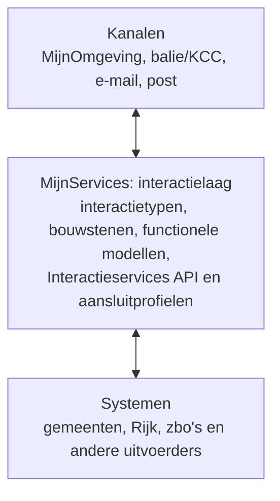

# MijnServices: betere dienstverlening

MijnServices maakt publieke dienstverlening begrijpelijk, proactief en
betrouwbaar. De [1-overheidsbeleving](https://www.digitaleoverheid.nl/overzicht-van-alle-onderwerpen/overheidsbrede-dienstverlening/loketfunctie-overheid/)
is het resultaat: actuele, eenduidige dienstverlening, via [elk kanaal](https://www.digitaleoverheid.nl/overzicht-van-alle-onderwerpen/overheidsbrede-dienstverlening/omnichannel-aanpak/).

## MijnServices standaardiseert op interactie

MijnServices is de interactielaag tussen kanalen en uitvoerende systemen. We
standaardiseren niet op een mijnomgeving, baliesysteem of zaaksysteem, maar op
wat iemand wil weten, doen, volgen of beheren.

Interactietypen benoemen terugkerende gebruikersbehoeften. [Bouwstenen](./bouwstenen/),
modellen, API's en aansluitprofielen maken ze herbruikbaar, in elk kanaal en met
elk bronsysteem.

## De kapstok: de dienstverleningscyclus

De [generieke klantroute](./interactie-patronen/) ordent dienstverlening vanuit
de levenscyclus van de gebruiker, niet vanuit organisatieonderdelen, formulieren
of systemen.

| Fase | Wat iemand nodig heeft | Terugkerende interactietypen |
| --- | --- | --- |
| Oriënteren en voorbereiden | Begrijpen wat er speelt en wat mogelijk is | Attenderen; mogelijkheden en rechten verkennen |
| Handelen en voortgang volgen | Doen wat nodig is en weten waar men aan toe is | Taken uitvoeren; status volgen |
| Afronden en beheren | Regie houden, kunnen terugkijken en hulp krijgen | Gegevens beheren; historie inzien; hulp en ondersteuning krijgen |

Dit is geen lineair proces: hulp kan in elke fase nodig zijn en een besluit kan
een nieuwe oriëntatie starten. Gebruik de cyclus om klantreizen en bouwstenen te
ontwerpen.

## Waar begin ik?

| Rol | Start bij | Daarna |
| --- | --- | --- |
| Service designer, beleidsmedewerker of product owner | [Interactie](./interactie-patronen/) | Kies de interactietypen en bijpassende bouwstenen voor de klantreis. |
| Functioneel ontwerper | [Bouwstenen](./bouwstenen/) | Werk de benodigde informatie en het gedrag per kanaal uit. |
| Front-end developer | [Kanaal: MijnOmgeving](./kanalen/mijn-omgeving) | Vertaal de bouwsteen naar een toegankelijk scherm en sluit aan op het NL Design System. |
| Back-end- of API-developer | [Functionele modellen](./specificaties/functionele-modellen/) en de [Interactieservices API](./specificaties/interactieservices-api/) | Implementeer de API-contracten en kies het passende aansluitprofiel voor de koppeling met een bronsysteem. |
| Architect | [Architectuur en standaarden](./architectuur-en-standaarden/) | Borg de samenhang tussen kanalen, interactielaag, standaarden en systemen. |

## Drie randvoorwaarden

| Pijler | Vereiste | Uitwerking |
| --- | --- | --- |
| Gedrag | Voorspelbaar verloop | Service blueprints en de generieke klantroute |
| Vorm | Herkenbare presentatie | [NL Design System](/communities/nl-design-system) en [Gebruiker Centraal](/communities/gebruiker-centraal) |
| Inhoud | Actuele dossierkennis | Data bij de bron, Federatief Datastelsel en NL API Strategie |

Deze randvoorwaarden maken de interactielaag consistent over organisaties en
kanalen heen.
