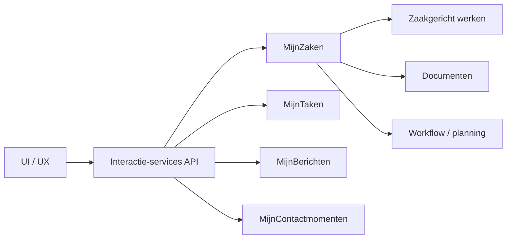

# MijnZaken

:::info[MijnZaken is in ontwikkeling]

Deze pagina beschrijft een standaard die nog in ontwikkeling is. De inhoud kan
veranderen.

:::

MijnZaken biedt procestransparantie bij lopende en afgeronde
dienstverleningsprocessen. De bouwsteen helpt inwoners en ondernemers begrijpen
waar een zaak staat, wat er al is gebeurd, welke formele informatie daarbij
hoort en welke vervolgstappen mogelijk of nodig zijn.

MijnZaken is daarmee geen digitale kopie van een backofficeproces en ook geen
losse track & trace. Track & trace kan een verschijningsvorm zijn, maar de kern
is breder: het vertalen van interne procesinformatie naar begrijpelijke,
betrouwbare en handelingsgerichte interactie.

## Doel

Het doel van MijnZaken is het wegnemen van onzekerheid bij inwoners en
ondernemers over de status, voortgang en betekenis van een aanvraag, melding,
procedure of ander dienstverleningsproces.

De waarde van MijnZaken ontstaat niet doordat een organisatie zaakdata toont,
maar doordat een inwoner of ondernemer grip ervaart:

- begrijpen welke zaken lopen of zijn afgerond;
- herkennen waar een zaak over gaat;
- zien wat de actuele status betekent;
- terugvinden welke documenten, besluiten en contactmomenten erbij horen;
- weten wat de verwachte volgende stap is;
- weten of er zelf nog een actie nodig of mogelijk is.

In deze documentatie gebruiken we daarom liever het woord **grip** dan
**regie**. Een inwoner bestuurt meestal niet het interne behandelproces, maar
kan wel overzicht, begrip en handelingsperspectief krijgen.

## Ontwerpbenadering

MijnZaken is een bouwsteen voor service design: het standaardiseert de
interactie rond procesinformatie in publieke dienstverlening. De bouwsteen staat
op het snijvlak van communicatiewetenschap, cognitieve ergonomie en
systeemtheorie.

| Perspectief            | Ontwerpvraag                                                         | Betekenis voor MijnZaken                                                                                                   |
| :--------------------- | :------------------------------------------------------------------- | :------------------------------------------------------------------------------------------------------------------------- |
| Communicatiewetenschap | Hoe wordt procesinformatie begrijpelijk en betrouwbaar overgebracht? | Statussen, mijlpalen, besluiten en verwachtingen worden vertaald naar inwonertaal.                                         |
| Cognitieve ergonomie   | Hoe verminderen we mentale belasting?                                | Zaakinformatie wordt geordend rond herkenning, actuele situatie, tijdlijn, documenten en vervolgstappen.                   |
| Systeemtheorie         | Hoe tonen we samenhang zonder interne complexiteit te kopiëren?      | MijnZaken componeert informatie uit zaakregistraties, documenten, contactmomenten, taken en workflows tot één zaakcontext. |

Deze benadering sluit aan op Service-Dominant Logic: waarde ontstaat in gebruik,
niet in het beschikbaar stellen van data op zichzelf. MijnZaken levert dus niet
alleen gegevens over een zaak, maar ondersteunt een interactie waarin inwoner en
dienstverlener dezelfde situatie kunnen begrijpen.

## Gebruikersbehoeften

MijnZaken ondersteunt drie soorten behoeften: weten, doen en zijn.

| Behoefte | Vraag van de gebruiker                              | Antwoord van MijnZaken                                                                                                         |
| :------- | :-------------------------------------------------- | :----------------------------------------------------------------------------------------------------------------------------- |
| Weten    | Waar staat mijn zaak en wat betekent dat?           | Toon de actuele status, de tijdlijn, de relevante documenten, besluiten en contactmomenten in samenhang.                       |
| Doen     | Moet of kan ik nog iets doen?                       | Maak vervolgstappen zichtbaar in de context van de zaak, bijvoorbeeld aanvullen, reageren, betalen, uploaden of bezwaar maken. |
| Zijn     | Ben ik gezien en kan ik deze informatie vertrouwen? | Laat zien dat de zaak bekend is, waar informatie vandaan komt, hoe actueel die is en wat formeel of indicatief is.             |

De emotionele waarde is hierbij belangrijk. Statusinformatie is niet alleen een
feitelijke mededeling; het kan onzekerheid verminderen, vertrouwen vergroten en
onnodig contact voorkomen.

## Scope

MijnZaken beschrijft de interactie rond zaken en dienstverleningsprocessen. De
bouwsteen standaardiseert niet hoe organisaties hun interne behandeling moeten
inrichten.

MijnZaken omvat:

- het tonen van lopende, afgeronde en conceptzaken;
- het herkennen en filteren van zaken;
- het tonen van de actuele status en statusgeschiedenis;
- het tonen van mijlpalen in inwonertaal;
- het tonen van documenten, besluiten en contactmomenten in de context van een
  zaak;
- het tonen van verwachte vervolgstappen of doorlooptijd wanneer deze
  beschikbaar zijn;
- het verbinden van relevante acties vanuit de zaakcontext.

MijnZaken omvat niet:

- het uitvoeren van taken zelf; dat hoort bij MijnTaken of MijnActies;
- het beheren van berichtenconversaties; dat hoort bij MijnBerichten;
- het vastleggen van contactmomenten zelf; dat hoort bij MijnContactmomenten;
- het afdwingen van één intern zaakproces of één backofficesysteem;
- het tonen van alle interne workflowdetails aan de inwoner.

## Capabilities

De capabilities beschrijven wat MijnZaken als interactiebouwsteen mogelijk moet
maken. Ze zijn geformuleerd vanuit gebruikerswaarde, niet vanuit endpoints of
schermen.

| Capability                | Interactiewaarde                                                                            | Contract op hoofdlijnen                                                                                      |
| :------------------------ | :------------------------------------------------------------------------------------------ | :----------------------------------------------------------------------------------------------------------- |
| Zaken vinden en herkennen | De gebruiker kan zaken terugvinden, onderscheiden en filteren op actualiteit en relevantie. | Lever per zaak minimaal een identifier, herkenbare omschrijving, zaaktype, statusgroep en laatste wijziging. |
| Statusbetekenis tonen     | De gebruiker begrijpt wat de actuele status betekent.                                       | Vertaal interne statussen naar begrijpelijke statusgroepen, statusteksten en mijlpalen.                      |
| Zaakcontext componeren    | De gebruiker ziet documenten, besluiten, contactmomenten en gebeurtenissen in samenhang.    | Stel een samenhangende ZaakContext samen uit onderliggende bronnen.                                          |
| Vooruitblik geven         | De gebruiker weet wat de verwachte volgende stap of termijn is.                             | Lever een begrijpelijke verwachting, bijvoorbeeld een geplande stap, serviceniveau of uiterste beslisdatum.  |
| Handelen vanuit context   | De gebruiker ziet welke actie mogelijk of nodig is.                                         | Verwijs vanuit de zaak naar relevante taken, acties of contactmogelijkheden.                                 |
| Betrouwbaarheid duiden    | De gebruiker begrijpt hoe actueel, formeel en betrouwbaar informatie is.                    | Maak bron, actualiteit en aard van informatie zichtbaar waar dit relevant is.                                |

## Use cases

Inwoners en ondernemers willen op elk moment weten waar hun zaken staan, wat er
al is gebeurd en wat er nog van hen wordt verwacht. De use cases hieronder
beschrijven hoe MijnZaken daarin voorziet.

### UC-01: Overzicht van zaken inzien

Een inwoner of ondernemer opent de MijnOmgeving en wil in één oogopslag zien
welke zaken lopen, welke zijn afgerond en welke eventueel nog als concept
bestaan.

Het overzicht helpt de gebruiker zaken herkennen en prioriteren. Daarom toont
het overzicht niet alle beschikbare details, maar vooral informatie die nodig is
om de juiste zaak te vinden:

- herkenbare titel of omschrijving;
- zaaktype of dienst;
- actuele statusgroep, bijvoorbeeld open, afgerond of concept;
- laatste wijziging of relevante datum;
- eventueel een signaal dat actie nodig is;
- eventueel een eerstvolgende verwachte stap.

### UC-02: Inhoud van een zaak inzien

Een inwoner of ondernemer kiest een zaak en wil de volledige context begrijpen:
wat is de huidige status, welke stappen zijn doorlopen, welke documenten en
besluiten horen erbij en welke contactmomenten zijn relevant?

De detailweergave componeert informatie uit meerdere bronnen tot één
samenhangende zaakcontext. De gebruiker hoeft daardoor niet zelf te zoeken in
losse brieven, berichten, documenten of contactgeschiedenis.

### UC-03: Vervolgstappen vanuit een zaak begrijpen

Een inwoner of ondernemer bekijkt een zaak en wil weten wat er nu gaat gebeuren
of wat er zelf nog moet gebeuren.

MijnZaken toont daarom, waar beschikbaar:

- de verwachte volgende mijlpaal;
- een indicatie van de doorlooptijd;
- acties die nog openstaan;
- acties die de gebruiker zelf kan starten;
- contactmogelijkheden in de context van de zaak.

### UC-04: Formele informatie terugvinden

Een inwoner of ondernemer wil een ingediend document, ontvangen brief,
vergunning, besluit of bewijsstuk terugvinden.

MijnZaken toont formele informatie in de context van de zaak. Daardoor wordt
duidelijk welk document bij welke stap hoort, wat de status van het document is
en of het om een formeel besluit, een ingediend stuk of ondersteunende
informatie gaat.

### UC-05: Vertrouwen krijgen in de informatie

Een inwoner of ondernemer wil kunnen vertrouwen op de getoonde informatie.

MijnZaken maakt daarom, waar nodig, zichtbaar:

- wanneer informatie voor het laatst is bijgewerkt;
- uit welke bron of organisatie informatie komt;
- of een datum, status of vervolgstap formeel of indicatief is;
- wat de gebruiker kan doen als informatie ontbreekt of onduidelijk is.

## Functioneel ontwerp

De functionele uitwerking van MijnZaken volgt een vaste informatieopbouw. Deze
opbouw voorkomt dat interne procescomplexiteit rechtstreeks op de gebruiker
wordt overgedragen.

### Overzichtsniveau

Het overzichtsniveau helpt de gebruiker bepalen welke zaak relevant is. De
informatie is compact en vergelijkbaar tussen zaken.

Belangrijke elementen:

- filteren op actualiteit, bijvoorbeeld lopend, afgerond of concept;
- filteren op type dienstverlening, bijvoorbeeld vergunning, melding of
  aanvraag;
- sorteren op relevantie, laatste wijziging of datum;
- signaleren dat actie nodig is;
- doorklikken naar de zaakcontext.

### Detailniveau

Het detailniveau helpt de gebruiker de zaak begrijpen.

Belangrijke elementen:

- actuele status en betekenis in inwonertaal;
- tijdlijn met mijlpalen en gebeurtenissen;
- documenten en besluiten;
- contactmomenten;
- openstaande taken of acties;
- verwachte volgende stap;
- metadata over actualiteit en bron.

### Uitzonderingssituaties

MijnZaken moet ook duidelijke interacties ondersteunen wanneer informatie niet
beschikbaar of niet compleet is.

Voorbeelden:

- er zijn geen zaken beschikbaar;
- een document is tijdelijk niet bereikbaar;
- een status is onbekend of nog niet vertaald;
- de verwachte doorlooptijd is niet beschikbaar;
- informatie uit een onderliggend systeem is vertraagd;
- de gebruiker heeft geen toegang tot een specifieke zaak.

In deze situaties is het belangrijk dat de gebruiker niet met technische
foutmeldingen wordt geconfronteerd, maar begrijpt wat er aan de hand is en wat
eventueel de volgende stap is.

## Schermen

Elk scherm krijgt een eigen pagina met een korte omschrijving, een Figma-link of
screenshot, en een interactietabel: per UI-element de interactie en de
bijbehorende API-aanroep(en). Schermen worden geïdentificeerd met het patroon
`SCR-<ONDERWERP>`.

Startpunt voor deze uitwerking:
[MijnZaken-overzicht in Figma](https://www.figma.com/proto/O3Wzm9ANIRHQTK98X0ljYs/VNG-mijn-services-prototype?node-id=9427-21196&starting-point-node-id=9448%3A758053).

Voor MijnZaken zijn minimaal de volgende schermen relevant:

| Scherm               | Doel                                                            |
| :------------------- | :-------------------------------------------------------------- |
| `SCR-ZAKENOVERZICHT` | Zaken vinden, herkennen en filteren.                            |
| `SCR-ZAAKDETAIL`     | De actuele status en volledige zaakcontext begrijpen.           |
| `SCR-ZAAKDOCUMENTEN` | Documenten, besluiten en bewijsstukken binnen de zaak bekijken. |
| `SCR-ZAAKVERVOLG`    | Vervolgstappen, taken en acties in zaakcontext tonen.           |
| `SCR-GEEN-ZAKEN`     | Uitleg geven wanneer er geen zaken beschikbaar zijn.            |

## API's en interactieservices

De API's van MijnZaken leveren niet alleen ruwe zaakdata, maar een
interactiecontract voor procestransparantie. De API moet de UI in staat stellen
om overzicht, context, vooruitblik en handelingsperspectief te tonen zonder dat
de UI kennis nodig heeft van interne backofficeprocessen.

### Conceptuele resources

| Resource           | Betekenis                                                                                                      |
| :----------------- | :------------------------------------------------------------------------------------------------------------- |
| `ZaakSamenvatting` | Compacte representatie van een zaak voor overzichten en filters.                                               |
| `ZaakContext`      | Samengestelde detailweergave van een zaak met status, tijdlijn, documenten, contactmomenten en vervolgstappen. |
| `ZaakGebeurtenis`  | Gebeurtenis of mijlpaal in de tijdlijn van een zaak.                                                           |
| `ZaakDocument`     | Document, besluit, bewijsstuk of formele communicatie in de context van de zaak.                               |
| `ZaakVervolgstap`  | Verwachte mijlpaal, openstaande taak of mogelijke actie bij een zaak.                                          |

### Data-minimalisatie

Het overzicht levert alleen gegevens die nodig zijn om een zaak te herkennen en
te kiezen. Details, documenten en contactgeschiedenis worden pas opgehaald
wanneer de gebruiker een specifieke zaak opent.

Voor een `ZaakSamenvatting` zijn op hoofdlijnen nodig:

- unieke identifier;
- herkenbare omschrijving;
- zaaktype of dienst;
- statusgroep, bijvoorbeeld `OPEN`, `CLOSED` of `DRAFT`;
- statuslabel in inwonertaal;
- relevante datum, bijvoorbeeld laatste wijziging of indieningsdatum;
- indicatie of actie nodig is.

Voor een `ZaakContext` zijn aanvullend nodig:

- actuele status en betekenis;
- tijdlijn met mijlpalen;
- gekoppelde documenten en besluiten;
- gekoppelde contactmomenten;
- gekoppelde taken of acties;
- verwachte volgende stap of doorlooptijd, wanneer beschikbaar;
- bron- en actualiteitsinformatie.

### Relatie met andere bouwstenen

MijnZaken staat niet op zichzelf. De bouwsteen componeert of verwijst naar
informatie uit andere bouwstenen en domeinen.

| Bouwsteen of domein | Relatie met MijnZaken                                                                     |
| :------------------ | :---------------------------------------------------------------------------------------- |
| MijnTaken           | Openstaande acties worden in de context van een zaak zichtbaar gemaakt.                   |
| MijnActies          | Mogelijke acties kunnen vanuit een zaak worden gestart.                                   |
| MijnBerichten       | Berichten kunnen aan een zaak gerelateerd zijn.                                           |
| MijnContactmomenten | Contactgeschiedenis wordt in de zaakcontext getoond.                                      |
| Documenten          | Ingediende stukken, brieven, besluiten en bewijsstukken worden gekoppeld aan de zaak.     |
| Zaakgericht werken  | Zaakregistraties vormen een belangrijke bron, maar bepalen niet één-op-één de interactie. |

### API's voor zaakgericht werken

[ZGW API's](https://vng-realisatie.github.io/gemma-zaken/standaard/) zijn een
belangrijke bron voor zaakgegevens. MijnZaken gebruikt deze broninformatie niet
als rechtstreeks schermmodel, maar vertaalt deze naar interactie-informatie:

- interne statussen worden begrijpelijke statusgroepen en statusteksten;
- zaakobjecten worden herkenbare zaakrepresentaties;
- documenten en besluiten worden in context geplaatst;
- workflowinformatie wordt vertaald naar mijlpalen en verwachtingen.

## Architectuur en standaarden

MijnZaken past binnen de algemene
[architectuur en standaarden](../../architectuur-en-standaarden/) van
MijnServices. De belangrijkste architectuurkeuze is dat we interactie
modelleren, niet alleen registratie.

De UI toont de interactie. De interactieservices leveren de samenhangende
gebruikerscontext. Bouwstenen zoals MijnZaken, MijnTaken, MijnBerichten en
MijnContactmomenten standaardiseren elk een herkenbaar interactiepatroon binnen
die context.

Voor MijnZaken betekent dit:

- de UI hoeft geen interne proceslogica te kennen;
- de API levert informatie in termen van gebruikersinteractie;
- broninformatie blijft herleidbaar;
- statusinformatie wordt losgekoppeld van interne workflowcodes;
- de bouwsteen kan kanaalonafhankelijk worden toegepast.

## Ontwerpprincipes

De volgende ontwerpprincipes helpen om MijnZaken consistent uit te werken.

1. **Begin bij onzekerheid**  
   Toon eerst wat de gebruiker nodig heeft om de situatie te begrijpen.

2. **Gebruik inwonertaal**  
   Vertaal interne statussen en processtappen naar begrijpelijke taal.

3. **Maak onderscheid tussen feit, verwachting en actie**  
   Een besluit, een verwachte datum en een openstaande taak zijn verschillende
   soorten informatie.

4. **Toon samenhang, geen systeemgrenzen**  
   Groepeer informatie rond de zaak, niet rond de bronapplicatie.

5. **Minimaliseer informatie in het overzicht**  
   Toon in het overzicht alleen wat nodig is om de juiste zaak te herkennen.

6. **Geef handelingsperspectief**  
   Maak duidelijk wat de gebruiker kan doen, moet doen of juist niet hoeft te
   doen.

7. **Duid betrouwbaarheid**  
   Maak zichtbaar wanneer informatie actueel, formeel, indicatief of afkomstig
   uit een specifieke bron is.
