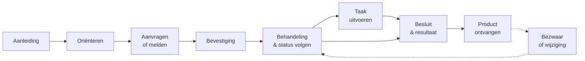

# Voorspelbare interacties

Een inwoner die een parkeervergunning aanvraagt bij de gemeente, moet diezelfde
logica herkennen wanneer zij een toeslag aanvraagt bij de Belastingdienst. Toch
werkt elke overheidsorganisatie vandaag met eigen processen, eigen termen en
eigen stappen. Het gevolg: inwoners en ondernemers moeten bij elke instantie
opnieuw het systeem leren begrijpen.

Dat kan anders. Niet door organisaties te dwingen dezelfde software te
gebruiken, maar door de interactie vanuit het perspectief van de gebruiker te
standaardiseren. Dat is het idee achter de **generieke klantroute**.

## De ontdekking: patronen in meer dan 200 klantreizen

De klantroutes zijn niet aan de tekentafel bedacht. Ze zijn het resultaat van
meer dan 200 klantreisonderzoeken, uitgevoerd met service blueprints — een
methode die klantreizen en de gevolgen voor achterliggende processen, systemen
en organisatie gedetailleerd in kaart brengt.

Daarbij zijn inzichten verwerkt van gemeenten, ketenpartners,
ervaringsdeskundigen en inwoners en ondernemers uit heel Nederland. Wat bleek:
ongeacht of het gaat om een melding openbare ruimte, de aanvraag van een
parkeervergunning of een aanvraag voor gezinsondersteuning — de
interactiepatronen verlopen telkens volgens een voorspelbaar pad.

Op basis van deze inzichten zijn de meest voorkomende stappen gefilterd en
gebundeld tot generieke patronen.

## Het pad: van aanleiding tot resultaat

De generieke klantroute beschrijft de stappen die een inwoner of ondernemer
doorloopt bij vrijwel elke overheidsinteractie:

Of het nu gaat om een verhuizing, het starten van een bedrijf of het verlengen
van een rijbewijs: deze stappen keren in essentie steeds terug. De specifieke
invulling verschilt per dienst, maar het pad is herkenbaar.

## Wat dit oplevert

Door de generieke klantroute als gemeenschappelijk model te hanteren, kunnen
overheidsorganisaties:

- **Overzicht creëren** van de mogelijke routes die inwoners en ondernemers
  afleggen.
- **De scope bepalen** van een specifieke klantreis en de benodigde bouwstenen.
- **Klantwaarde duiden** van projecten en verbeterinitiatieven.
- **Verbeterpunten signaleren** in processen door ze tegen het generieke pad te
  leggen.
- **Eén taal spreken** in de samenwerking tussen afdelingen en organisaties.

## Van route naar bouwstenen

De generieke klantroute is de blauwdruk. De
[bouwstenen van MijnServices](./bouwstenen/) vormen de gereedschapskist waarmee
deze route concreet wordt ingevuld. Elke bouwsteen — van MijnZaken (status
volgen) tot MijnTaken (acties uitvoeren) — is ontworpen om een specifiek
onderdeel van de klantreis generiek af te handelen.

<!-- downloadlink generieke klantroutes -->
